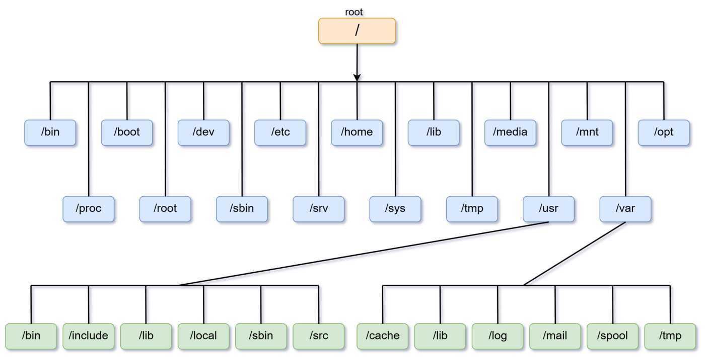

> 来源：`source/_posts/linux-basic.md`  
> 整理日期：2026-06-16  
> 适用场景：排查测试环境、理解 Linux 测试节点部署、定位文件/磁盘问题

---

## 一、一切皆文件

Linux 将所有资源抽象为文件，包括硬件设备、进程、套接字。这种设计带来统一的操作接口，但也意味着测试人员需要理解不同文件类型的含义。

| 类型标识 | 类型 | 测试关注点 |
|---|---|---|
| `-` | 普通文件 | 日志、配置文件、测试数据 |
| `d` | 目录 | 测试产物输出目录 |
| `l` | 符号链接 | 部署脚本中常见的软链指向 |
| `c` / `b` | 字符/块设备 | 磁盘、裸设备测试 |
| `s` | 套接字 | 进程间通信、网络服务 |
| `p` | 命名管道 | 进程间数据传递 |

---

## 二、目录结构（FHS）

| 目录           | 用途        | 测试开发常见操作         |
| ------------ | --------- | ---------------- |
| `/etc`       | 配置文件      | 修改测试环境配置、检查服务配置  |
| `/var`       | 日志与可变数据   | 查看应用日志、测试报告输出    |
| `/tmp`       | 临时文件      | 存放临时测试数据，注意重启后清理 |
| `/opt`       | 第三方软件     | 安装测试工具、被测服务      |
| `/home`      | 用户主目录     | 个人测试脚本、SSH 密钥    |
| `/usr/local` | 用户自行安装的软件 | 自定义测试工具部署        |
| `/proc`      | 虚拟文件系统    | 查看进程、系统状态        |
| `/dev`       | 设备文件      | 磁盘、块设备测试         |

**FHS 目录结构示意图**：



---

## 三、inode 与链接

### 3.1 inode

inode 存储文件元数据（权限、大小、修改时间、数据块位置）。每个文件对应一个 inode 号。

```bash
# 查看 inode 信息
stat /var/log/messages
ls -i /var/log/messages
```

**测试开发注意**：
- 小文件过多可能耗尽 inode，导致"磁盘有空间但无法创建文件"。
- 日志目录需监控 inode 使用率。

### 3.2 硬链接与软链接

| 特性 | 硬链接 | 软链接 |
|---|---|---|
| inode | 与源文件相同 | 不同 |
| 能否跨文件系统 | 否 | 是 |
| 能否链接目录 | 否 | 是 |
| 源文件删除后 | 仍可访问 | 失效（ dangling link） |

```bash
ln /etc/crontab crontab_hard    # 硬链接
ln -s /etc/crontab crontab_soft # 软链接
```

**测试应用**：测试环境中常用软链管理不同版本的配置文件或测试数据目录。

---

## 四、磁盘、分区与文件系统

### 4.1 分区与挂载流程

```bash
# 查看磁盘
lsblk
fdisk -l

# 格式化
mkfs.ext4 /dev/sdb1

# 挂载
mount /dev/sdb1 /mnt/data

# 开机自动挂载（写入 /etc/fstab）
echo '/dev/sdb1 /mnt/data ext4 defaults 0 0' >> /etc/fstab
```

### 4.2 LVM 逻辑卷

LVM 适合需要灵活扩容的测试环境。

```bash
pvcreate /dev/sdb
vgcreate test_vg /dev/sdb
lvcreate -L 50G -n test_lv test_vg
mkfs.ext4 /dev/test_vg/test_lv
mount /dev/test_vg/test_lv /mnt/test_data
```

### 4.3 RAID 速览

| RAID | 特点 | 适用测试场景 |
|---|---|---|
| RAID 0 | 性能提升，无冗余 | 临时测试数据，可丢失 |
| RAID 1 | 镜像，高可靠 | 关键测试环境系统盘 |
| RAID 5 | 均衡性能与冗余 | 一般测试数据存储 |
| RAID 10 | 性能与冗余均高 | 高要求数据库测试环境 |

---

## 五、权限与用户管理

### 5.1 文件权限

```bash
-rwxr-xr-x 1 root root 1234 Jun 16 10:00 script.sh
```

- 所有者（owner）、所属组（group）、其他用户（other）
- 读（r=4）、写（w=2）、执行（x=1）

```bash
chmod 755 script.sh      # rwxr-xr-x
chmod u+x script.sh      # 给所有者添加执行权限
chown tester:tester file # 修改所有者和所属组
```

### 5.2 特殊权限

| 权限 | 符号 | 作用 |
|---|---|---|
| SUID | `s` 在所有者执行位 | 执行时获得文件所有者权限 |
| SGID | `s` 在所属组执行位 | 执行时获得所属组权限 |
| Sticky | `t` 在其他人执行位 | 目录中只能删除自己的文件 |

### 5.3 用户与组

```bash
useradd tester          # 创建用户
passwd tester           # 设置密码
usermod -aG docker tester  # 将用户加入 docker 组
groups tester           # 查看用户所属组
```

---

## 六、进程管理基础

### 6.1 进程状态

```bash
ps -ef | grep java      # 查看 Java 进程
top                     # 实时查看 CPU/内存
htop                    # 更友好的 top（需安装）
```

### 6.2 信号控制

```bash
kill -9 PID             # 强制终止
kill -15 PID            # 正常终止（默认）
kill -HUP PID           # 重载配置
```

**测试应用**：测试用例执行前后清理进程、模拟服务异常退出。

---

## 七、实践建议

1. **测试产物放 `/var` 或独立数据盘**：避免根目录被打满导致系统异常。
2. **定期检查 inode**：小文件多的日志/报告目录容易触发 inode 耗尽。
3. **用软链管理多版本配置**：如 `config -> config-test-v1.yaml`。
4. **权限最小化**：测试服务不要以 root 运行，按需授权。
5. **挂载选项注意 `noexec`**：某些安全加固目录禁止执行脚本，部署测试工具时注意。

---

## 八、关联文档

- [2.2.2 Linux 常用命令速查](2.2.2%20Linux%20常用命令速查.md)
- [2.2.3 Shell 脚本编程](2.2.3%20Shell%20脚本编程.md)
- [2.3.1 TCP/IP 与 HTTP/HTTPS](../2.3%20计算机网络/2.3.1%20TCP%20IP%20与%20HTTP%20HTTPS.md)
- [4.2 容器与 Kubernetes](../../4-云原生与基础设施测试/)
