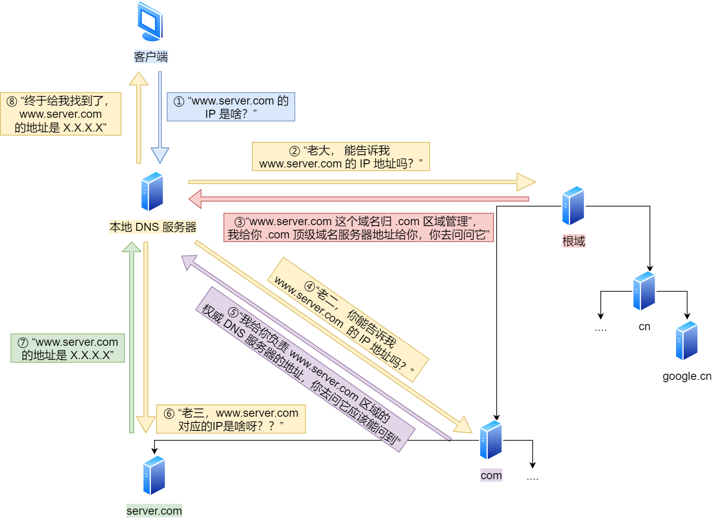

> 来源：`source/_posts/network-base.md`  
> 整理日期：2026-06-16  
> 适用场景：接口测试问题定位、理解 HTTP/HTTPS 行为、网络故障排查

---

## 一、TCP/IP 四层模型

| TCP/IP 层级 | OSI 对应 | 核心功能 | 测试开发常用协议 |
|---|---|---|---|
| 应用层 | L5-L7 | 面向用户的应用协议 | HTTP、HTTPS、DNS、SSH、FTP |
| 传输层 | L4 | 端到端可靠/不可靠传输 | TCP、UDP |
| 网络层 | L3 | 寻址与路由 | IP、ICMP、BGP |
| 链路层 | L1-L2 | 物理介质传输、MAC 寻址 | ARP、以太网 |

**测试开发视角**：
- 接口测试主要关注 **应用层** 的请求/响应语义。
- 性能测试需要理解 **传输层** TCP 连接、拥塞控制、端口复用。
- 环境部署排查需要用到 **网络层/链路层** 的 ping、traceroute、ARP。

---

## 二、HTTP 协议

### 2.1 基本特性

- **无状态**：服务器不保留客户端请求历史，需借助 Cookie/Session/Token 维持状态。
- **请求-应答模式**：客户端发起请求，服务器返回响应。
- **文本协议**：报文由 Header + Body 组成，易于抓包分析。

### 2.2 常见状态码与测试含义

| 状态码 | 含义 | 测试关注点 |
|---|---|---|
| 200 | 成功 | 正常响应断言基准 |
| 201 | 创建成功 | POST 创建资源后验证 |
| 204 | 无内容 | DELETE 或更新操作成功但无返回体 |
| 301/302 | 重定向 | 验证重定向目标、是否循环重定向 |
| 304 | 未修改 | 缓存生效验证 |
| 400 | 请求参数错误 | 参数校验用例核心断言 |
| 401 | 未认证 | 鉴权失败场景 |
| 403 | 无权限 | 权限控制测试 |
| 404 | 资源不存在 | 异常路径测试 |
| 500 | 服务器内部错误 | 服务端异常兜底 |
| 502 | 网关错误 | 反向代理/上游服务异常 |
| 503 | 服务不可用 | 限流、熔断、降级场景 |
| 504 | 网关超时 | 超时配置、慢请求测试 |

### 2.3 状态保持机制

| 机制 | 原理 | 测试关注点 |
|---|---|---|
| Cookie | 服务器通过 `Set-Cookie` 写入客户端，后续请求携带 | XSS/CSRF 安全测试、过期时间 |
| Session | 状态存服务端，通过 Session ID 关联 | 会话一致性、分布式会话 |
| Token（JWT） | 服务器签发令牌，客户端每次携带 | 令牌失效、刷新、鉴权范围 |

### 2.4 HTTP 与 HTTPS

| 对比项 | HTTP | HTTPS |
|---|---|---|
| 安全性 | 明文传输 | SSL/TLS 加密 |
| 端口 | 80 | 443 |
| 性能 | 较低开销 | 增加 TLS 握手开销 |
| 证书 | 不需要 | 需要 CA 证书 |

**测试注意**：HTTPS 测试需关注证书过期、自签名证书信任、TLS 版本兼容性。

---

## 三、DNS 解析

### 3.1 解析流程

1. 浏览器缓存 → 系统 hosts → 本地 DNS 缓存
2. 本地 DNS 服务器（递归查询）
3. 根域名服务器 → 顶级域 → 权威域（迭代查询）
4. 返回 IP 地址并缓存

```bash
# 查看 DNS 解析过程
dig +trace www.example.com
nslookup www.example.com
```

### 3.2 测试开发应用

- 环境切换时通过修改 `/etc/hosts` 指向测试服务器。
- DNS 解析失败会导致接口测试大面积超时，需单独排查。
- CDN、负载均衡场景下同一域名可能解析到不同 IP。

**DNS 解析流程示意图**：



---

## 四、TCP 与 UDP

### 4.1 TCP 特点

- 面向连接、可靠传输
- 流量控制、拥塞控制、超时重传
- 适用于 HTTP/HTTPS、SSH、FTP

### 4.2 TCP 三次握手与四次挥手

```text
三次握手：SYN → SYN+ACK → ACK
四次挥手：FIN → ACK → FIN → ACK
```

**测试意义**：
- 大量短连接会导致频繁握手，消耗资源（HTTP Keep-Alive 可复用连接）。
- `TIME_WAIT` 状态过多可能耗尽端口，影响压测。

### 4.3 UDP 特点

- 无连接、不可靠、低延迟
- 适用于 DNS、视频流、日志采集、SNMP

### 4.4 选择建议

| 场景 | 推荐协议 |
|---|---|
| 接口测试、Web 请求 | TCP/HTTP |
| 实时音视频、游戏 | UDP |
| 域名解析 | UDP（DNS） |
| 高可靠文件传输 | TCP |

---

## 五、网络排查工具与场景

### 5.1 连通性

```bash
ping 8.8.8.8              # 基础连通性
traceroute www.example.com # 路由路径
```

### 5.2 DNS 排查

```bash
nslookup www.example.com
dig www.example.com
```

### 5.3 端口与服务

```bash
ss -tlnp                  # 查看监听端口
curl -v http://localhost:8080/health  # 详细请求响应
```

### 5.4 抓包分析

```bash
# 抓取 8080 端口流量
tcpdump -i eth0 -w capture.pcap port 8080

# 仅抓取 HTTP 请求
tcpdump -i eth0 -A port 80 | grep GET
```

**测试应用**：
- 定位接口超时是网络层还是应用层问题。
- 验证请求参数是否正确发送。
- 分析重试、连接复用行为。

---

## 六、WebSocket

| 特性 | HTTP | WebSocket |
|---|---|---|
| 通信方向 | 单向：客户端发起 | 双向：服务器可主动推送 |
| 连接 | 短连接/长连接 | 长连接 |
| 头部开销 | 每次请求带完整头部 | 建立连接后数据帧轻量 |
| 适用 | 请求-响应场景 | 实时通知、IM、行情推送 |

**测试关注点**：
- 连接建立与断开。
- 心跳保活机制。
- 断线重连与消息顺序。
- 并发连接数与资源消耗。

---

## 七、实践建议

1. **状态码不是唯一断言**：4xx/5xx 要配合业务错误码和消息体一起判断。
2. **区分网络超时与应用超时**：`curl -w "%{time_total}\n"` 可查看各环节耗时。
3. **HTTPS 测试准备证书方案**：自签名证书需配置信任，避免测试环境因证书失败。
4. **抓包是最后手段**：先确认 DNS、端口、路由可达，再上升到抓包。
5. **长连接测试关注 TIME_WAIT**：高并发短连接场景需调优内核参数。

---

## 八、关联文档

- [2.2.2 Linux 常用命令速查](../2.2%20Linux%20基础/2.2.2%20Linux%20常用命令速查.md)
- [2.2.3 Shell 脚本编程](../2.2%20Linux%20基础/2.2.3%20Shell%20脚本编程.md)
- [3.3 接口自动化测试](../../3-自动化测试工程/)
- [4.4.2 网络虚拟化与 SDN](../../4-云原生与基础设施测试/)
- [4.4.3 云计算网络测试关注点](../../4-云原生与基础设施测试/)
