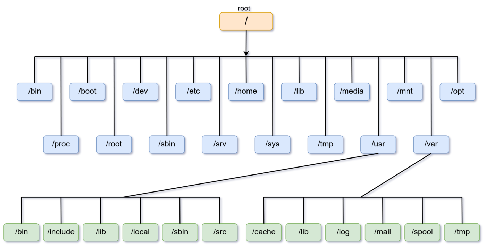
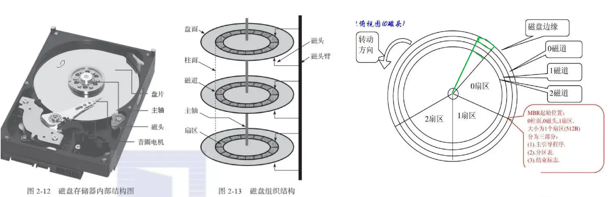
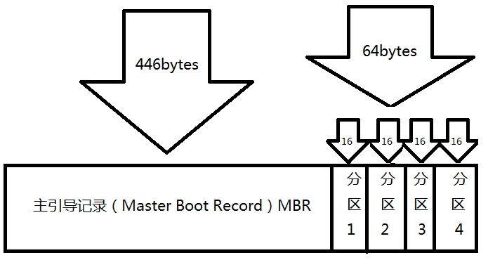
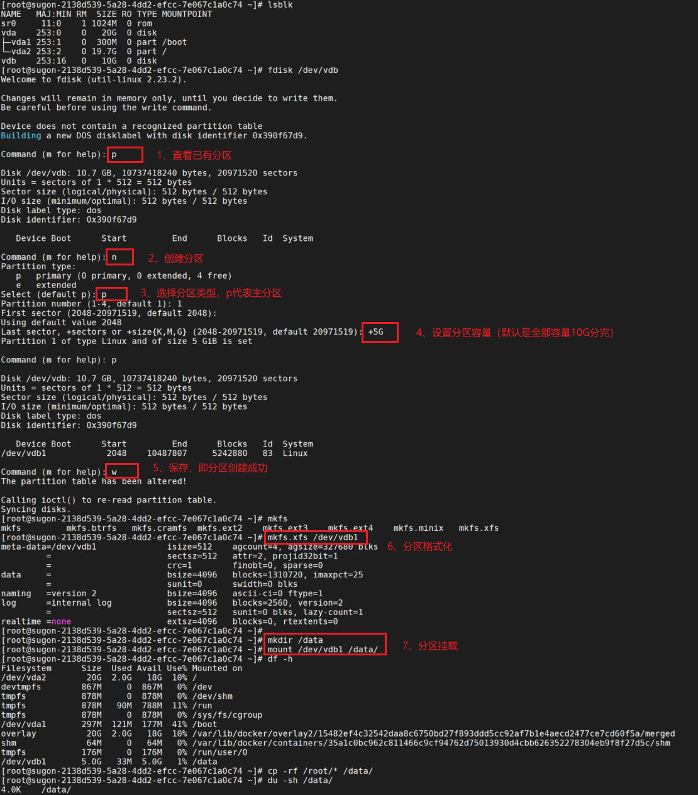
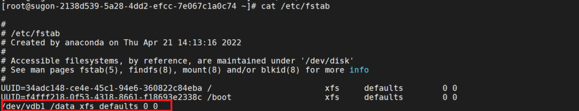

# Linux 操作系统

## Linux 简介

Linux 是一款广泛使用的开源操作系统，全称 GNU/Linux，设计灵感来源于 UNIX 操作系统，支持多用户、多任务，并且是自由和开源的。

在 GNU/Linux 系统中，Linux 是内核组件，其余组件则由 GNU 项目开发，包括编译器、调试器、文本编辑器、Shell 终端、图形界面等。

## Linux 发行版

从技术上说，Linux 只是一个符合 POSIX 标准的内核，还不是一个完整的操作系统。除了 Linux 内核，一个典型的桌面操作系统通常还包括一个 Shell 交互界面、一些基础的工具和库、附加的软件和文档，以及窗口系统、窗口管理器等。这样一个完整的操作系统就被称为“Linux 发行版”（distribution，简称 distro）。

Linux 的发行版本可以大体分为两类，一类是商业公司维护的发行版本，一类是社区组织维护的发行版本。前者以著名的Redhat（RHEL）为代表，后者以 Debian 为代表。

- Redhat 系列包括 RHEL、Fedora Core（由原来的 Redhat 桌面版本发展而来，免费版本）、CentOS（RHEL的社区克隆版本，免费）等
- Debian 系列包括 Debian 和Ubuntu
- 在国产 Linux 发行版方面，比较著名的有中科方德、麒麟 Linux、OpenEuler、Anolis OS 等发行版

# Linux 文件与目录管理

## 一切皆文件

“一切皆是文件”是 Unix/Linux 的基本哲学之一，它是指 Linux 系统中的所有的一切都可以通过文件的方式访问、管理，即使不是文件，也以文件的形式来管理。例如硬件设备、进程、套接字等都抽象成伪文件，使用统一的用户接口，虽然文件类型各不相同，但是对其提供的却是同一套操作。

在 Linux 中共有 7 种类型的文件，使用了不同的字符来加以区分，其中伪文件并不占用磁盘空间：

| 文件类型标识  | 文件类型                     |
| ------------- | ---------------------------- |
| `-`           | 普通文件                     |
| `d`           | 目录文件                     |
| `l`           | 符号链接                     |
| `c`（伪文件） | 字符设备（character device） |
| `b`（伪文件） | 块设备（block device）       |
| `s`（伪文件） | 套接字文件（socket）         |
| `p`（伪文件） | 命名管道文件（pipe）         |

## 硬件设备命名

系统内核中的udev设备管理器会自动把硬件名称规范起来，目的是让用户通过设备文件的名字可以猜出设备大致的属性以及分区信息等；这对于陌生的设备来说特别方便。

| 硬件设备      | 文件名称                                                     |
| ------------- | ------------------------------------------------------------ |
| SCSI/SATA/U盘 | /dev/sd[a-z]                                                 |
| virtio设备    | /dev/vd[a-z]（用于虚拟机内）                                 |
| 软驱          | /dev/fd[0-7]                                                 |
| 打印机        | /dev/lp[0-15]                                                |
| 光驱CDROM     | /dev/sr[0-1] （通用，CentOS 较常见）/dev/cdrom （当前 CDROM） |
| 鼠标          | /dev/mouse                                                   |
| 磁带机        | /dev/st0或/dev/ht0                                           |

## 文件权限与属性

文件的读、写、执行权限可以简写为rwx，亦可分别用数字4、2、1来表示，文件所有者，所属组及其他用户权限之间无关联。


在上图中，包含了文件的类型、访问权限、所有者（属主）、所属组（属组）、占用的磁盘大小、修改时间和文件名称等信息。

通过分析可知，该文件类型为普通文件，所有者权限为可读、可写（rw-），所属组权限为可读（r--），除此以外的其他人也只有可读权限（r--），文件的磁盘占用大小是34298字节，最近一次的修改时间为4月2日的凌晨23分，文件的名称为install.log。

## 目录树结构

在Windows操作系统中，想要找到一个文件，要依次进入该文件所在的磁盘分区（也叫盘符），然后再进入该分区下的具体目录，最终找到这个文件。但是在Linux系统中并不存在C、D、E、F等盘符，**Linux系统中的一切文件都是从“根”目录（/）开始的，并按照文件系统层次标准(FHS)采用倒树状结构来存放文件，以及定义了常见目录的用途。**



Linux系统中常见的目录名称以及相应内容

| 目录名称    | 应放置文件的内容                                          |
| ----------- | --------------------------------------------------------- |
| /boot       | 开机所需文件—内核、开机菜单以及所需配置文件等             |
| /dev        | 以文件形式存放任何设备与接口                              |
| /etc        | 配置文件                                                  |
| /home       | 用户主目录                                                |
| /bin        | 存放单用户模式下还可以操作的[命令]                        |
| /lib        | 开机时用到的函数库，以及/bin与/sbin下面的命令要调用的函数 |
| /sbin       | 开机过程中需要的命令                                      |
| /media      | 用于挂载设备文件的目录                                    |
| /opt        | 放置第三方的软件                                          |
| /root       | 系统管理员的家目录                                        |
| /srv        | 一些网络服务的数据文件目录                                |
| /tmp        | 任何人均可使用的“共享”临时目录                            |
| /proc       | 虚拟文件系统，例如系统内核、进程、外部设备及网络状态等    |
| /usr/local  | 用户自行安装的软件                                        |
| /usr/sbin   | Linux系统开机时不会使用到的软件/命令/[脚本]               |
| /usr/share  | 帮助与说明文件，也可放置共享文件                          |
| /var        | 主要存放经常变化的文件，如日志                            |
| /lost+found | 当文件系统发生错误时，将一些丢失的文件片段存放在这里      |


# Linux 硬盘与文件系统管理

## **硬盘类型**



**机械硬盘**（HDD）的组成主要有盘片、机械手臂、磁头与主轴马达所组成，而数据的写入其实是在盘片上面。盘片上面又可细分出扇区（Sector）与磁道（Track）两种单位，其中扇区的容量设计有两种大小，分别是 512Bytes 与 4KBytes。

**固态硬盘**（SSD）是基于半导体闪存（NAND Flash）作为存储介质的硬盘，相比传统的机械硬盘，它去掉了机械固件，引入了主控芯片来代替机械操作，这意味着它的性能、功耗及可靠性会比HDD高出一大截。固态硬盘虽然没有物理扇区，但逻辑上仍保留扇区的概念以兼容操作系统和文件系统。

关于硬盘的总结如下：

- 扇区（Sector）为最小的物理储存单位，且依据磁盘设计的不同，目前主要有 512Bytes与 4K 两种格式；
- 柱面（cylinder）是由多个盘片上处于同一磁道位置（即同一半径）的磁道组成的集合；

## 硬盘分区和挂载

**分区工具**
常用的分区工具有 `fdisk`、`parted`、Windows 下的磁盘管理工具等。使用这些工具可以在硬盘上建立一个分区表，用于记录每个分区的起始位置、结束位置、大小及其它属性。

**分区表类型**

**MBR（Master Boot Record）**：传统的分区表格式，最多支持4个主分区（或3个主分区加一个扩展分区，扩展分区内可创建多个逻辑分区）。

MBR 分区表中，第一个扇区最重要，里面有主开机记录（Master boot record,MBR）及分区表（partition table），其中 MBR 占有 446 Bytes，而 partition table 则占有 64 Bytes。



**GPT（GUID Partition Table）**：现代硬盘常用的分区表格式，支持更多分区，且对于大容量硬盘有更好的支持和数据冗余能力。

**分区过程**
分区工具会让你选择起始扇区和结束扇区，从而决定每个分区的大小。现在的分区都是基于逻辑扇区（LBA）进行划分的。

- **指定大小和位置**：用户可以根据需要指定各个分区的大小和位置，确保不同的分区满足不同应用场景的需求。
- **确定分区类型**：通常会根据用途为分区分配不同的标记或文件系统类型（如Linux下的 ext4、swap 分区，Windows下的 NTFS 等）。
- **写入分区表**：完成分区配置后，工具会将信息写入硬盘的分区表中。以后系统启动时，就会根据这个分区表来识别和管理各个分区。

**方法一：分区 → 格式化 → 挂载**

使用步骤：

1. 输入 `n` 创建新分区。
2. 输入分区类型（如 `primary` 或 `logical`）。
3. 设置起始和结束扇区（通常直接按回车使用默认值）。
4. 输入 `w` 保存分区表并退出。
5. 格式化分区
6. 挂载分区
7. 开机自动挂载（可选）





**方法二：直接格式化→ 挂载**

这种方法适合特定用途，例如非系统盘的大容量存储。

```sh
sudo mkfs.ext4 /dev/sdb
sudo mount /dev/sdb /mnt/data
```

**方法三：使用 LVM（逻辑卷管理器）**

如果需要灵活管理硬盘容量，可以使用 LVM：初始化 → 创建卷组 → 创建逻辑卷 → 格式化 → 挂载

```sh
# 初始化硬盘
sudo pvcreate /dev/sdb
# 创建卷组
sudo vgcreate my_vg /dev/sdb
# 创建逻辑卷
sudo lvcreate -L 50G -n my_lv my_vg
#格式化卷
sudo mkfs.ext4 /dev/my_vg/my_lv
#挂载卷
sudo mount /dev/my_vg/my_lv /mnt/data
```

**方法四：作为裸设备使用**

某些特殊用途（如数据库或存储系统）可能直接使用裸设备，无需分区和格式化。例如数据库（如 MySQL）可以直接将 `/dev/sdb` 作为数据存储路径。

## 文件系统

### 链接文件

> Unix/Linux系统内部不使用文件名，而使用inode号码来识别文件，即系统读取根据 inode号码获取inode信息，分析 inode 所记录的权限与使用者是否符合，若符合才能够读取文件所在block里的数据。

**硬链接**

一般情况下，文件名和inode号码是"一一对应"关系，每个inode号码对应一个文件名。但是，Unix/Linux系统允许，多个文件名指向同一个inode号码。

这意味着，可以用不同的文件名访问同样的内容；对文件内容进行修改，会影响到所有文件名；但是，删除一个文件名，不影响另一个文件名的访问。这种情况就被称为"硬链接"（hard link）。

使用限制：link不能跨文件系统，也不能 link 目录

```sh
[root@master01 ~]# ll -i /etc/crontab
268535884 -rw-r--r-- 1 root root 451 Mar 14  2020 /etc/crontab

[root@master01 ~]# ln /etc/crontab .

# 建立硬链接，链接数加1
[root@master01 ~]# ll -i /etc/crontab crontab
268535884 -rw-r--r-- 2 root root 451 Mar 14  2020 crontab
268535884 -rw-r--r-- 2 root root 451 Mar 14  2020 /etc/crontab

# 删除硬链接，链接数减1
[root@master01 ~]# rm -rf crontab
[root@master01 ~]# ll -i /etc/crontab
268535884 -rw-r--r-- 1 root root 451 Mar 14  2020 /etc/crontab

```

**软链接（符号链接）**

软链接与硬链接最大的不同：文件A指向文件B的文件名，而不是文件B的inode号码，文件B的inode"链接数"不会因此发生变化。如果删除了文件B，打开文件A就会报错："No such file or directory"。

```sh
[root@master01 ~]# ln -s /etc/crontab crontab_test

[root@master01 ~]# ll -i /etc/crontab crontab_test
344677386 lrwxrwxrwx 1 root root  12 Jan 20 18:41 crontab_test -> /etc/crontab
268535884 -rw-r--r-- 1 root root 451 Mar 14  2020 /etc/crontab
```

另外，在Linux系统上/bin/sh通常就是指向/bin/bash的符号链接。

```bash
[root@master01 ~]# ll -i /bin/sh
872423134 lrwxrwxrwx 1 root root 4 Feb 20  2024 /bin/sh -> bash

[root@master01 ~]# ll -i /bin/bash
872423123 -rwxr-xr-x 1 root root 1166952 Feb 20  2024 /bin/bash
```

### XFS 文件系统

XFS 是一种高性能的文件系统，相比 ext4，它在某些方面具有显著优势。如下：

- **大文件处理**：XFS 在处理大文件时性能优异，适合需要频繁读写大文件的场景（如视频编辑、数据库）。
- **高并发**：XFS 通过延迟分配（Delayed Allocation）和分布式 B+ 树索引，优化了高并发写入性能，特别是在多线程场景下，能够更好地利用多核 CPU，适合高并发工作负载。
- **动态 inode 分配**：XFS 可以动态分配 inode，而 ext4 需要在创建文件系统时预先分配 inode，可能导致 inode 不足和格式化速度慢的问题。
- **高效的日志机制**：XFS 的日志机制更高效，能够快速恢复文件系统一致性，尤其在系统崩溃后。


### Proc 文件系统

Linux 系统上的 /proc 目录是一种文件系统，即 proc 文件系统（procfs），它以文件系统的方式为用户提供访问系统内核数据的操作接口。proc 文件系统是一种内核和内核模块用来向进程（process）发送信息的机制，因此被称为 proc。

与其它常见的文件系统不同的是，proc 是一种伪文件系统（也即虚拟文件系统），它只存在于内存当中，因此它会在系统启动时创建并挂载到 /proc 目录，在系统关闭时卸载并释放。

下面是linux服务器上 /proc 的挂载信息

```sh
[root@master03 ~]# mount |grep proc
proc on /proc type proc (rw,nosuid,nodev,noexec,relatime)
systemd-1 on /proc/sys/fs/binfmt_misc type autofs (rw,relatime,fd=30,pgrp=1,timeout=0,minproto=5,maxproto=5,direct,pipe_ino=104535)
```

/proc 目录中的文件及其说明如下：

| 文件                  | 描述                                                         |
| --------------------- | ------------------------------------------------------------ |
| /proc/buddyinfo       | 每个内存区中的每个 order 有多少块可用，和内存碎片问题有关。  |
| /proc/cmdline         | 启动时传递给 kernel 的参数信息。                             |
| **/proc/cpuinfo**     | CPU 信息。                                                   |
| /proc/crypto          | 内核可用的加密模块及细节。                                   |
| **/proc/devices**     | 已装载的设备（包括字符设备和块设备）。                       |
| **/proc/diskstats**   | 每个逻辑磁盘设备的信息（包括设备编号） 。                    |
| /proc/dma             | 已注册使用的 ISA DMA 通道列表。                              |
| /proc/execdomains     | Linux 内核当前支持的 execution domains。                     |
| /proc/fb              | 帧缓冲设备列表，包括数量和控制它的驱动。                     |
| **/proc/filesystems** | 内核当前支持的文件系统类型。                                 |
| /proc/interrupts      | 当前系统使用的中断信息。                                     |
| /proc/iomem           | 每个物理设备当前在系统内存中的映射。                         |
| /proc/ioports         | 一个设备的输入输出所使用的注册端口范围。                     |
| /proc/kcore           | 代表系统的物理内存，存储为核心文件格式。                     |
| /proc/kmsg            | 等待内核输出信息，可以通过 /sbin/klogd 或 /bin/dmesg 来处理。 |
| /proc/loadavg         | 依据过去一段时间内 CPU 和 IO 的状态得出的负载形态，与 uptime 命令有关。 |
| /proc/locks           | 内核锁住的文件列表。                                         |
| /proc/mdstat          | 多硬盘，RAID 配置信息（md=multiple disks）。                 |
| **/proc/meminfo**     | 内核管理内存的信息。                                         |
| /proc/misc            | 在杂项设备（设备号为10）上注册的驱动。                       |
| **/proc/modules**     | 所有装载到内核的模块列表。                                   |
| /proc/mounts          | 系统当前的所有挂载信息。                                     |
| /proc/mtrr            | 系统使用的 Memory Type Range Registers（MTRRs）。            |
| /proc/partitions      | 磁盘分区中的块分配信息。                                     |
| /proc/slabinfo        | 系统中所有活动的 slab 缓存信息。                             |
| /proc/stat            | 所有的 CPU 活动信息。                                        |
| /proc/sysrq-trigger   | 该文件是只写的。使用 echo 命令来写这个文件的时候，远程 root 用户可以执行大多数的系统请求关键命令，就好像在本地终端执行一样。要写入这个文件，需要把 /proc/sys/kernel/sysrq 设置为1，开启 SysRq（Magic System Request Key）功能。 |
| /proc/uptime          | 系统自开机以来的运行时间。                                   |
| /proc/schedstat       | kernel 调度器的统计信息。                                    |
| /proc/swaps           | 交换区域的使用情况。                                         |
| **/proc/version**     | 当前 Linux 内核版本、发行版号、gcc 版本号、更新时间等信息。  |
| /proc/vmcore          | 内核 panic 时的内存映像。                                    |
| /proc/vmstat          | 虚拟内存统计信息。                                           |
| /proc/zoneinfo        | 显示内存空间的统计信息，对分析虚拟内存行为很有用。           |


## 硬盘阵列技术

RAID技术的设计初衷是减少因为采购硬盘设备带来的费用支出，但是与数据本身的价值相比较，**现代企业更看重的则是RAID技术所具备的冗余备份机制以及带来的硬盘吞吐量的提升**。也就是说，RAID不仅降低了硬盘设备损坏后丢失数据的几率，还提升了硬盘设备的读写速度，所以它在绝大多数运营商或大中型企业中得以广泛部署和应用。

### RAID 特性

- **协同工作**：多块硬盘通过一定的 RAID 级别协同工作。
- **性能提升**：通过并行读写提高数据吞吐量（如 RAID 0、RAID 10）。
- **可靠性增强**：通过数据冗余提高数据安全性（如 RAID 1、RAID 5）。
- **容量组合**：多块硬盘的容量可以组合成一个逻辑卷。
- **应用场景**：适用于服务器、企业级存储、大型数据库系统等。

### 常见的 RAID 级别

| **RAID 级别** | **特点**                                                     |
| ------------- | ------------------------------------------------------------ |
| RAID 0        | 数据交错存放，性能提升，但无数据冗余，一块硬盘损坏即丢失全部数据 |
| RAID 1        | 两块硬盘存储相同数据，可靠性高但容量利用率低，若使用软件RAID，可能写入性能会变差 |
| RAID 5        | 分布式校验数据，性能和可靠性均衡，需要至少 3 块硬盘；当一块磁盘损毁时，可以通过同位检查码重建数据 |
| RAID 10       | RAID 1+0，性能和可靠性均高，需要至少 4 块硬盘                |

### **软件 RAID**

由于磁盘阵列有很多优秀的功能，然而硬件磁盘阵列卡偏偏又贵的很～因此就有发展出利用软件来仿真磁盘阵列的功能，这就是所谓的软件磁盘阵列（software RAID）。软件磁盘阵列主要是通过软件来仿真阵列的任务，因此会损耗较多的系统资源，比如说 CPU 的运算与I/O 总线的资源等。

> 硬件磁盘阵列（hardware RAID）是通过磁盘阵列卡来达成阵列的目的。磁盘阵列卡上面有一块专门的芯片在处理 RAID 的任务，因此在性能方面会比较好。

软件实现 RAID，通过 Linux 的 `mdadm` 工具配置软件 RAID。

```sh
sudo mdadm --create /dev/md0 --level=5 --raid-devices=3 /dev/sd[b-d]
```

# Linux 网络设备管理

## 网卡Bond

所谓bond，就是把多个物理网卡绑定成一个逻辑上的网卡，使用同一个IP工作，有时服务器带宽不够了也可以用作增加带宽。

借助于网卡bond技术，不仅可以提高网络传输速度，更重要的是，还可以确保在其中一块网卡出现故障时，依然可以正常提供网络服务。

网卡绑定mode共有七种(0~6) bond0、bond1、bond2、bond3、bond4、bond5、bond6。常用的有三种：

- mode=0（平衡负载模式）：平时两块网卡均工作，且自动备援，但需要在与服务器本地网卡相连的交换机设备上进行端口聚合来支持绑定技术。
- mode=1（自动备援模式）：平时只有一块主网卡工作，在它故障后自动替换为另外的网卡。
- mode=6（平衡负载模式）：平时两块网卡均工作，且自动备援，无须交换机设备提供辅助支持。

### 1.Bond准备工作

首先要确定服务器上的网卡规划用途，以及哪些网卡已插网线，一般是有两块网卡对应两根网线，分别连接不同的交换机。

```sh
[root@master01 network-scripts]# ethtool p4p2
Settings for p4p2:
        Supported ports: [ FIBRE ]
        Supported link modes:   1000baseKX/Full
                                10000baseKR/Full
                                25000baseCR/Full
                                25000baseKR/Full
                                25000baseSR/Full
        Supported pause frame use: Symmetric
        Supports auto-negotiation: Yes
        Supported FEC modes: None BaseR
        Advertised link modes:  1000baseKX/Full
                                10000baseKR/Full
                                25000baseCR/Full
                                25000baseKR/Full
                                25000baseSR/Full
        Advertised pause frame use: Symmetric
        Advertised auto-negotiation: Yes
        Advertised FEC modes: None
        Speed: 10000Mb/s
        Duplex: Full
        Port: FIBRE
        PHYAD: 0
        Transceiver: internal
        Auto-negotiation: on
        Supports Wake-on: d
        Wake-on: d
        Current message level: 0x00000004 (4)
                               link
        Link detected: yes
```

> ethtool查看网卡信息，`Link detected：yes`表示有网线插入；
>
> 如果`Link detected:no` 的话，尝试用`ifup ethxxx`，如果依然为no的话，才能说明此网卡确实没有网线插入。

### 2.网卡Bond配置

方法一：命令行配置

```sh
# 创建一个名为 storagepub 的网卡绑定接口，类型为 bond，模式为 802.3ad
ip link add storagepub type bond mode 802.3ad xmit_hash_policy layer3+4

# 关闭网卡
ip link set ens4np1 down

# 将网卡 ens4np1 加入到名为 storagepub 的绑定接口，成为其从属（slave）设备
ip link set ens4np1 master storagepub

# 启用网卡
ip link set ens4np1 up

# 启用绑定接口 storagepub，使其可用
ip link set storagepub up

# 查看绑定接口 storagepub 的详细信息，包括模式、成员网卡、负载均衡策略等。
cat /proc/net/bonding/storagepub
```

方法二：修改bond网卡的配置文件

```sh
[root@master01 network-scripts]# cat ifcfg-bond-storagepub
DEVICE=storagepub
BONDING_OPTS="mode=4 miimon=100 xmit_hash_policy=1"
TYPE=Bond
BONDING_MASTER=yes	# 表示该设备是绑定主设备（master）。
BOOTPROTO=static	# 使用静态 IP 配置（不依赖 DHCP）
PEERDNS=no
IPV4_FAILURE_FATAL=no
IPV6INIT=no	# 不启用 IPv6 配置
NAME=bond-storagepub
ONBOOT=yes
IPADDR=172.22.88.177
NETMASK=255.255.255.0

[root@master01 network-scripts]# cat ifcfg-p4p2
TYPE=Ethernet
BOOTPROTO=static
DEVICE=p4p2
ONBOOT=yes
MASTER=storagepub	# 指定绑定接口的主设备为 storagepu。
SLAVE=yes	# 指定该网卡是绑定接口的从设备（slave）
```

### 3.重启网络验证

```
[root@master01 ~]# systemctl restart network

[root@master01 ~]# ip a |grep storagepub
11: p4p2: <BROADCAST,MULTICAST,SLAVE,UP,LOWER_UP> mtu 1500 qdisc mq master storagepub state UP group default qlen 1000
19: storagepub: <BROADCAST,MULTICAST,MASTER,UP,LOWER_UP> mtu 1500 qdisc noqueue state UP group default qlen 1000
    inet 172.22.88.177/24 brd 172.22.88.255 scope global noprefixroute storagepub
```

# Linux Shell

Shell是这样的一个命令行工具（也称为终端或壳），充当的是人与内核之间的翻译官，用户把一些命令“告诉”终端，它就会调用相应的程序服务去完成某些工作。

## Bash shell 功能

主流Linux系统选择Bash（Bourne-Again SHell）作为默认的Shell主要有以下4项优势

**1、命令记忆功能**

- 通过上下方向键来调取过往执行过的Linux命令；
- ~/.bash_history 记录的是前一次登陆以前所执行过的指令，而至于这一次登陆所执行的指令都被暂存在内存中，当用户成功登出系统后，该指令记忆才会记录到 .bash_history 当中

**2、Tab键自动补全命令或文件**

**3、命令别名设置功能（alias）**

**4：程序化脚本（shell scripts）**


## Shell 变量

**变量的设置规则：**

1. 变量名由字母、数字、下划线组成，不能以数字开头。变量名一般习惯用大写
2. 等号两侧不能有空格
3. 变量值若有空白字符，可使用双引号或单引号将变量内容结合起来
   - 双引号内的特殊字符如 $ 等，可以保有原本的特性
   - 单引号内的特殊字符则仅为一般字符（纯文本）
4. 反斜杠\ 可以将后面的特殊符号（如 [Enter], $, \, 空白字符, '等）变成一般字符串
5. 反引号`` 或$()可以将其中的命令执行后返回结果
6. 若该变量需要在其他子程序执行，则需要以 export 来使变量变成环境变量： `export PATH`


**变量基本操作：**

1. 查看所有环境变量：`env`
2. 查看单个变量：`echo $PATH`、`echo ${HOME}`
3. 定义变量：`变量名=变量值`
4. 删除变量：`unset 变量名` 
5. 特殊符号变量：
   - $$：当前进程的 PID 进程号
   - $?：上个命令执行的回传值，0为执行成功，非0执行失败
   - $0：脚本文件名称
   - $#：脚本的参数个数
   - $@：代表 「`"&1" "&2" "&3" "&4"`」 的意思，每个变量是独立的（用双引号括起来）


```bash
# 示例1：使用反斜杠（\）进行转义
[root@linuxprobe ~]# PRICE=5
[root@linuxprobe ~]# echo "Price is \$$PRICE"
Price is $5


# 示例2:将一个命令的执行结果赋值给变量（重点）
[root@node-1 ~]# A=`date`
[root@node-1 ~]# echo $A
2021年 12月 14日 星期二 01:22:02 CST

[root@node-1 ~]# A=$(date)
[root@node-1 ~]# echo $A
2021年 12月 14日 星期二 01:25:22 CST

# 示例3:单引号和双引号的使用区别
[root@node-1 ~]# NAME='liao xiaobo'
[root@node-1 ~]# NAME="My name is $NAME"	# 双引号会保留特殊符号的含义
[root@node-1 ~]# echo $NAME
My name is liao xiaobo

[root@node-1 ~]# NAME2='My name is $NAME'	# 单引号之间的内容原封不动的指定给了变量；
[root@node-1 ~]# echo $NAME2
My name is $NAME
```

## Bash 的环境配置文件

bash 配置文件的读入方式是通过 source 指令来读取的。

整个 login shell 的读取流程如下：


 `/etc/profile`：这是系统整体的设置，一般不需要修改这个文件；

`~/.bash_profile` 或 `~/.bash_login`：属于登陆用户的个人设置

## 输入输出重定向

简而言之，输入重定向是指把文件导入到命令中，而输出重定向则是指把原本要输出到屏幕的数据信息写入到指定文件中。

在日常的学习和工作中，相较于输入重定向，我们使用输出重定向的频率更高，输出重定向分为标准输出重定向和错误输出重定向两种不同的技术，以及清空写入与追加写入两种模式。

输入重定向中用到的符号及其作用

| 符号                 | 作用                                         |
| -------------------- | -------------------------------------------- |
| 命令 < 文件          | 将文件作为命令的标准输入                     |
| 命令 << 分界符       | 从标准输入中读入，直到遇见分界符才停止       |
| 命令 < 文件1 > 文件2 | 将文件1作为命令的标准输入并将标准输出到文件2 |

```sh
# 远程执行本地shell脚本
ssh master02 'bash -s'< /opt/kill.sh

# 等同于cat admin-openrc.sh | wc -l的管道符命令组合
[root@master01 ~]# wc -l < admin-openrc.sh
11
```

输出重定向中用到的符号及其作用

| 符号                               | 作用                                         |
| ---------------------------------- | -------------------------------------------- |
| 命令 > 文件                        | 将标准输出重定向到一个文件中（清空）         |
| 命令 2> 文件                       | 将错误输出重定向到一个文件中（清空）         |
| 命令 >> 文件                       | 将标准输出重定向到一个文件中（追加）         |
| 命令 2>> 文件                      | 将错误输出重定向到一个文件中（追加）         |
| 命令 >> 文件 2>&1 或 命令 &>> 文件 | 将标准输出与错误输出共同写入到文件中（追加） |


## 常用判断式

### 文件判断（类型、权限）

| 测试的标志 | 含义                                                         |
| :--------: | :----------------------------------------------------------- |
|     -e     | 文件是否存在；**常用**                                       |
|     -f     | 该文件是否存在且为文件（file）？**常用**                     |
|     -d     | 该文件是否存在且为目录（directory）？**常用**                |
|     -b     | 该文件是否存在且为一个 block device ？                       |
|     -r     | 该文件是否存在且具有可读权限？                               |
|     -w     | 该文件是否存在且具有可写权限？                               |
|     -x     | 该文件是否存在且具有可执行权限？                             |
|    -ef     | 判断 file1 与 file2 是否是同一文件，可用在判断 hard link 的判定上。主要意义在判定两个文件是否均指向同一个 inode |

### 整数比较

整数比较运算符仅是对数字的操作，不能将数字与字符串、文件等内容一起操作，而且不能想当然地使用日常生活中的等号、大于号、小于号等来判断。

| 测试的标志 | 含义                              |
| :--------: | :-------------------------------- |
|    -eq     | 两数值相等（equal）               |
|    -ne     | 不相等（not equal）               |
|    -gt     | 大于（greater than）              |
|    -lt     | 小于（less than）                 |
|    -ge     | 大于等于（greater than or equal） |
|    -le     | 小于等于（less than or equal）    |

### 字符串比较

|  测试的标志  | 含义                                                        |
| :----------: | :---------------------------------------------------------- |
|  -z string   | 判定字符串是否为 0？若为空串，则为 true                     |
|  -n string   | 判定字符串是否不为 0？若为空串，则为 false；注意：-n 可省略 |
| str1 == str2 | 是否相等，相等则为 true                                     |
| str1 != str2 | 是否不相等，相等则为 false                                  |

### 逻辑判断

| 测试的标志 | 含义                                                         |
| :--------: | :----------------------------------------------------------- |
|     -a     | （and）两状况同时成立；如：`test -r filename -a -x filename`，则 file 同时具有 r 与 x 权限时才为 true |
|     -o     | （or）任意一个成立。如：`test -r filename -o -x filename`，则 file 具有 r 或 x 权限时就为 true |
|     !      | 反向状态                                                     |

## 脚本执行方式差异

**./script 或者 sh script执行**：运行脚本时都会使用一个新的 bash 环境，即子程序的 bash 内执行。当子程序完成后，子程序内的各项变量或动作将会结束，不会传回到父程序中。

```bash
# 运行上面范例的姓名打印
[mrcode@study bin]$ ./showname.sh 
Please input you first name: m
Please input you last name: q

 Your full name is: mq		#  echo -e "\n Your full name is: ${firstname}${lastname}" 打印出来了信息
[mrcode@study bin]$ echo ${fristname}${lastname}		# 但是在父程序中却没有信息

```

**source 执行**：同样的测试代码，使用 source 则会在父程序中执行

```sh
[mrcode@study bin]$ source showname.sh 
Please input you first name: m
Please input you last name: q

 Your full name is: mq
[mrcode@study bin]$ echo ${firstname}${lastname}
mq			# 在父程序中还能获取到
```

## 脚本练习

### 利用 date 进行文件的建立

```sh
#!/bin/bash
# Program: 
#       用户输入文件名前缀，生成前天、昨天、今天的三个空文件

echo -e "将使用 ‘touch’ 命令创建 3 个文件"
read -p "请输入文件名：" fileuser

# 容错，使用变量功能判定与赋值默认值
filename=${fileuser:-"filename"}

# date 命令的使用
date1=$(date --date='2 days ago' +%Y-%m-%d)		# 两天前的日期，并格式化显示
date2=$(date --date='1 days ago' +%Y-%m-%d)	
date3=$(date +%Y-%m-%d)

file1="${filename}_${date1}"
file2="${filename}_${date2}"
file3="${filename}_${date3}"

# 在这里其实可以直接拼接文件名
touch "${file1}"
touch "${file2}"
touch "${file3}"
```

### 数值运算：简单的加减乘除

在Linux变量中，需要使用 `declare`来定义变量为正数才能进行计算，此外，也可以利用 `$((计算表达式))` 来进行数值运算，可惜的是，bashe shell 预设仅支持整数数据。

```sh
#!/bin/bash
# Program:
#       用户输入 2 个整数；输出相乘后的结果
read -p '请输入第一个整数：' intUser1
read -p '请输入第二个整数：' intUser2
declare -i int1=${intUser1}
declare -i int2=${intUser2}

echo -e  "\n ${int1} x ${int2} = $((int1*int2))"
```

### 多重、复杂条件判断

```sh
#!/bin/bash
# Program:
#       直接携带参数提示

if [ "$1" == "hello" ]; then
	echo "Hello, how ary you?"
elif [ -z "$1" ]; then
	echo "请携带参数"
else
	echo "只能携带参数 hello"
fi
```

### 利用 `case...esac` 判断

```sh
#!/bin/bash
# Program:
#       直接携带参数提示

case $1 in
	"hello")
		echo "Hello, how ary you?"
	;;
	"")
		echo "请携带参数"
	;;
	*)
		echo "只能携带参数 hello"
	;;
esac
```

