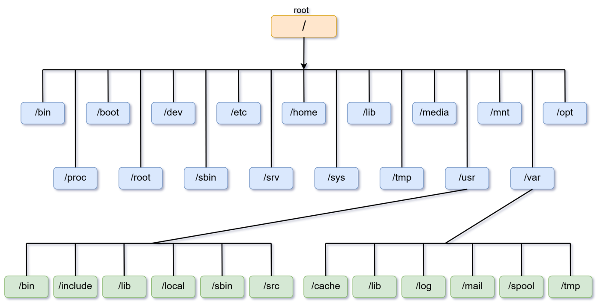
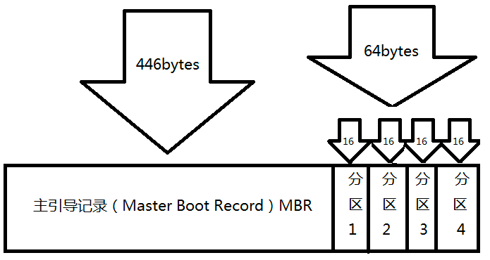
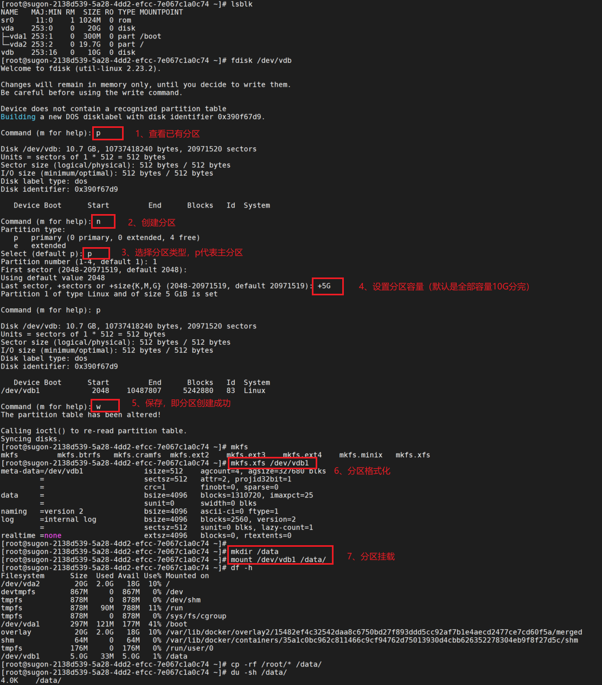
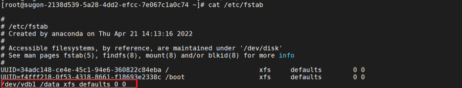

# Linux 操作系统

## Linux 简介

Linux 是一款广泛使用的开源操作系统，全称 GNU/Linux，与 Windows、macOS 操作系统一起被称为“三大操作系统”。

在 GNU/Linux 系统中，Linux 是内核组件，其余组件则由 GNU 项目开发，包括编译器、调试器、文本编辑器、Shell 终端、图形界面等。

Linux 操作系统的设计灵感来源于 UNIX 操作系统，支持多用户、多任务，并且是自由和开源的。这意味着，用户拥有对 Linux 操作系统的所有控制权限，使得 Linux 成为计算机黑客和极客的理想选择。

## Linux 发行版

从技术上说，Linux 只是一个符合 POSIX 标准的内核，还不是一个完整的操作系统。除了 Linux 内核，一个典型的桌面操作系统通常还包括一个 Shell 交互界面、一些基础的工具和库、附加的软件和文档，以及窗口系统、窗口管理器等。这样一个完整的操作系统就被称为“Linux 发行版”（distribution，简称 distro）。

Linux 的发行版本可以大体分为两类，一类是商业公司维护的发行版本，一类是社区组织维护的发行版本。前者以著名的Redhat（RHEL）为代表，后者以 Debian 为代表。

- Redhat 系列包括 RHEL、Fedora Core（由原来的 Redhat 桌面版本发展而来，免费版本）、CentOS（RHEL的社区克隆版本，免费）等
- Debian 系列包括 Debian 和Ubuntu
- 在国产 Linux 发行版方面，比较著名的有中科方德、麒麟 Linux、OpenEuler、Anolis OS 等发行版

# Linux 文件系统

## 一切皆文件

“一切皆是文件”是 Unix/Linux 的基本哲学之一，它是指 Linux 系统中的所有的一切都可以通过文件的方式访问、管理，即使不是文件，也以文件的形式来管理。例如硬件设备、进程、套接字等都抽象成伪文件，使用统一的用户接口，虽然文件类型各不相同，但是对其提供的却是同一套操作。

在 Linux 中共有 7 种类型的文件，使用了不同的字符来加以区分，其中伪文件并不占用磁盘空间：

| 文件类型标识  | 文件类型                     |
| ------------- | ---------------------------- |
| `-`           | 普通文件                     |
| `d`           | 目录文件                     |
| `l`           | 符号链接                     |
| `c`（伪文件） | 字符设备（character device） |
| `b`（伪文件） | 块设备（block device）       |
| `s`（伪文件） | 套接字文件（socket）         |
| `p`（伪文件） | 命名管道文件（pipe）         |

## 目录结构

在Windows操作系统中，想要找到一个文件，要依次进入该文件所在的磁盘分区（也叫盘符），然后再进入该分区下的具体目录，最终找到这个文件。但是在Linux系统中并不存在C、D、E、F等盘符，**Linux系统中的一切文件都是从“根”目录（/）开始的，并按照文件系统层次标准(FHS)采用倒树状结构来存放文件，以及定义了常见目录的用途。**



Linux系统中常见的目录名称以及相应内容

| 目录名称    | 应放置文件的内容                                          |
| ----------- | --------------------------------------------------------- |
| /boot       | 开机所需文件—内核、开机菜单以及所需配置文件等             |
| /dev        | 以文件形式存放任何设备与接口                              |
| /etc        | 配置文件                                                  |
| /home       | 用户主目录                                                |
| /bin        | 存放单用户模式下还可以操作的[命令]                        |
| /lib        | 开机时用到的函数库，以及/bin与/sbin下面的命令要调用的函数 |
| /sbin       | 开机过程中需要的命令                                      |
| /media      | 用于挂载设备文件的目录                                    |
| /opt        | 放置第三方的软件                                          |
| /root       | 系统管理员的家目录                                        |
| /srv        | 一些网络服务的数据文件目录                                |
| /tmp        | 任何人均可使用的“共享”临时目录                            |
| /proc       | 虚拟文件系统，例如系统内核、进程、外部设备及网络状态等    |
| /usr/local  | 用户自行安装的软件                                        |
| /usr/sbin   | Linux系统开机时不会使用到的软件/命令/[脚本]               |
| /usr/share  | 帮助与说明文件，也可放置共享文件                          |
| /var        | 主要存放经常变化的文件，如日志                            |
| /lost+found | 当文件系统发生错误时，将一些丢失的文件片段存放在这里      |

## 文件权限

文件的读、写、执行权限可以简写为rwx，亦可分别用数字4、2、1来表示，文件所有者，所属组及其他用户权限之间无关联。


在上图中，包含了文件的类型、访问权限、所有者（属主）、所属组（属组）、占用的磁盘大小、修改时间和文件名称等信息。

通过分析可知，该文件的类型为普通文件，所有者权限为可读、可写（rw-），所属组权限为可读（r--），除此以外的其他人也只有可读权限（r--），文件的磁盘占用大小是34298字节，最近一次的修改时间为4月2日的凌晨23分，文件的名称为install.log。

## Proc 文件系统

Linux 系统上的 /proc 目录是一种文件系统，即 proc 文件系统（procfs），它以文件系统的方式为用户提供访问系统内核数据的操作接口。proc 文件系统是一种内核和内核模块用来向进程（process）发送信息的机制，因此被称为 proc。

与其它常见的文件系统不同的是，proc 是一种伪文件系统（也即虚拟文件系统），它只存在于内存当中，因此它会在系统启动时创建并挂载到 /proc 目录，在系统关闭时卸载并释放。

下面是linux服务器上 /proc 的挂载信息

```sh
[root@master03 ~]# mount |grep proc
proc on /proc type proc (rw,nosuid,nodev,noexec,relatime)
systemd-1 on /proc/sys/fs/binfmt_misc type autofs (rw,relatime,fd=30,pgrp=1,timeout=0,minproto=5,maxproto=5,direct,pipe_ino=104535)
```

/proc 目录中的文件及其说明如下：

| 文件                  | 描述                                                         |
| --------------------- | ------------------------------------------------------------ |
| /proc/buddyinfo       | 每个内存区中的每个 order 有多少块可用，和内存碎片问题有关。  |
| /proc/cmdline         | 启动时传递给 kernel 的参数信息。                             |
| **/proc/cpuinfo**     | CPU 信息。                                                   |
| /proc/crypto          | 内核可用的加密模块及细节。                                   |
| **/proc/devices**     | 已装载的设备（包括字符设备和块设备）。                       |
| **/proc/diskstats**   | 每个逻辑磁盘设备的信息（包括设备编号） 。                    |
| /proc/dma             | 已注册使用的 ISA DMA 通道列表。                              |
| /proc/execdomains     | Linux 内核当前支持的 execution domains。                     |
| /proc/fb              | 帧缓冲设备列表，包括数量和控制它的驱动。                     |
| **/proc/filesystems** | 内核当前支持的文件系统类型。                                 |
| /proc/interrupts      | 当前系统使用的中断信息。                                     |
| /proc/iomem           | 每个物理设备当前在系统内存中的映射。                         |
| /proc/ioports         | 一个设备的输入输出所使用的注册端口范围。                     |
| /proc/kcore           | 代表系统的物理内存，存储为核心文件格式。                     |
| /proc/kmsg            | 等待内核输出信息，可以通过 /sbin/klogd 或 /bin/dmesg 来处理。 |
| /proc/loadavg         | 依据过去一段时间内 CPU 和 IO 的状态得出的负载形态，与 uptime 命令有关。 |
| /proc/locks           | 内核锁住的文件列表。                                         |
| /proc/mdstat          | 多硬盘，RAID 配置信息（md=multiple disks）。                 |
| **/proc/meminfo**     | 内核管理内存的信息。                                         |
| /proc/misc            | 在杂项设备（设备号为10）上注册的驱动。                       |
| **/proc/modules**     | 所有装载到内核的模块列表。                                   |
| /proc/mounts          | 系统当前的所有挂载信息。                                     |
| /proc/mtrr            | 系统使用的 Memory Type Range Registers（MTRRs）。            |
| /proc/partitions      | 磁盘分区中的块分配信息。                                     |
| /proc/slabinfo        | 系统中所有活动的 slab 缓存信息。                             |
| /proc/stat            | 所有的 CPU 活动信息。                                        |
| /proc/sysrq-trigger   | 该文件是只写的。使用 echo 命令来写这个文件的时候，远程 root 用户可以执行大多数的系统请求关键命令，就好像在本地终端执行一样。要写入这个文件，需要把 /proc/sys/kernel/sysrq 设置为1，开启 SysRq（Magic System Request Key）功能。 |
| /proc/uptime          | 系统自开机以来的运行时间。                                   |
| /proc/schedstat       | kernel 调度器的统计信息。                                    |
| /proc/swaps           | 交换区域的使用情况。                                         |
| **/proc/version**     | 当前 Linux 内核版本、发行版号、gcc 版本号、更新时间等信息。  |
| /proc/vmcore          | 内核 panic 时的内存映像。                                    |
| /proc/vmstat          | 虚拟内存统计信息。                                           |
| /proc/zoneinfo        | 显示内存空间的统计信息，对分析虚拟内存行为很有用。           |

# Linux 物理设备

## 设备命名规则

系统内核中的udev设备管理器会自动把硬件名称规范起来，目的是让用户通过设备文件的名字可以猜出设备大致的属性以及分区信息等；这对于陌生的设备来说特别方便。

**常见的硬件设备及其文件名称**

| 硬件设备      | 文件名称           |
| ------------- | ------------------ |
| IDE设备       | /dev/hd[a-d]       |
| SCSI/SATA/U盘 | /dev/sd[a-z]       |
| virtio设备    | /dev/vd[a-z]       |
| 软驱          | /dev/fd[0-1]       |
| 打印机        | /dev/lp[0-15]      |
| 光驱          | /dev/cdrom         |
| 鼠标          | /dev/mouse         |
| 磁带机        | /dev/st0或/dev/ht0 |

一般的硬盘设备都会是以“/dev/sd”开头。一台主机上可以有多块硬盘，因此系统采用a～p来代表16块不同的硬盘（默认从a开始分配）。而且硬盘的分区编号也很有讲究：**主分区或扩展分区的编号从1开始，到4结束；逻辑分区从编号5开始**。

## **硬盘基础知识**

硬盘设备是由大量的扇区组成的，每个扇区的容量为512字节。

- 其中第一个扇区最重要，它里面保存着主引导记录与分区表信息

- 就第一个扇区来讲，主引导记录需要占用446字节，分区表为64字节，结束符占用2字节；其中分区表每记录一个分区信息就需要16字节，这样一来最多只有4个分区信息可以写到第一个扇区中，这4个分区就是4个主分区



- 为了解决分区个数不够的问题，用户一般会选择使用3个主分区加1个扩展分区的方法，然后在扩展分区中创建出数个逻辑分区，从而来满足多分区（大于4个）的需求


## 硬盘设备使用

### 方法一：分区 → 格式化 → 挂载

使用步骤：

1. 输入 `n` 创建新分区。
2. 输入分区类型（如 `primary` 或 `logical`）。
3. 设置起始和结束扇区（通常直接按回车使用默认值）。
4. 输入 `w` 保存分区表并退出。
5. 格式化分区
6. 挂载分区
7. 开机自动挂载（可选）





### **方法二：直接格式化→ 挂载**

这种方法适合特定用途，例如非系统盘的大容量存储。

```sh
sudo mkfs.ext4 /dev/sdb
sudo mount /dev/sdb /mnt/data
```

### **方法三：使用 LVM（逻辑卷管理器）**

如果需要灵活管理硬盘容量，可以使用 LVM：初始化 → 创建卷组 → 创建逻辑卷 → 格式化 → 挂载

```sh
# 初始化硬盘
sudo pvcreate /dev/sdb
# 创建卷组
sudo vgcreate my_vg /dev/sdb
# 创建逻辑卷
sudo lvcreate -L 50G -n my_lv my_vg
#格式化卷
sudo mkfs.ext4 /dev/my_vg/my_lv
#挂载卷
sudo mount /dev/my_vg/my_lv /mnt/data
```

### **方法四：作为裸设备使用**

某些特殊用途（如数据库或存储系统）可能直接使用裸设备，无需分区和格式化。例如数据库（如 MySQL）可以直接将 `/dev/sdb` 作为数据存储路径。

## 硬盘RAID

RAID技术的设计初衷是减少因为采购硬盘设备带来的费用支出，但是与数据本身的价值相比较，**现代企业更看重的则是RAID技术所具备的冗余备份机制以及带来的硬盘吞吐量的提升**。也就是说，RAID不仅降低了硬盘设备损坏后丢失数据的几率，还提升了硬盘设备的读写速度，所以它在绝大多数运营商或大中型企业中得以广泛部署和应用。

### RAID 特性

- **协同工作**：多块硬盘通过一定的 RAID 级别协同工作。
- **性能提升**：通过并行读写提高数据吞吐量（如 RAID 0、RAID 10）。
- **可靠性增强**：通过数据冗余提高数据安全性（如 RAID 1、RAID 5）。
- **容量组合**：多块硬盘的容量可以组合成一个逻辑卷。
- **应用场景**：适用于服务器、企业级存储、大型数据库系统等。

### 常见的 RAID 级别（硬盘阵列）

| **RAID 级别** | **特点**                                                     |
| ------------- | ------------------------------------------------------------ |
| RAID 0        | 数据条带化，性能提升，但无数据冗余，一块硬盘损坏即丢失全部数据。 |
| RAID 1        | 数据镜像，两块硬盘存储相同数据，可靠性高但容量利用率低。     |
| RAID 5        | 分布式校验数据，性能和可靠性兼顾，需要至少 3 块硬盘。        |
| RAID 10       | RAID 1+0，结合镜像和条带化，性能和可靠性均高，需要至少 4 块硬盘。 |

### **配置 RAID**

1. 硬件支持 RAID

   - 使用 RAID 控制卡或服务器主板内置的硬件 RAID 功能。

2. 软件实现 RAID

   - 通过 Linux 的 `mdadm` 工具配置软件 RAID。

   - 示例：

     ```sh
     sudo mdadm --create /dev/md0 --level=5 --raid-devices=3 /dev/sd[b-d]
     ```

## 网卡Bond

所谓bond，就是把多个物理网卡绑定成一个逻辑上的网卡，使用同一个IP工作，有时服务器带宽不够了也可以用作增加带宽。

借助于网卡bond技术，不仅可以提高网络传输速度，更重要的是，还可以确保在其中一块网卡出现故障时，依然可以正常提供网络服务。

网卡绑定mode共有七种(0~6) bond0、bond1、bond2、bond3、bond4、bond5、bond6。常用的有三种：

- mode=0（平衡负载模式）：平时两块网卡均工作，且自动备援，但需要在与服务器本地网卡相连的交换机设备上进行端口聚合来支持绑定技术。
- mode=1（自动备援模式）：平时只有一块主网卡工作，在它故障后自动替换为另外的网卡。
- mode=6（平衡负载模式）：平时两块网卡均工作，且自动备援，无须交换机设备提供辅助支持。

### 1.Bond准备工作

首先要确定服务器上的网卡规划用途，以及哪些网卡已插网线，一般是有两块网卡对应两根网线，分别连接不同的交换机。

```sh
[root@master01 network-scripts]# ethtool p4p2
Settings for p4p2:
        Supported ports: [ FIBRE ]
        Supported link modes:   1000baseKX/Full
                                10000baseKR/Full
                                25000baseCR/Full
                                25000baseKR/Full
                                25000baseSR/Full
        Supported pause frame use: Symmetric
        Supports auto-negotiation: Yes
        Supported FEC modes: None BaseR
        Advertised link modes:  1000baseKX/Full
                                10000baseKR/Full
                                25000baseCR/Full
                                25000baseKR/Full
                                25000baseSR/Full
        Advertised pause frame use: Symmetric
        Advertised auto-negotiation: Yes
        Advertised FEC modes: None
        Speed: 10000Mb/s
        Duplex: Full
        Port: FIBRE
        PHYAD: 0
        Transceiver: internal
        Auto-negotiation: on
        Supports Wake-on: d
        Wake-on: d
        Current message level: 0x00000004 (4)
                               link
        Link detected: yes
```

> ethtool查看网卡信息，`Link detected：yes`表示有网线插入；
>
> 如果`Link detected:no` 的话，尝试用`ifup ethxxx`，如果依然为no的话，才能说明此网卡确实没有网线插入。

### 2.网卡Bond配置

方法一：命令行配置

```sh
# 创建一个名为 storagepub 的网卡绑定接口，类型为 bond，模式为 802.3ad
ip link add storagepub type bond mode 802.3ad xmit_hash_policy layer3+4

# 关闭网卡
ip link set ens4np1 down

# 将网卡 ens4np1 加入到名为 storagepub 的绑定接口，成为其从属（slave）设备
ip link set ens4np1 master storagepub

# 启用网卡
ip link set ens4np1 up

# 启用绑定接口 storagepub，使其可用
ip link set storagepub up

# 查看绑定接口 storagepub 的详细信息，包括模式、成员网卡、负载均衡策略等。
cat /proc/net/bonding/storagepub
```

方法二：修改bond网卡的配置文件

```sh
[root@master01 network-scripts]# cat ifcfg-bond-storagepub
DEVICE=storagepub
BONDING_OPTS="mode=4 miimon=100 xmit_hash_policy=1"
TYPE=Bond
BONDING_MASTER=yes	# 表示该设备是绑定主设备（master）。
BOOTPROTO=static	# 使用静态 IP 配置（不依赖 DHCP）
PEERDNS=no
IPV4_FAILURE_FATAL=no
IPV6INIT=no	# 不启用 IPv6 配置
NAME=bond-storagepub
ONBOOT=yes
IPADDR=172.22.88.177
NETMASK=255.255.255.0

[root@master01 network-scripts]# cat ifcfg-p4p2
TYPE=Ethernet
BOOTPROTO=static
DEVICE=p4p2
ONBOOT=yes
MASTER=storagepub	# 指定绑定接口的主设备为 storagepu。
SLAVE=yes	# 指定该网卡是绑定接口的从设备（slave）
```

### 3.重启网络验证

```
[root@master01 ~]# systemctl restart network

[root@master01 ~]# ip a |grep storagepub
11: p4p2: <BROADCAST,MULTICAST,SLAVE,UP,LOWER_UP> mtu 1500 qdisc mq master storagepub state UP group default qlen 1000
19: storagepub: <BROADCAST,MULTICAST,MASTER,UP,LOWER_UP> mtu 1500 qdisc noqueue state UP group default qlen 1000
    inet 172.22.88.177/24 brd 172.22.88.255 scope global noprefixroute storagepub
```

