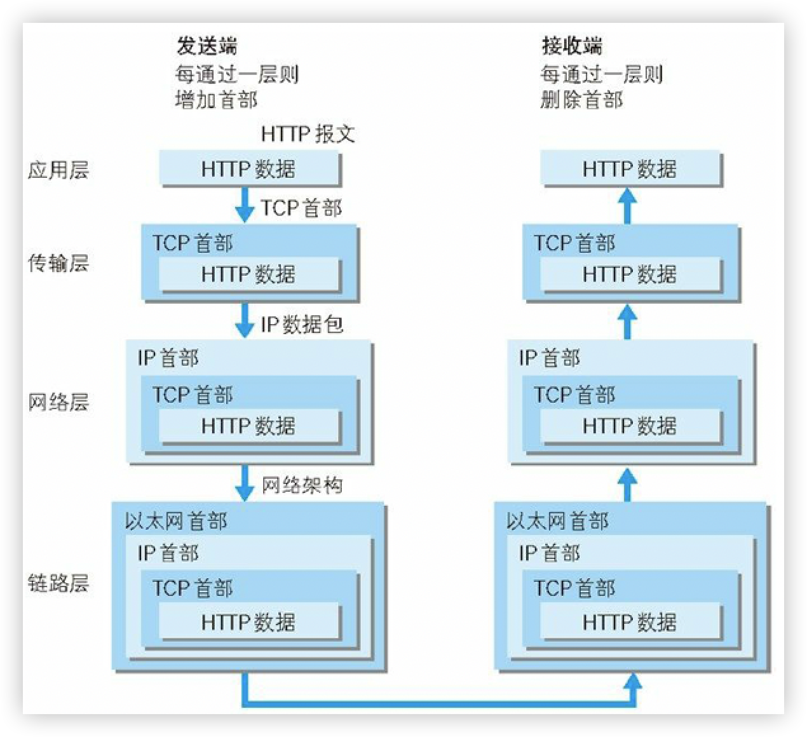
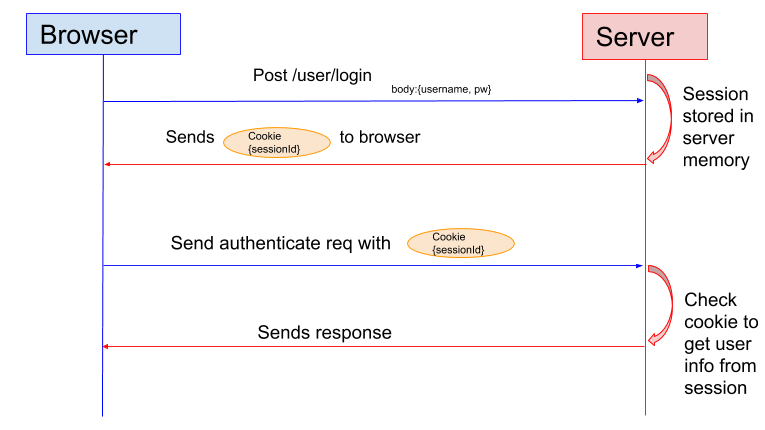
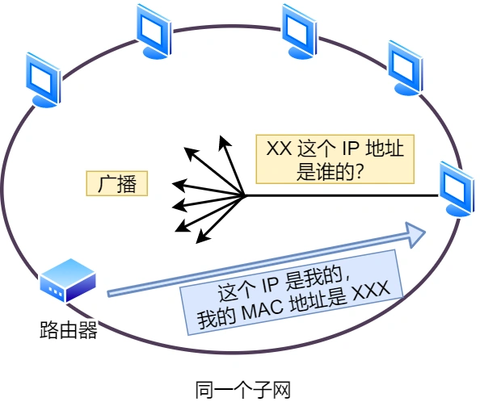

# TCP/IP 模型

| TCP/IP 层级 | 对应 OSI 层级                   | 功能描述                   | 核心协议                        |
| ----------- | ------------------------------- | -------------------------- | ------------------------------- |
| 应用层      | L5-L7（会话层、表示层、应用层） | 面向用户，处理具体应用需求 | HTTP、FTP、DNS、SMTP、WebSocket |
| 传输层      | L4                              | 确保数据“端到端”可靠传输   | TCP、UDP                        |
| 网络层      | L3                              | 路由寻址                   | IP、ICMP、ARP、BGP              |
| 链路层      | L1-L2（数据链路层、物理层）     | 物理介质传输比特流         | 以太网、Wi-Fi、MAC 地址         |

## 应用层

**功能**：直接和用户打交道，处理具体应用需求。
**类比**：你要寄一封信，信的内容可能是文字、图片或视频——应用层决定了这封信的“用途”。
**例子**：

- 浏览器访问网站 → HTTP协议
- 发送邮件 → SMTP协议
- 文件传输 → FTP协议

**核心**：定义数据格式，并通过协议告诉对方如何处理这些数据  

## 传输层

**功能**：确保数据可靠地“端到端”传输，解决“怎么送”的问题。
**类比**：快递包装和确保送达。
**例子**：

- **TCP协议**：像“挂号信”，要求对方签收。如果包裹丢失会重发（适合网页、文件传输）。
- **UDP协议**：像“普通平邮”，不管对方是否收到（适合直播、视频通话，速度优先）。

**核心**：通过“端口号”区分不同的应用程序（比如80端口给网页，53端口给DNS查询）。

## 网络层

**功能**：规划数据传输的“路线”，解决“往哪送”的问题。
**类比**：快递中转站根据地址决定包裹走哪条路线，跨城市甚至跨国运输。
**例子**：

- **IP协议**：给每台设备分配唯一地址（如`192.168.1.1`），类似快递单上的收件人地址。
- **路由器**：像中转站，根据IP地址选择最佳路径。

**核心**：通过IP地址定位设备，并动态调整传输路径（比如避开拥堵路段）。  

## **链路层**

**功能**：负责“物理连接”，解决“最后一公里”的传输。
**类比**：快递员骑着电动车，把包裹从你家门口送到附近的中转站。
**例子**：

- **Wi-Fi**：通过无线信号传输数据。
- **以太网**：通过网线传输数据。
- **MAC地址**：设备的物理编号（如`00:1A:2B:3C:4D:5E`），类似快递员的工号。

**核心**：将数据转为电信号、光信号或无线电波，通过物理设备（网卡、网线）传输。

## 总结

**TCP/IP 网络协作过程示例（发一封邮件）**

1. **应用层**：你写邮件内容（使用SMTP协议）
2. **传输层**：TCP将邮件拆分成数据段，添加端口号
3. **网络层**：IP协议给数据段贴上目标IP地址，规划传输路线。
4. **链路层**：通过Wi-Fi将数据转为电信号，传给路由器
5. **接收端反向操作**：链路层接收信号 → 网络层验证IP → 传输层重组数据 → 应用层显示邮件

> 网络接口层的传输单位是帧（frame），IP 层的传输单位是包（packet），TCP 层的传输单位是段（segment），HTTP 的传输单位则是消息或报文（message）。但这些名词并没有什么本质的区分，可以统称为数据包。

# 常见网络设备

| 设备           | 工作层级 | 功能                                                         |
| -------------- | -------- | ------------------------------------------------------------ |
| **集线器**     | L1       | 广播数据包到所有端口，无智能过滤                             |
| **交换机**     | L2       | 基于 MAC 地址转发数据帧（Frame），支持 VLAN 划分             |
| **路由器**     | L3       | 基于 IP 地址路由数据包（Packet），隔离广播域，支持 NAT 和防火墙 |
| **三层交换机** | L3       | 结合交换机和路由器的功能，高速转发并支持路由策略             |

**交换机的工作流程**

1. 当交换机从某个端口收到一个数据包，它先读取包头中的源MAC地址，这样它就知道源MAC地址的机器是连在哪个端口上；
2. 再去读取包头中的目的MAC地址，并在地址表中查找相应的端口；
3. 如表中有与这目的MAC地址对应的端口，把数据包直接复制到这端口上.

**三层交换机**

三层交换机（L3 Switch）通过引入路由功能，主要解决了局域网中网段划分之后，网段中子网必须依赖路由器进行管理的局面，解决了传统路由器低速、复杂所造成的网络延迟等瓶颈问题，提高了数据包转发的效率。

其原理是：三层交换机在对第一个数据包进行路由后，它将会产生一个MAC地址与IP地址的映射表，当同样的数据包再次通过时，将根据此表直接通过二层交换转发。

假设两个使用IP协议的主机A、B通过三层交换机进行通信，主机A在开始发送时，把自己的IP地址与主机B的IP地址比较，判断主机B是否与自己在同一子网内。

- 若两个主机在同一子网内，则直接进行二层的转发。
- 若两个主机不在同一子网内，主机A要向“默认网关”的IP地址广播出一个ARP请求，“默认网关”的IP地址其实是三层交换机的三层交换模块。
  - 如果三层交换模块在以前的通信过程中已经知道主机B的MAC地址，则向主机A回复B的MAC地址。
  - 如果三层交换模块不知道主机B的MAC地址，三层交换模块根据路由信息向主机B广播一个ARP请求，主机B得到此ARP请求后向三层交换模块回复其MAC地址，三层交换模块保存此地址并回复给主机A,同时将主机B的MAC地址发送到二层交换引擎的MAC地址表中。从这以后，当A向B发送的数据包便全部交给二层交换处理，信息得以高速交换。

# HTTP 协议

## 基本概念

HTTP 是超文本传输协议，也就是**HyperText Transfer Protocol**。

到目前为止，HTTP 常见到版本有 HTTP/1.1，HTTP/2.0，HTTP/3.0，不同版本的 HTTP 特性是不一样的。

## **常见状态码**

`1xx` 类状态码属于**提示信息**，是协议处理中的一种中间状态，实际用到的比较少。

- 「**101 Switching Protocols**」协议切换，服务器已经理解了客户端的请求，并将通过 Upgrade 消息头通知客户端采用不同的协议来完成这个请求。比如切换到一个实时且同步的协议（如 WebSocket）以传送利用此类特性的资源。

`2xx` 类状态码表示服务器**成功**处理了客户端的请求。

- 「**200 OK**」是最常见的成功状态码，表示一切正常。如果是非 `HEAD` 请求，服务器返回的响应头都会有 body 数据。
- 「**204 No Content**」也是常见的成功状态码，与 200 OK 基本相同，但响应头没有 body 数据。
- 「**206 Partial Content**」是应用于 HTTP 分块下载或断点续传，表示响应返回的 body 数据并不是资源的全部，而是其中的一部分，也是服务器处理成功的状态。

`3xx` 类状态码表示客户端请求的资源发生了变动，需要客户端用新的 URL 重新发送请求获取资源，也就是**重定向**。

- 「**301 Moved Permanently**」表示永久重定向，说明请求的资源已经不存在了，需改用新的 URL 再次访问。
- 「**302 Found**」表示临时重定向，说明请求的资源还在，但暂时需要用另一个 URL 来访问。

- 「**304 Not Modified**」不具有跳转的含义，表示资源未修改，重定向已存在的缓冲文件，也称缓存重定向，也就是告诉客户端可以继续使用缓存资源，用于缓存控制。

`4xx` 类状态码表示客户端发送的**报文有误**，服务器无法处理，也就是错误码的含义。

- 「**400 Bad Request**」表示客户端请求的报文有错误，但只是个笼统的错误。
- 「**401 Unauthorized**」表示客户端请求没有进行验证或验证失败。
- 「**403 Forbidden**」表示服务器禁止访问资源，并不是客户端的请求出错。
- 「**404 Not Found**」表示请求的资源在服务器上不存在或未找到。

`5xx` 类状态码表示客户端请求报文正确，但是**服务器处理时内部发生了错误**，属于服务器端的错误码。

- 「**500 Internal Server Error**」与 400 类似，是个笼统通用的错误码。
- 「**501 Not Implemented**」表示请求的方法不被服务器支持。
- 「**502 Bad Gateway**」表示作为网关或者代理的服务器尝试执行请求时，从上游服务器接收到无效的响应。
- 「**503 Service Unavailable**」表示服务器尚未处于可以接受请求的状态，类似“网络服务正忙，请稍后重试”的意思。
- 「**504 Gateway Timeout**」表示作为网关或者代理的服务器无法在规定的时间内，从上游服务器获得想要的响应。

## 相关问题

### HTTP/1.1 的优点有哪些？

***1. 简单***

HTTP 基本的报文格式就是 `header + body`，头部信息也是 `key-value` 简单文本的形式，**易于理解**，降低了学习和使用的门槛。

***2. 灵活和易于扩展***

HTTP 协议里的各类请求方法、URI/URL、状态码、头字段等每个组成要求都没有被固定死，都允许开发人员**自定义和扩充**。

同时 HTTP 由于是工作在应用层（ `OSI` 第七层），则它**下层可以随意变化**，比如：

- HTTPS 就是在 HTTP 与 TCP 层之间增加了 SSL/TLS 安全传输层；
- HTTP/1.1 和 HTTP/2.0 传输协议使用的是 TCP 协议，而到了 HTTP/3.0 传输协议改用了 UDP 协议。

***3. 应用广泛和跨平台***

互联网发展至今，HTTP 的应用范围非常的广泛，从台式机的浏览器到手机上的各种 APP，HTTP 的应用遍地开花，同时天然具有**跨平台**的优越性。

### HTTP/1.1 的缺点有哪些？

HTTP 协议里有优缺点一体的双刃剑，分别是「**无状态**、***队头阻塞***」，同时还有一大缺点「**不安全**」。

**1.无状态**

HTTP协议的无状态特性意味着服务器不会记录客户端的请求历史，每个请求都被视为独立且无关的。这一设计虽然简化了服务器实现并提升了处理效率，但也带来了以下主要问题：

- 无法直接识别客户端：服务器无法直接识别客户端，每次都要进行用户身份验证和授权，导致用户登录、个性化推荐等关联功能难以实现。
- 重复传输大量信息：每个请求都要重复传输大量相同的信息，如Host、Authentication、Cookies等元数据，增加了数据传输量和服务器的处理负担。

**2.队头拥塞**

「请求 - 应答」的模式加剧了 HTTP 的性能问题。

因为当顺序发送的请求序列中的一个请求因为某种原因被阻塞时，在后面排队的所有请求也一同被阻塞了，会招致客户端一直请求不到数据，这也就是「**队头阻塞**」。

**3.不安全**

HTTP 比较严重的缺点就是不安全：

- 通信使用明文（不加密），内容可能会被窃听。
- 不验证通信方的身份，因此有可能遭遇伪装。
- 无法证明报文的完整性，所以有可能已遭篡改。

### 怎么解决 HTTP 请求无状态带来的问题？

#### 1. **Cookie机制**

- **原理**：服务器通过响应头的`Set-Cookie`字段向客户端浏览器写入键值对数据，客户端后续请求时自动携带这些Cookie，从而使服务器能够识别并跟踪用户会话。
- **局限**：
  - 数据存储在客户端，存在安全风险（如XSS攻击窃取Cookie）。
  - 单个域名下Cookie大小受限（通常4KB），且每次请求均会携带，可能影响性能

#### 2. **Session机制**

- **原理**：服务器创建唯一Session ID并将其发送给客户端（通常通过Cookie传递），并将用户状态存储在服务端（如内存、数据库）。在后续的请求中，客户端会携带Session ID，服务器根据Session ID在服务器端检索对应的会话状态。
- **优势**：状态数据存储在服务端，安全性较高，适合保存敏感信息（如用户权限）。
- **局限**：
  - 服务器需维护Session存储（比如会话同步），高并发场景下可能产生性能瓶颈，且在分布式系统中会限制负载均衡的能力。
  - Session ID依赖Cookie传递，若客户端禁用Cookie则需通过URL重写实现。

#### 3. **Token机制**

- **原理**：服务器生成包含用户信息的令牌（如JWT），客户端在请求头（如`Authorization`）中携带该令牌。客户端每次请求时携带该Token，服务器验证后获取用户信息，服务器无需存储会话数据。
- **优势**：
  - 无状态设计减轻服务器压力，适合分布式系统。
  - 支持跨域场景和多种客户端（如移动端App）
- **局限**：令牌需定期更新以防止泄露，且需处理令牌吊销问题

#### 4. **其他优化技术**

- **持久连接（Keep-Alive）** ：HTTP/1.1默认启用，通过复用TCP连接减少握手开销，间接提升状态相关请求的效率（虽不直接解决无状态问题）。
- **缓存机制**：利用强制缓存（如`Cache-Control`）和协商缓存（如`ETag`）减少重复数据传输，缓解无状态导致的冗余问题

### HTTP 与 HTTPS 有哪些区别？

- HTTP 是超文本传输协议，信息是明文传输，存在安全风险的问题。HTTPS 则解决 HTTP 不安全的缺陷，在 TCP 和 HTTP 网络层之间加入了 SSL/TLS 安全协议，使得报文能够加密传输（通常是对称加密数据）。
- HTTP 连接建立相对简单，TCP 三次握手之后便可进行 HTTP 的报文传输。而 HTTPS 比 HTTP 多了 SSL/TLS 的握手过程，才可进入加密报文传输。
- 两者的默认端口不一样，HTTP 默认端口号是 80，HTTPS 默认端口号是 443。
- HTTPS 协议需要向 CA（证书权威机构）申请数字证书，来保证服务器的身份是可信的。

# **TCP 协议**

TCP 的全称叫传输控制协议（*Transmission Control Protocol*），大部分应用使用的正是 TCP 传输层协议，比如 HTTP 应用。

应用需要传输的数据可能会非常大，当数据包大小超过 MSS（TCP 最大报文段长度） ，就要将**数据包分块**，这样即使中途有一个分块丢失或损坏了，只需要重新发送这一个分块，而不用重新发送整个数据包。在 TCP 协议中，我们把每个分块称为一个 TCP 段（*TCP Segment*）。

一台设备上可能会有很多应用在接收或者传输数据，因此需要用一个编号将应用区分开来，这个编号就是**端口**。比如 80 端口通常是 Web 服务器用的，22 端口通常是远程登录服务器用的。而对于浏览器（客户端）中的每个标签栏都是一个独立的进程，操作系统会为这些进程分配临时的端口号。

由于传输层的报文中会携带端口号，因此接收方可以识别出该报文是发送给哪个应用。

**特点**：面向连接、可靠传输（流量控制、超时重传、拥塞控制）  、基于字节流

# **UDP 协议**

UDP 相对来说就很简单，简单到只负责发送数据包，不保证数据包是否能抵达对方，但它实时性相对更好，传输效率也高。当然，UDP 也可以实现可靠传输，把 TCP 的特性在应用层上实现就可以，不过要实现一个商用的可靠 UDP 传输协议，也不是一件简单的事情。

**特点**：无连接、不可靠、低延迟

# IP 协议

网络层最常使用的是 IP 协议（*Internet Protocol*），IP 协议会将传输层的报文作为数据部分，再加上 IP 报头组装成 IP 报文，如果 IP 报文大小超过 MTU（以太网中一般为 1500 字节）就会**再次进行分片**，得到一个即将发送到网络的 IP 报文。

IP 协议使用 **IP 地址** 来区分互联网上的每一台设备。但是一个单纯的 IP 地址，**寻址**起来还是特别麻烦，全世界那么多台设备，难道一个一个去匹配？这就产生了**子网**的概念，即寻址过程中，先要匹配找到同一个子网，才会去找对应的主机。

IP 协议另一个重要的能力就是**路由**。实际场景中，两台设备并不是用一条网线连接起来的，而是通过很多网关、路由器、交换机等众多网络设备连接起来的，那么就会形成很多条网络的路径。**路由器**寻址工作中，就是要找到目标地址的子网，找到后进而把数据包转发给对应的网络内。

# ARP 协议

**ARP（Address Resolution Protocol）**：将 IP 地址解析为 MAC 地址

计算机通常会把第一次通过 ARP 获取的 MAC 地址缓存到本地，以便下次直接从缓存中找到对应 IP 地址的 MAC 地址。既然是"缓存"表，意味着它有时效性，如果计算机或者通信设备重启的话，这张表就会清空；也就是说，如果下次需要通信，又需要进行ARP请求。

- 查看本机arp缓存记录：`arp -n`
- 删除arp条目: `arp -d 192.168.10.10`
