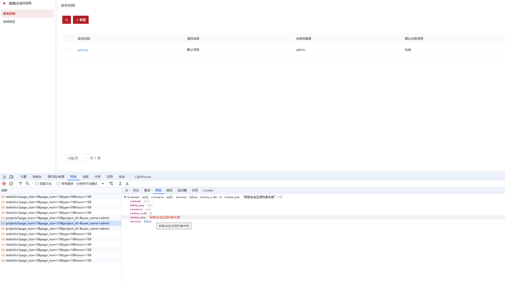
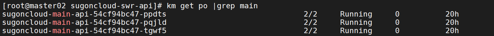
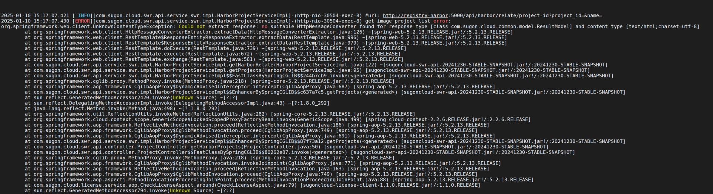
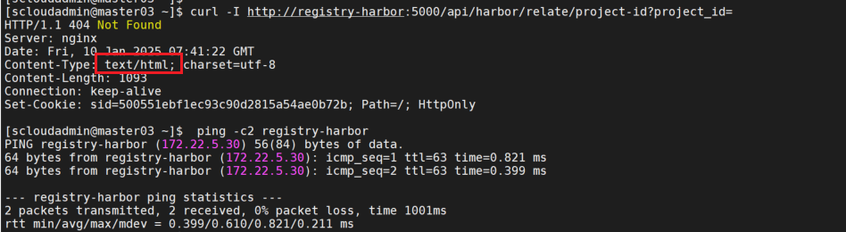
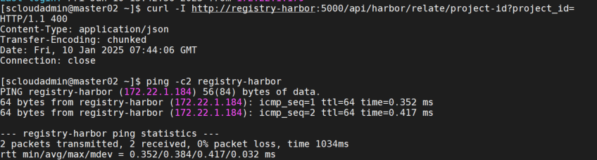

## 问题现象

**获取命令空间列表的接口报错**



## 问题分析

1、发现3次请求会出现一次失败，怀疑请求是被负载到异常的swr-api实例上。

2、查看swr的pod状态全部都是正常状态



3、继续查看swr-api的日志分析，果然在其中一个节点的实例有如下报错日志：



```java
2025-01-10 15:17:07.421 [ INFO][com.sugon.cloud.swr.api.service.swr.impl.HarborProjectServiceImpl]-(http-nio-30504-exec-8) #url: http://registry-harbor:5000/api/harbor/relate/project-id?project_id=&name=
2025-01-10 15:17:07.430 [ERROR][com.sugon.cloud.swr.api.service.swr.impl.HarborProjectServiceImpl]-(http-nio-30504-exec-8) get image project list error:
org.springframework.web.client.UnknownContentTypeException: Could not extract response: no suitable HttpMessageConverter found for response type [class com.sugon.cloud.common.model.ResultModel] and content type [text/html;charset=utf-8]
        at org.springframework.web.client.HttpMessageConverterExtractor.extractData(HttpMessageConverterExtractor.java:126) ~[spring-web-5.2.13.RELEASE.jar!/:5.2.13.RELEASE]
        at org.springframework.web.client.RestTemplate$ResponseEntityResponseExtractor.extractData(RestTemplate.java:996) ~[spring-web-5.2.13.RELEASE.jar!/:5.2.13.RELEASE]
```

请教了下ChatGPT，原因可能有如下3种情况

> 1. **请求参数为空**：
>    - 查询参数 `project_id` 和 `name` 都为空，可能是调用方法时未正确传递值。
>    - 服务端收到无效请求，返回了 HTML 格式的错误页面（通常是 400 或 500 错误页），而非预期的 JSON 格式响应。
> 2. **服务端响应格式不匹配**：
>    - 服务端返回的响应为 `text/html`，但客户端期望是 JSON 格式（例如 `application/json`）。
>    - 这可能由于：
>      - 服务端未正确配置响应内容类型。
>      - 请求本身无效，服务端返回了错误页。
> 3. **HTTP 客户端未正确处理异常**：
>    - `RestTemplate` 默认使用 `HttpMessageConverter` 转换响应。
>    - 当响应格式不匹配时，Spring 抛出 `UnknownContentTypeException`

4、该问题是偶现的接口报错，所以可以排除第一种原因。在正常和存在问题的节点，手动curl请求访问对比，截图如下：





果然存在问题的节点，curl请求response格式不符合预期，进一步发现该节点的域名映射IP被人修改成`172.22.5.30`。

5、修改域名为正确的映射IP，重启POD，使其加载新的hosts文件，问题解决！


