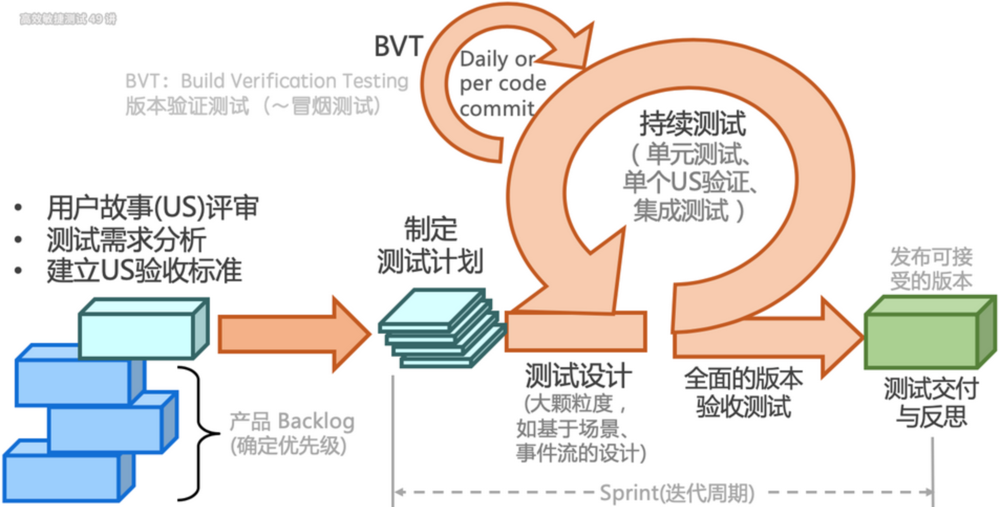

---

## 一、软件质量模型

软件质量模型是一组特性及特性之间的关系，它提供规定质量需求和评价质量的基础。

| 特性         | 核心子特性                                                   |
| ------------ | ------------------------------------------------------------ |
| **功能性**   | 适合性、准确性、互操作性、安全性                             |
| **可靠性**   | 成熟性（无故障）、容错性（出了故障不影响主功能）、可恢复性（快速恢复） |
| **易用性**   | 易理解性、易学性、易操作性                                   |
| **效率**     | 时间特性（RT≤2s）、资源利用率（CPU≤80%）                     |
| **可维护性** | 可分析性、可修改性、稳定性、易测试性                         |
| **可移植性** | 适应性（环境兼容）、易安装性、共存性（与其他系统共存）       |

---

## 二、测试思维与方法

### 1. 测试思维
- **批判性思维**：基于观察、分析、推理，持续质疑系统，优化测试设计。
- **系统性思维**：从整体到局部分析被测对象，对系统进行分解、分层（如分层测试策略）。
- **发散性思维**：多角度探索用户场景（如探索式测试中的路径多样性）。

### 2. 黑盒测试方法
| 方法           | 核心逻辑                                                     |
| -------------- | ------------------------------------------------------------ |
| **场景法**     | 模拟用户操作流程，覆盖基本流（正确流程）和备选流（异常流程）。 |
| **等价类划分** | 将输入划分为有效/无效等价类，每类选一个用例覆盖。            |
| **边界值分析** | 测试输入边界值（如最大值、最小值、空值）。                   |
| **因果图**     | 分析输入条件与输出的因果关系，生成判定表设计用例。（如）     |
| **错误猜测法** | 基于经验测试易错点，以点带面地分析共性bug（如特殊字符、越权漏洞测试）。 |

### 3. 白盒测试方法
- **语句覆盖**：每条代码至少执行一次。
- **判定覆盖**：每个分支的真/假至少执行一次。
- **条件覆盖**：每个条件表达式取真/假至少一次。
- **路径覆盖**：覆盖所有可能的执行路径（理论最高覆盖，但成本高）。

---

## 三、测试流程与敏捷实践

### 1. 传统测试流程
1. **需求分析**：明确测试范围与优先级。
2. **测试计划**：制定目标、策略、风险应对方案。
3. **测试设计**：转化为具体用例（等价类、场景法等）。
4. **测试执行**：执行自测、回归测试、缺陷跟踪。
5. **发布维护**：监控线上问题并修复。

### 2. 敏捷测试流程

敏捷测试本质是短、频、快地反馈代码提交的质量，促进持续交付。

敏捷测试的特点如下：

- **质量内建**：测试左移（参与需求评审） + 测试右移（监控生产环境）。
- **持续测试**：自动化与探索式测试结合，快速反馈代码质量。
- **分层策略**：单元测试→接口测试→UI测试，平衡效率与覆盖。

### 3. 探索式测试（ET）

探索式测试旨在将学习、测试设计、测试执行和测试结果分析做为一个循环快速地迭代，在较短的时间内（如1个小时）完成多次循环，以持续优化测试。该思路再次与敏捷软件开发小步快跑、持续反馈的理念不谋而合。

- **核心**：质疑系统存在漏洞（需求误解、实现错误、性能瓶颈等）。
- **实施步骤**：  
  1. 制定SMART目标（具体、可度量、可实现）。  
  2. 分时间盒（如50分钟）执行“设计-执行-分析”循环。  
  3. 通过测程管理（SBTM）记录测试结果并复盘。

---

## 四、性能测试

### 1. 测试类型
| 类型         | 目标                                                         |
| ------------ | ------------------------------------------------------------ |
| **负载测试** | 确定系统在满足性能指标下的最大负载，同时可找到性能下降拐点（如响应时间≤2s时支持1万用户）。 |
| **压力测试** | 测试系统在极端负载下的稳定性和可靠性（如用户量继续增加导致系统崩溃的临界点）。 |
| **容量测试** | 验证系统处理数据量/用户量的极限（如云存储最大数据量）。      |

### 2. 性能指标
| 指标              | 定义                                                         |
| ----------------- | ------------------------------------------------------------ |
| **响应时间 (RT)** | 用户发起请求到收到响应的总时间（含网络传输、后端服务处理、前端渲染）。 |
| **吞吐率（TPS）** | 每秒处理的事务数（衡量系统整体吞吐能力）。                   |
| **QPS**           | 每秒处理的请求数（公式：QPS = 并发用户数 / 平均响应时间）。  |

## 五、可靠性测试

- **定义**：验证系统在特定条件下（如长时间运行、异常输入、资源限制等）持续稳定运行的能力，确保其在设计预期内无故障运行或快速恢复。

- **核心目标**：

  - 发现系统潜在缺陷（如内存泄漏、死锁、资源耗尽）。
  - 验证系统在异常场景下的容错能力（如网络抖动、磁盘故障）。
  - 评估系统恢复时间（MTTR，Mean Time To Recovery）。

- **典型测试场景**：

  - 长时间压力测试（7×24小时运行）。
  - 模拟硬件故障（如强制关闭虚拟机节点）。
  - 异常输入测试（如无效请求、超大数据包）。

- 与高可用测试的区别：

  | 维度         | 可靠性测试                   | 高可用测试                                 |
  | :----------- | :--------------------------- | :----------------------------------------- |
  | **侧重点**   | 系统整体稳定性与容错能力     | 故障时服务的持续可用性                     |
  | **范围**     | 更广泛（覆盖所有异常场景）   | 更聚焦（仅针对故障场景的可用性）           |
  | **典型指标** | MTBF（平均无故障时间）、MTTR | SLA（如99.99%可用性）、RTO（恢复时间目标） |
  | **设计原则** | 容错设计、代码健壮性         | 冗余架构、故障转移机制                     |

## 六、测试工作总结

**测试的本质是反馈：无论测试结果如何，都是一次反馈**

测试人员的核心价值：对于任何被测系统，能够全面、高效地反馈产品的质量——发现、定位、解决。

测试充分性能否得到保证，不是测试设计的问题，而是测试需求分析问题。

测试有效性更关注如何测的问题、更关注测试过程的效率，即如何在有限的资源和时间内，最大化测试的价值。

**缺陷的产生不是玄学：**无法稳定的重现问题，就说明我们不知道问题到底是什么。采用控制变量的科学实验方法，逐一排查问题产生的唯一因素，也称最短路径。

**杀虫剂悖论** - 测试用例和自动化脚本、工具、数据等要定期更新，用同样的内容测变化的系统会越来越难发现问题

测试团队自动化体系建设的发展阶段：自动化->标准化->常态化