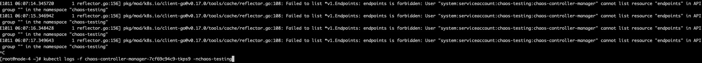
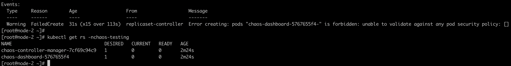
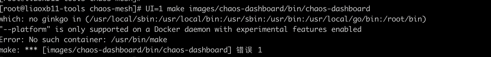
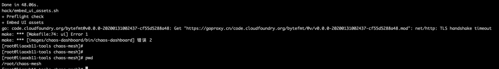
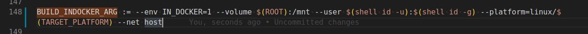
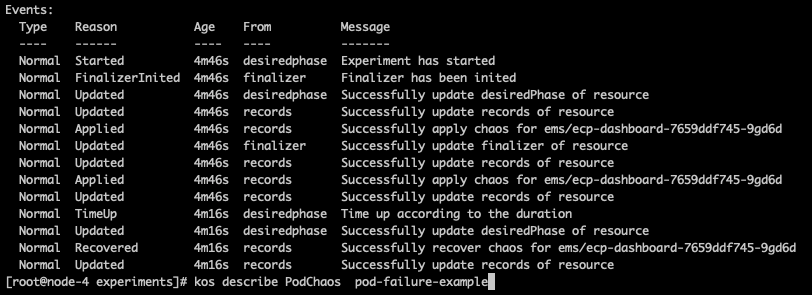
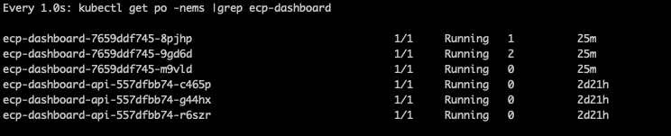
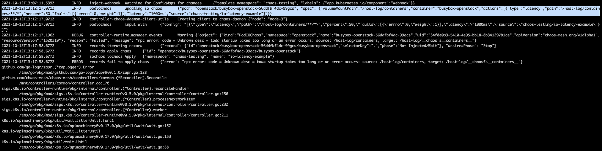

## 安装相关问题记录

### 1、没有list ep的权限



解决办法：手动部署一个rolebiding文件（为啥该文件没有自动部署？）

```yaml
apiVersion: rbac.authorization.k8s.io/v1
kind: RoleBinding
metadata:
  name: chaos-mesh-chaos-controller-manager-control-plane
  namespace: chaos-testing
roleRef:
  apiGroup: rbac.authorization.k8s.io
  kind: Role
  name: chaos-mesh-chaos-controller-manager-control-plane
subjects:
- kind: ServiceAccount
  name: chaos-controller-manager
  namespace: chaos-testing
```

### 2、chaos pod没有创建出来(偶现)

pod安全策略导致，错误如下



解决办法：手动部署一个psp文件

```yaml
apiVersion: rbac.authorization.k8s.io/v1
kind: RoleBinding
metadata:
  name: psp-chaos-testing
  namespace: chaos-testing
roleRef:
  apiGroup: rbac.authorization.k8s.io
  kind: ClusterRole
  name: psp-privileged
subjects:
- apiGroup: rbac.authorization.k8s.io
  kind: Group
  name: system:serviceaccounts:chaos-testing
```

### 3、ARM环境编译镜像遇到的问题记录

```yaml
安装docker（20+版本以上，需要支持 --load 参数）
安装golang
git clone https://github.com/chaos-mesh/chaos-mesh.git
cd chaos-mesh && UI=1 make chaos-dashboard
```

1、make过程中报--platform错误



https://thenew[stack.io/how-to-enable-docker-experimental-features-and-encrypt-your-login-credentials/](http://stack.io/how-to-enable-docker-experimental-features-and-encrypt-your-login-credentials/)

2、make过程中遇到TLSHandshakeTimeout



在arm机器上go get则正常，容器内go get mod包出现TLSHandshakeTimeout 解决办法：在Makefile文件中增加docker run参数，把容器网络改为主机网络，重新make编译即可解决。 具体问题原因链接见：

https://github.com/goproxy/goproxy.cn/issues/26



## 模拟 Pod 故障

### PodChaos 介绍

PodChaos 是 Chaos Mesh 中的一种故障类型，通过创建 PodChaos 类型的混沌实验，你可以模拟指定 Pod 或者容器发生故障的情景。目前，PodChaos 支持模拟以下故障类型：

- Pod Failure：向指定的 Pod 中注入故障，使得该 Pod 在一段时间内处于不可用的状态。
- Pod Kill：杀死指定的 Pod 。为了保证 Pod 能够成功重启，需要配置 ReplicaSet 或者类似的机制。
- Container Kill：杀死位于目标 Pod 中的指定容器。

*使用限制：Chaos Mesh 不支持向独立的 Pod 中注入故障，独立的 Pod 指未绑定到 ReplicaSet 或 Deployment 的 Pod。* 

### pod-failure 示例

> *PodFailure 是通过 Patch Pod 对象资源，用错误的镜像替换 Pod 中的镜像。Chaos 只修改了 **`containers`** 和 **`initContainers`** 的 **`image`** 字段，这也是因为 Pod 大部分字段是无法更改的。默认用于引发故障的容器镜像是 **`gcr.io/google-containers/pause:latest`**， 如果在国内环境使用，大概率会水土不服，可以将 **`gcr.io`** 替换为 **`registry.aliyuncs.com`**。*

1、将实验配置写入到文件中 pod-failure.yaml，内容示例如下：

```yaml
apiVersion: chaos-mesh.org/v1alpha1
kind: PodChaos
metadata:
  name: pod-failure-example
  namespace: chaos-testing # 指定ns下创建PodChaos实例,缺省default
spec:
  action: pod-failure
  mode: one
  duration: '30s'
  selector:
    namespaces:
      - ems
    labelSelectors:
      'application': 'ecp-dashboard'
```

2、启动该实验，Chaos Mesh 将向指定的 Pod 中注入 pod-failure 故障，将使该 Pod 在 30 秒内处于不可用的状态。

```yaml
[root@node-4 experiments]# kos apply -f pod-failure-example.yaml
podchaos.chaos-mesh.org/pod-failure-example created
[root@node-4 experiments]# kos get PodChaos
NAME                  AGE
pod-failure-example   40s
```

3、执行命令 kos describe PodChaos  pod-failure-example，可以查看到该实验的目标pod name，以及30s后实验结束并恢复故障



4、查看pod，可知目标pod出现了故障，被重启过一次



### pod-kill 示例

> *PodKill 的具体实现其实是通过调用 API Server 发送 Kill 命令。*

```yaml
apiVersion: chaos-mesh.org/v1alpha1
kind: PodChaos
metadata:
  name: pod-kill-example
  namespace: chaos-testing
spec:
  action: pod-kill
  mode: all
  #gracePeriod: 10
  selector:
    namespaces:
      - ems
    labelSelectors:
      'application': 'ecp-dashboard'
```

依据此配置示例，Chaos Mesh 将向指定的 Pod 中注入 pod-kill 故障，将使该 Pod 被杀死一次。 

Tips：

*1、实验被创建后，pod立刻就被全部kill；pod在被杀死一次后，实验立刻就结束了。*

2、`GracePeriod` 参数适用于 K8s 强制终止 Pod。例如在需要快速删除 Pod 时，我们使用 `kubectl delete pod --grace-period=0 --force` 命令。

3、如果要达到持续kill的场景，需要结合schedule来运行实验 

### container-kill 示例

> *ContainerKill 不同于 PodKill 和 PodFailure，后两个都是通过 K8s API Server 控制 Pod 生命周期，而 ContainerKill 是通过运行在集群 Node 上的 Chaos Daemon 程序操作完成。具体来说，ContainerKill 通过 Chaos Controller Manager 运行客户端向 Chaos Daemon 发起 grpc 调用。*

```yaml
apiVersion: chaos-mesh.org/v1alpha1
kind: PodChaos
metadata:
  name: container-kill
  namespace: chaos-testing
spec:
  action: container-kill
  mode: all
  duration: '60s'
  containerNames: ['ecp-dashboard']
  selector:
    namespaces:
      - ems
    labelSelectors:
      'application': 'ecp-dashboard'
```

依据此配置示例，Chaos Mesh 将向指定的 Container 中注入 container-kill 故障，将使该 Container 被杀死一次。

### 字段说明


| 参数           | 类型     | 说明                                                         | 默认值 | 是否必填 | 示例           |
| -------------- | -------- | ------------------------------------------------------------ | ------ | -------- | -------------- |
| action         | string   | 指定要注入的故障类型，仅支持 pod-failure、pod-kill、container-kill | 无     | 是       | pod-kill       |
| mode           | string   | 指定实验的运行方式，可选择的方式包括：one（表示随机选出一个符合条件的 Pod）、all（表示选出所有符合条件的 Pod）、fixed（表示选出指定数量且符合条件的 Pod）、fixed-percent（表示选出占符合条件的 Pod 中指定百分比的 Pod）、random-max-percent（表示选出占符合条件的 Pod 中不超过指定百分比的 Pod） | 无     | 是       | one            |
| value          | string   | 取决与 mode 的配置，为 mode 提供对应的参数。例如，当你将 mode 配置为 fixed-percent 时，value 用于指定 Pod 的百分比。 | 无     | 否       | 2              |
| selector       | struct   | 指定注入故障的目标 Pod，详情请参考[定义实验范围](https://chaos-mesh.org/zh/docs/define-chaos-experiment-scope/) | 无     | 是       |                |
| containerNames | []string | 当你将 action 配置为 container-kill 时，此配置为必填，用于指定注入故障的目标 container 名 | 无     | 否       | ['prometheus'] |
| gracePeriod    | int64    | 当你将 action 配置为 pod-kill 时，需要填写此项，用于指定删除 Pod 之前的持续时间 | 0      | 否       | 0              |
| duration       | string   | 指定实验的持续时间                                           | 无     | 是       | 30s            |

## 模拟压力场景

### StressChaos 介绍

> *StressChaos 类型的混沌也是由 Chaos Daemon 实施的，Controller Manager 计算好规则后就将任务下发到具体的 Daemon 上。拼装的参数如下，这些参数会组合成命令执行的参数，附加到 **`stress-ng`** 命令后执行*

Chaos Mesh 提供的 StressChaos 实验类型可用于模拟容器内压力的场景。

```yaml
apiVersion: chaos-mesh.org/v1alpha1
kind: StressChaos
metadata:
  name: stress
  namespace: chaos-testing
spec:
  mode: all
  duration: ''
  selector:
    namespaces:
      - ems
    labelSelectors:
      'application': 'ecp-dashboard'
  stressors:
    memory:
      workers: 2
      size: '1024MB'
    cpu:
      workers: 2
      load: 100
```

该实验配置会在选中容器中创建worker进程，不断分配和在内存中进行读写，最多占用 1024MB 内存和2核cpu

## 模拟文件 I/O 故障

### IOChaos 介绍

目前，IOChaos 支持模拟以下故障类型：

- latency：为文件系统调用加入延迟
- fault：使文件系统调用返回错误
- attrOverride：修改文件属性
- mistake：使文件读到或写入错误的值

### 注意事项

1. 创建 IOChaos 实验前，请确保目标 Pod 上没有运行 Chaos Mesh 的 Controller Manager。
2. IOChaos 可能会损坏你的数据，在生产环境中请**谨慎**使用

```yaml
apiVersion: chaos-mesh.org/v1alpha1
kind: IOChaos
metadata:
  name: io-latency-example
  namespace: chaos-testing
spec:
  action: latency
  mode: one
  selector:
    namespaces:
      - openstack
    labelSelectors:
      application: busybox
  volumePath: /host-log/containers
  path: '/host-log/containers/**/*'
  delay: '1000ms'
  percent: 50
  duration: '400s'
```

依据此配置示例，Chaos Mesh 将向 /host-log/containers 目录注入延迟故障，使该目录下的所有文件系统操作（包括读，写，列出目录内容等）产生 1 秒延迟。 

注入故障时遇到该问题



计划：

```yaml
apiVersion: chaos-mesh.org/v1alpha1
kind: Schedule
metadata:
  name: ovn-pod-random-kill
  namespace: chaos-testing
spec:
  concurrencyPolicy: Forbid
  historyLimit: 10
  podChaos:
    action: pod-kill
    duration: 48h
    gracePeriod: 0
    mode: one
    selector:
      labelSelectors:
        application: ovn
      namespaces:
      - openstack
  schedule: '*/30 * * * *'
  startingDeadlineSeconds: 86400
  type: PodChaos
```

## Schedule实验场景

### 每隔30分钟，随机kill符合条件的pod

```yaml
apiVersion: chaos-mesh.org/v1alpha1
kind: Schedule
metadata:
  name: ovn-pod-kill
  namespace: chaos-testing
spec:
  concurrencyPolicy: Forbid
  historyLimit: 10
  podChaos:
    action: pod-kill
    gracePeriod: 0
    mode: one
    selector:
      labelSelectors:
        application: ovn
      namespaces:
      - openstack
  schedule: '*/30 * * * *'
  type: PodChaos
```

### 每隔10分钟，指定kill container proton-server

```yaml
apiVersion: chaos-mesh.org/v1alpha1
kind: Schedule
metadata:
  name: ovn-container-kill
  namespace: chaos-testing
spec:
  concurrencyPolicy: Forbid
  historyLimit: 10
  podChaos:
    action: container-kill
    duration: 1h
    containerNames:
      - proton-server
    gracePeriod: 0
    mode: one
    selector:
      labelSelectors:
        application: proton
      namespaces:
      - openstack
  schedule: '*/10 * * * *'
  type: PodChaos
```

### 每隔10分钟，随机注入pod产生网络延迟，持续2min

```yaml
kind: Schedule
apiVersion: chaos-mesh.org/v1alpha1
metadata:
  name: ovndb-sb-network-delay
spec:
  schedule: '*/10 * * * *'
  startingDeadlineSeconds: 3600
  concurrencyPolicy: Forbid
  historyLimit: 10
  type: NetworkChaos
  networkChaos:
    selector:
      namespaces:
        - openstack
      labelSelectors:
        component: ovn-ovsdb-sb
    mode: one
    action: delay
    duration: 120s
    delay:
      latency: 1s
      correlation: '100'
      jitter: '0ms'
    #direction: to
```

### 每隔10分钟，随机注入pod产生压力，持续2min

```yaml
kind: Schedule
apiVersion: chaos-mesh.org/v1alpha1
metadata:
  name: ovn-controller-cpu-load-80
spec:
  schedule: '*/60 * * * *'
  startingDeadlineSeconds: 60
  concurrencyPolicy: Forbid
  historyLimit: 10
  type: StressChaos
  stressChaos:
    selector:
      namespaces:
        - openstack
      labelSelectors:
        component: ovn-controller
    mode: one
    stressors:
      memory:
        workers: 1
        size: '1024'
      cpu:
        workers: 2
        load: 80
    duration: 120s
```
