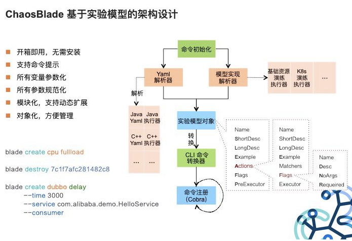

# 混沌工程

## 混沌工程是什么

混沌工程（Chaos Engineering）是在分布式系统上进行实验的学科, 目的是建立对系统抵御生产环境中失控条件的能力以及信心。

## 为什么需要混沌工程

1. **分布式系统的复杂性挑战**

- **服务依赖挑战**：微服务架构下服务间调用链路复杂，单点故障可能引发级联失效
- **环境动态性**：云原生环境中的弹性伸缩、自动扩缩容&回滚增加了不确定性
- **传统测试局限**：单元测试/集成测试难以覆盖真实生产环境中的复杂故障场景

2. **业务稳定性需求**


- **金融级SLA要求**：99.999%可用性目标需要验证极端场景下的系统表现
- **故障恢复能力验证**：验证熔断、降级、重试等容错机制的有效性

总之，云原生的发展不断推进着微服务的进一步解耦，海量的数据与用户规模也带来了基础设施的大规模分布式演进。分布式系统天生有着各种相互依赖，可以出错的地方数不胜数，处理不好就会导致业务受损，或者是其他各种无法预期的异常行为。

## 混沌工程原理

混沌工程的核心特征是**对照观测实验**。

为了具体地解决分布式系统在规模上的不确定性，可以把混沌工程看作是为了揭示系统弱点而进行的实验。这些实验通常包括如下步骤：

1. **定义稳态：**通过可量化的指标（响应时间、错误率等）定义系统正常运行的表现，为后续测试的有效性提供基准。
2. **构建假设**：提出系统对故障的预期反应，确保在实验过程中有明确的衡量标准。
3. **故障注入：**在实验组中主动注入特定的故障如 （Chaos Mesh、Chaos Monkey），以模拟生产环境中可能遇到的真实问题。如节点故障、硬盘故障、网络断开等。
4. **监控和观察：**监控系统指标变化及恢复时间，对比实验组/对照组之前的数据差异，评估是否符合实验假设。
5. **系统改进**：根据实验结果，优化系统的故障处理机制，提升其可靠性。

破坏稳态的难度越大，我们对系统行为的信心就越强。如果发现了一个弱点，那么我们就有了一个改进目标,避免在系统规模化之后被放大。


## 混沌工程的重要原则

以下原则描述了混沌工程的理想应用，应用于上述的实验过程。遵循这些原则的程度与我们对大规模分布式系统的信心密切相关。

### 在生产环境中运行实验

系统的行为因环境和流量模式而异。由于利用率的行为随时可能发生变化，因此对真实流量进行采样是可靠捕获请求路径的唯一方法。为了保证系统运行方式的真实性以及与当前部署系统的相关性，Chaos 强烈倾向于直接在生产流量上进行试验。

### 自动化实验以连续运行

手动运行实验是劳动密集型的，最终是不可持续的。自动化实验并连续运行它们。混沌工程将自动化构建到系统中，以驱动编排和分析。

### **最小化爆照半径** 

混沌工程具备导致生产环境崩溃的风险，所谓“最小化爆炸半径”就是尽量让薄弱环节暴露出来，又不会造成更大规模的故障。

可以采用分阶段实验策略：

1. 单服务实例故障
2. 单集群故障
3. 跨区域故障

另外，《混沌工程》中详细介绍了几个步骤：

- 采用递进的方式进行实验；
- 只向一小部分终端（用户）注入故障；
- 开始进行小规模的扩散实验（需要定义好指标来过滤真正通过测试的用户）；
- 小规模集中实验，不断扩大实验范围（有定义的路由实验，无定义路由的大规模实验……）；
- 在实验造成过多危害时，自动终止实验；
- 避免在高风险时段进行实验（所有人都要在工作状态内）
- 运行实验本身不能对系统造成过大影响，造成结果偏移。每次只检验一个可控故障；


# 混沌测试工具调研


## Chaos Mesh

2019 年 12 月 31 日，PingCap在 GitHub 上正式开源了 Chaos Mesh。作为一个云原生的混沌测试平台，Chaos Mesh 提供在 Kubernetes 平台上进行混沌测试的能力。

Chaos Mesh 通过运行在 K8s 集群中的 “特权” 容器，依据 CRD 资源中的测试场景，在集群中制造混沌（模拟故障）。

### 架构设计

Chaos Mesh 的架构如下：


- **Chaos Dashboard**: a Web UI for managing, designing, monitoring Chaos Experiments.
- **Controller-manager**: used to schedule and manage the lifecycle of CRD objects
- **Chaos-daemon**: runs as daemonset with privileged system permissions over network, Cgroup, etc. for a specific node

**CRD 设计**

Chaos Mesh 中使用 [CRD](https://kubernetes.io/docs/tasks/access-kubernetes-api/custom-resources/custom-resource-definitions/) 来定义 chaos 对象，在 Kubernetes 生态中 CRD 是用来实现自定义资源的成熟方案，又有非常成熟的实现案例和工具集，这样就可以避免重复造轮子。并且可以更好的融合到 Kubernetes 生态中。

Chaos Mesh 中 CRD 的定义可以自由发挥，根据不同的错误注入类型，定义单独的 CRD 对象。如果新添加的错误注入符合已有的 CRD 对象定义，就可以拓展这个 CRD 对象；如果是一个完全不同的错误注入类型，也可以自己重新增加一个 CRD 对象，这样的设计可以将不同的错误注入类型的定义以及逻辑实现从最顶层就抽离开，让代码结构看起来更加清晰，并且降低了耦合度，降低出错的几率。另一方面 [controller-runtime](https://github.com/kubernetes-sigs/controller-runtime) 提供了很好的 controller 实现的封装，不用去对每一个 CRD 对象去自己实现一套 controller 的逻辑，避免了大量的重复劳动。

目前在 Chaos Mesh 中设计了三个 CRD 对象，分别是 PodChaos、NetworkChaos 以及 IOChaos，从命名上就可以很容易的区分这几个 CRD 对象分别对应的错误注入类型。

### 工作原理


上图是 Chaos Mesh 的基本工作流原理图：

- 目前 controller-manager 可以分为两部分，一部分 controllers 用于调度和管理 CRD 对象实例，另一部分为 admission-webhooks 动态的给 Pod 注入 sidecar 容器。
- Chaos-daemon 以 daemonset 的方式运行，并具有 Privileged 权限，Chaos-daemon 可以操作具体 Node 节点上网络设备以及 Cgroup 等。
- Sidecar contianer 是一类特殊的容器，由 admission-webhooks 动态的注入到目标 Pod 中

整体工作流如下：

1. 用户通过 YAML 文件或是 Kubernetes 客户端往 Kubernetes API Server 创建或更新 Chaos 对象。
2. Chaos-mesh 通过 watch API Server 中的 Chaos 对象创建更新或删除事件，维护具体 Chaos 实验的运行以及生命周期，在这个过程中 controller-manager、chaos-daemon 以及 sidecar 容器协同工作，共同提供错误注入的能力。
3. Admission-webhooks 是用来接收准入请求的 HTTP 回调服务，当收到 Pod 创建请求，会动态修改待创建的 Pod 对象，例如注入 sidecar 容器到 Pod 中。第 3 步也可以发生在第 2 步之前，在应用创建的时候运行。

### 功能支持

#### 故障注入

故障注入是混沌实验的核心。Chaos Mesh 充分考虑分布式系统可能出现的故障，提供全面、细粒度的故障类型，分为基础资源类型故障、平台类型故障和应用层故障三大类。

- 基础资源类型故障：
  - [PodChaos](https://chaos-mesh.org/zh/docs/simulate-pod-chaos-on-kubernetes/)：模拟 Pod 故障，例如 Pod 节点重启、Pod 持续不可用，以及特定 Pod 中的某些容器故障。
  - [NetworkChaos](https://chaos-mesh.org/zh/docs/simulate-network-chaos-on-kubernetes/)：模拟网络故障，例如网络延迟、网络丢包、包乱序、各类网络分区。
  - [DNSChaos](https://chaos-mesh.org/zh/docs/simulate-dns-chaos-on-kubernetes/)：模拟 DNS 故障，例如 DNS 域名解析失败、返回错误 IP 地址。
  - [HTTPChaos](https://chaos-mesh.org/zh/docs/simulate-http-chaos-on-kubernetes/)：模拟 HTTP 通信故障，例如 HTTP 通信延迟。
  - [StressChaos](https://chaos-mesh.org/zh/docs/simulate-heavy-stress-on-kubernetes/)：模拟 CPU 抢占或内存抢占场景。
  - [IOChaos](https://chaos-mesh.org/zh/docs/simulate-io-chaos-on-kubernetes/)：模拟具体某个应用的文件 I/O 故障，例如 I/O 延迟、读写失败。
  - [TimeChaos](https://chaos-mesh.org/zh/docs/simulate-time-chaos-on-kubernetes/)：模拟时间跳动异常。
  - [KernelChaos](https://chaos-mesh.org/zh/docs/simulate-kernel-chaos-on-kubernetes/)：模拟内核故障，例如应用内存分配异常。
- 平台类型故障：
  - [AWSChaos](https://chaos-mesh.org/zh/docs/simulate-aws-chaos/)：模拟 AWS 平台故障，例如 AWS 节点重启。
  - [GCPChaos](https://chaos-mesh.org/zh/docs/simulate-gcp-chaos/)：模拟 GCP 平台故障，例如 GCP 节点重启。
- 应用层故障：
  - [JVMChaos](https://chaos-mesh.org/zh/docs/simulate-jvm-application-chaos/)：模拟 JVM 应用故障，例如函数调用延迟。

#### 混沌实验场景

用户运行混沌场景，可以通过一系列的混沌实验，不断地扩大爆炸半径（包括攻击范围）和增加故障类型。运行混沌实验后，用户可以方便地检查当前的应用状态，判断是否需要进行后续混沌实验。同时用户可以不断地迭代混沌实验场景，积累混沌实验场景，以及方便地将已有的混沌实验场景复用到其他应用混沌实验中，大大降低了混沌实验的成本。

目前混沌实验场景提供的功能有：

- 编排串行混沌实验
- 编排并行混沌实验
- 支持状态检查步骤
- 支持中途暂停混沌实验
- 支持使用 YAML 文件定义和管理混沌实验场景
- 支持通过 Web UI 定义和管理混沌实验场景

具体的实验场景配置，参考具体[创建 Chaos Mesh Workflow](https://chaos-mesh.org/zh/docs/create-chaos-mesh-workflow/)。

#### 可视化界面操作

Chaos Mesh 为用户提供了单独的 Chaos Dashboard 组件，即可视化支持。Chaos Dashboard 极大地简化了混沌实验，用户可以直接通过可视化界面来管理和监控混沌实验，仅需点一点鼠标就能够定义混沌实验的范围、指定混沌注入的类型、定义调度规则，以及在界面上获取到混沌实验的结果等。


#### 安全保障

Chaos Mesh 通过 Kubernetes 原生的 [RBAC](https://kubernetes.io/docs/reference/access-authn-authz/rbac/)（基于角色的权限控制）功能对权限进行管理。

用户可以根据实际的权限需求自由地创建多种 Role，然后绑定到用户名 Service Account 上，最后生成 Service Account 对应的 Token。用户使用该 Token 登陆 Dashboard，只能在该 Service Account 允许的权限范围内进行 Chaos 实验。

此外 Chaos Mesh 还支持通过设置 Namespace Annotation 的方式开启特定 Namespace 下混沌实验的权限，进一步保障混沌实验的可控性。

### 如何安装

#### 脚本安装

```YAML
wget -O /tmp/install.sh https://mirrors.chaos-mesh.org/latest/install.sh
sh /tmp/install.sh -r containerd
```

#### helm安装

```YAML
git clone https://github.com/pingcap/chaos-mesh.git
cd chaos-mesh
// 创建 CRD 资源
kubectl apply -f manifests/
// 安装 Chaos-mesh
helm install helm/chaos-mesh --name=chaos-mesh --namespace=chaos-testing
// 检查 Chaos-mesh 状态
kubectl get pods --namespace chaos-testing -l app.kubernetes.io/instance=chaos-mesh
```

**⚠️ Tips：docker hub上只有Chaos-Mesh每个Release版本的X86镜像，但是目前没有ARM镜像！**

如果安装环境是ARM，则需要在安装时需要指定仓库地址为 `ghcr.io/chaos-mesh/chaos-mesh/` ，或者安装后手动修改镜像地址。

```Bash
kubectl set image deploy chaos-controller-manager chaos-mesh=ghcr.io/chaos-mesh/chaos-mesh/chaos-mesh:latest-arm64 -nchaos-testing
kubectl set image deploy chaos-dashboard chaos-dashboard=ghcr.io/chaos-mesh/chaos-mesh/chaos-dashboard:latest-arm64 -nchaos-testing
kubectl set image ds chaos-daemon chaos-daemon=ghcr.io/chaos-mesh/chaos-mesh/chaos-daemon:latest-arm64 -nchaos-testing
```

## Chaos Blade

Chaosblade 是内部 MonkeyKing 对外开源的项目，其建立在阿里巴巴近十年故障测试和演练实践基础上，结合了集团各业务的最佳创意和实践。

### 如何部署

#### **容器内快速体验**

```Bash
docker pull chaosbladeio/chaosblade-demo

docker run -it --privileged chaosbladeio/chaosblade-demo
```

#### **二进制包安装**

获取 ChaosBlade 最新的 release 包，目前支持的平台是 linux/amd64 和 darwin/64，下载对应平台的包。

https://github.com/chaosblade-io/chaosblade/releases

下载完成后解压即可，解压之后的文件中有一个blade的可执行文件，这就是Chaosblade提供的客户端工具

### 架构设计



### 功能支持

ChaosBlade 不仅使用简单，而且支持丰富的实验场景，场景包括：

- 基础资源：比如 CPU、内存、网络、磁盘、进程等实验场景；
- Java 应用：比如数据库、缓存、消息、JVM 本身、微服务等，还可以指定任意类方法注入各种复杂的实验场景；
- C++ 应用：比如指定任意方法或某行代码注入延迟、变量和返回值篡改等实验场景；
- Docker 容器：比如杀容器、容器内 CPU、内存、网络、磁盘、进程等实验场景；
- 云原生平台：比如 Kubernetes 平台节点上 CPU、内存、网络、磁盘、进程实验场景，Pod 网络和 Pod 本身实验场景如杀 Pod，容器的实验场景如上述的 Docker 容器实验场景

### 混沌实验模型


以上所有的实验场景都遵循混沌实验模型，此模型共分为四层，包含：

- Target：实验靶点。指实验发生的组件，如容器、应用框架（Dubbo、Redis）等；
- Scope：实验实施的范围。指具体触发实验的机器或者集群等；
- Matcher：实验规则匹配器。根据所配置的 Target，定义相关的实验匹配规则，可以配置多个。由于每个 Target 可能有各自特殊的匹配条件，比如 RPC 领域的 Dubbo，可以根据服务提供者提供的服务和服务消费者调用的服务进行匹配，缓存领域的 Redis，可以根据 set、get 操作进行匹配；
- Action：指实验模拟的具体场景，Target 不同，实施的场景也不一样，比如磁盘，可以演练磁盘满，磁盘 IO 读写高等。如果是应用，可以抽象出延迟、异常、返回指定值（错误码、大对象等）、参数篡改、重复调用等实验场景。

### 面向云原生


将混沌实验场景按照上述的实验模型，定义为 Kubernetes 中的资源，并通过自定义控制器来管理，可以通过 Yaml 配置或者直接执行 blade 命令执行。

### 如何使用

使用方式有两种：

- 一种是通过配置 yaml 方式，使用 kubectl 执行；
- 另一种是直接使用 chaosblade 包中的 blade 命令执行。

**yaml 配置方式**

```YAML
apiVersion: [chaosblade.io/v1alpha1](http://chaosblade.io/v1alpha1)

kind: ChaosBlade
metadata:
  name: cpu-load
spec:
  experiments:
  - scope: node
    target: cpu
    action: fullload
    desc: "increase node cpu load by names"
    matchers:
    - name: names
      value:
      - "cn-hangzhou.192.168.0.205"
    - name: cpu-percent
      value:
      - "80"
```

**Blade相关命令**

- [blade create]() - 创建一个混沌实验
- blade_destroy.md - 销毁一个混沌实验
- blade_prepare.md - 准备混沌实验环境，部分实验执行前必须执行
- blade_revoke.md - 撤销混沌实验环境，与 prepare 操作对应
- [blade status]() - 查询混沌实验和混沌实验环境状态
- blade_query.md - 查询部分实验所需的系统参数
- [blade version]() - 打印 blade 工具版本信息
- [blade server]() - server 模式


## 工具调研总结

基于对以上混沌工程的工具相关资料整理和学习，对三款工具进行对比总结如下：

|                    |                                                              |                                                              |                                                      |
| ------------------ | ------------------------------------------------------------ | ------------------------------------------------------------ | ---------------------------------------------------- |
|                    | **Chaos Monkey**                                             | **Chaos Mesh（1.2.2）**                                      | **Chaos Blade（1.2.0）**                             |
| 安装是否有特定依赖 | Spinnaker                                                    | 无                                                           | 无                                                   |
| 部署方式           | Spinnaker上配置启用                                          | helm部署、脚本部署                                           | 二进制包安装、容器直接运行                           |
| 功能和特点         | 功能和实验场景单一，仅支持终止实例   不能支持云原生的实验场景 | 场景丰富度高，支持云原生   应用无侵入，类似于istio的sidecar设计 | 场景丰富度极高，支持云原生  应用无侵入，扩展性强     |
| 易用性             | 使用上手较困难                                               | 除了yaml文件编排，提供了dashboard编排界面；   单独开发了grafana插件，易于观测实验前后结果 | 简洁易用   通过 CLI 方式执行，具有友好的命令提示功能 |
| 社区活跃度         | release周期长，最近release版本是在2016年   国内成熟的实践案例和相关资料较少 | 活跃度高                                                     | 活跃度高，且国内已有较多成熟的实践案例               |


------

**参考资料：**

https://www.infoq.cn/article/xbbm7mft8lecbzqh2bnw

https://github.com/chaosops/awesome-chaos-engineering

https://www.infoq.cn/article/gsqtykoa3uvrtqi1kkmo

https://github.com/chaosblade-io/chaosblade/blob/master/README_CN.md

https://chaos-mesh.org/docs/

https://chaos-mesh.org/blog/Securing-Online-Gaming-Combine-Chaos-Engineering-with-DevOps-Practices/
