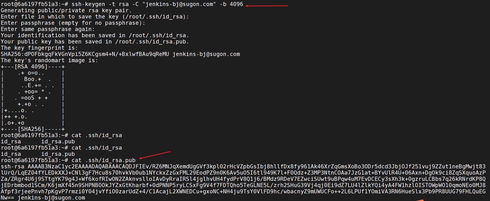
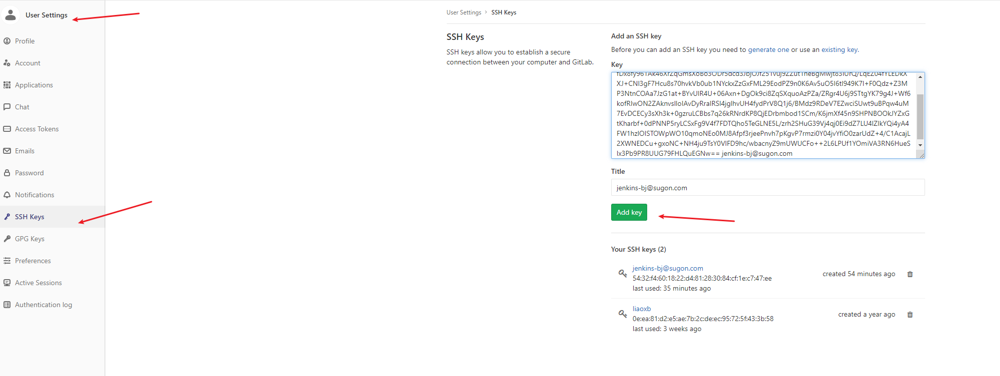
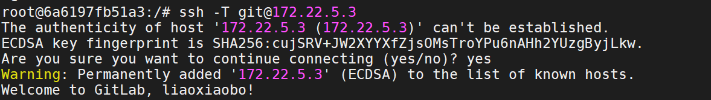
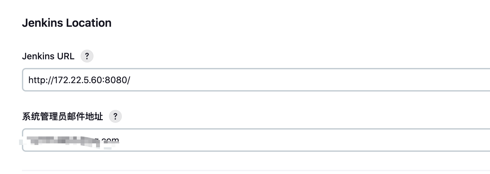

# 需求背景

公司项目搭建了一套CICD，每天可以自动地构建镜像并部署至测试环境，此时需要对接自动化测试，实现持续集成测试。

# 安装Jenkins

```sh
docker run -u root -d  --name jenkins-ci -p 8081:8080 -p 50000:50000 -v /etc/localtime:/etc/localtime -v /etc/timezone:/etc/timezone -v jenkins-data:/var/jenkins_home -v /var/run/docker.sock:/var/run/docker.sock -v $(which docker):/usr/bin/docker jenkinsci/blueocean
```

命令说明：

1、通过 `-v $(which docker):/usr/bin/docker` 和 `-v /var/run/docker.sock:/var/run/docker.sock`，容器内可以直接调用宿主机的 Docker命令，从而实现构建、测试等任务。即DooD（Docker-outside-of-Docker）方案

2、如果宿主机不存在timezone文件，自己手动创建并写入Asia/Shanghai即可

执行命令截图：


为了省心方便，在此默认选择了jenkins推荐的插件安装,这需要耐心等待一段时间：


# 配置Jenkins

## **配置gitlab仓库拉取权限**

1、jenkins容器内生成SSH密钥对



2、拷贝SSH公钥至gitlab账号



3、Jenkins容器内验证SSH密钥是否已正确添加，参考以下文档



## 配置邮件服务器

1、配置发件人邮箱



2、jenkins配置smtp服务器

以配置qq邮箱服务器为例（密码填qq邮箱的授权码），测试配置如果发送成功，说明邮件配置成功


## 安装报告插件

由于项目里的自动化脚本基于RF编写开发，所以Jenkins需要安装robot-framework插件。该插件在Jenkins中收集并发布Robot Framework测试结果。


# 集成自动化测试项目

## 项目介绍

框架搭建时，主要用了以下工具：

- gitee：管理多分支代码
- Robot Framework：作为测试框架
- docker：打包测试脚本和python包依赖，构建测试镜像

配置数据管理

- 目前是把不同的测试集群信息放在wisecloud.yaml文件里管理，另外basedata.py文件管理其它配置数据。比如公共登录账号、harbor地址账号等。
- 配置读取：单独创建一个Rest类，并继承REST父类。get_baseurl实例方法会根据env_type变量值，去动态获取目标集群的访问地址、集群ip地址,并调用BuiltIn().set_global_variable方法去设为全局变量。供用例执行过程中使用

分层设计与解耦

- 用例、方法（关键字）、测试库分层

- 用例按模块划分成多个测试用例文件，集中放进测试套件Suites

- 方法按模块划分成多个资源文件，集中放进资源文件夹Resource

- 自定义创建测试库和方法，集中放进Library。以关键字的形式以供调用

```sh
  ├── Library
  │   ├── Basedata.py
  │   ├── Rest.py
  │   ├── ServiceAdd.py
  │   └── wisecloud.yaml
  ├── Resource
  │   ├── BackupRestore.robot
  │   ├── Common.robot
  │   ├── Configcenter.robot
  │   ├── Dashboard.robot
  │   ├── Monitor.robot
  │   ├── Orche_App.robot
  │   ├── Orche_Stack.robot
  │   ├── Resource_Manager.robot
  │   ├── Workflow.robot
  │   └── pipeline_workflow.robot
  ├── Suites
  │   ├── backuprestore.robot
  │   ├── configcenter.robot
  │   ├── dashboard.robot
  │   ├── ingress
  │   │   └── ingress.robot
```


## 编写Pipeline脚本

直接贴脚本，pipeline支持的语法可查看官方手册。

```
pipeline {
    agent any
    options {
        // 添加日志打印时间
        timestamps()
        // 设置全局超时间
        // timeout(time:10,unit:'MINUTES')
    }
    environment {
        // GIT_BRANCH = 'master' # 已设置全局变量
        GIT_USER_ID = '76f84542-2dba-4128-8651-bed7a849eddd'
    }
    stages {
        stage('Git Clone') {
            steps {
                // sh  'printenv |sort'
                git branch: "${GIT_BRANCH}", credentialsId: "${GIT_USER_ID}", url: 'https://gitee.com/wisecloud/wise2c-robot.git'
            }
        }
        stage('Build Image') {
            steps {
                sh 'docker build -t ${JOB_NAME}:${GIT_BRANCH} .'
            }
        }
        stage('API Test') {
            steps {
                script{
                    sh 'ls -a'
                    sh 'docker run --rm -v jenkins-data:/robot-results --name ${JOB_NAME} ${JOB_NAME}:${GIT_BRANCH} robot --outputdir /robot-results /wise2c-robot/Project/Suites/resource_manager.robot'
                }
            }
        }
    }
    post {
        always {
            echo 'Publish Test Report'
            robot logFileName: 'log.html', outputFileName: 'output.xml', outputPath: '/var/jenkins_home/', passThreshold: 100.0, reportFileName: 'report.html', unstableThreshold: 90.0
            // deleteDir() /* clean up our workspace */
        }
        success {
            mail bcc: '', body: "API自动化测试通过\n测试版本分支：${GIT_BRANCH}\n测试报告地址：${BUILD_URL}", cc: '', from: '1219199895@qq.com', replyTo: '', subject: "${JOB_NAME}测试报告", to: 'liaoxb@wise2c.com'
        }
        failure {
            mail bcc: '', body: "API自动化测试未通过，请相关模块的同事分析定位问题，谢谢大家。\n测试版本分支：${GIT_BRANCH}\n测试报告地址：${BUILD_URL}", cc: '', from: '1219199895@qq.com', replyTo: '', subject: "${JOB_NAME}测试报告", to: 'liaoxb@wise2c.com'
        }
    }
}
```

## webhook触发流水线

1、新建pipeline时，构建触发器选择‘触发远程构建’这项，输入token name。比如apitest
这时就可以获得一个webhhok地址，提供给维护CICD平台的同事即可。
2、把pipeline脚本内容粘贴到流水线里，检查下有没有语法错误，最后点击保存
3、现在可以用curl模拟发送一次webhhok请求，不过记得临时把全局安全配置里的授权策略给放开，改成没有任何限制。

```
curl JENKINS_URL/job/wise2c-robot/build?token=TOKEN_NAME
```


## 测试结果报告展示

job首页测试结果展示，失败了1条case，同时收到了一封关于api测试失败的邮件通知：


测试结果详情页面展示，点击log.html链接可以直接查看日志；


如果到打开失败，可以参考这个解决办法。https://stackoverflow.com/questions/36607394/error-opening-robot-framework-log-failed
管理jenkins–>脚本命令行输入如下脚本:

```
System.setProperty("hudson.model.DirectoryBrowserSupport.CSP","sandbox allow-scripts; default-src 'none'; img-src 'self' data: ; style-src 'self' 'unsafe-inline' data: ; script-src 'self' 'unsafe-inline' 'unsafe-eval' ;")
```
