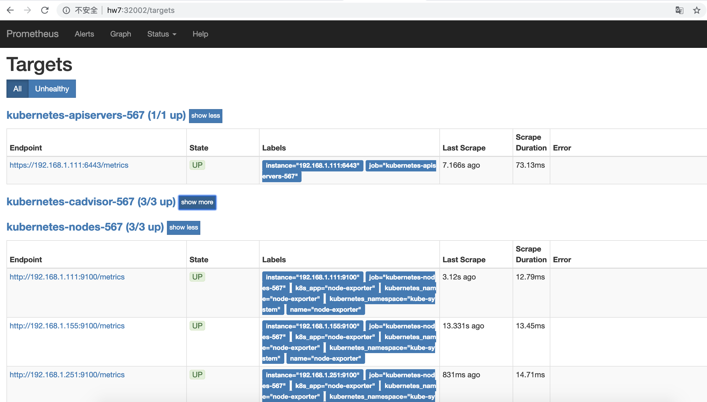
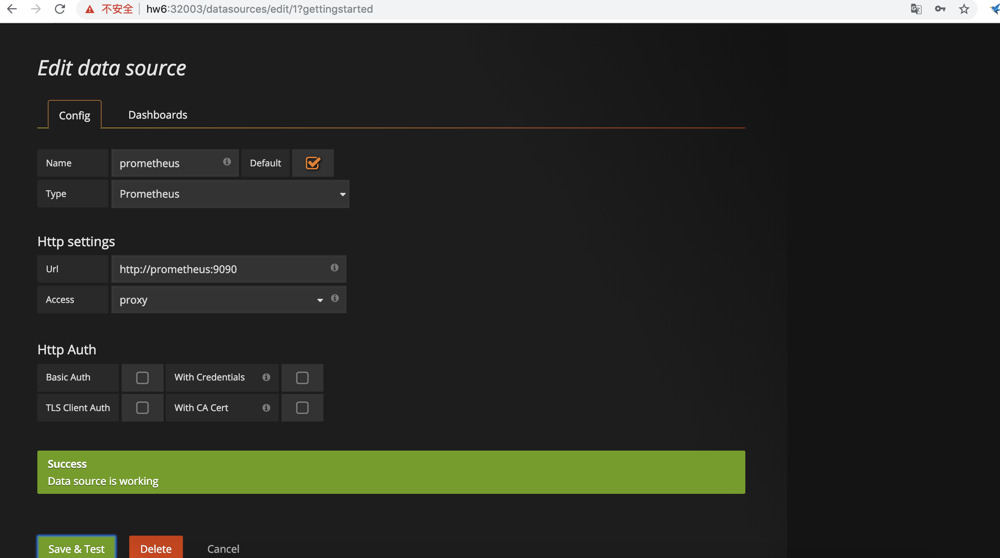
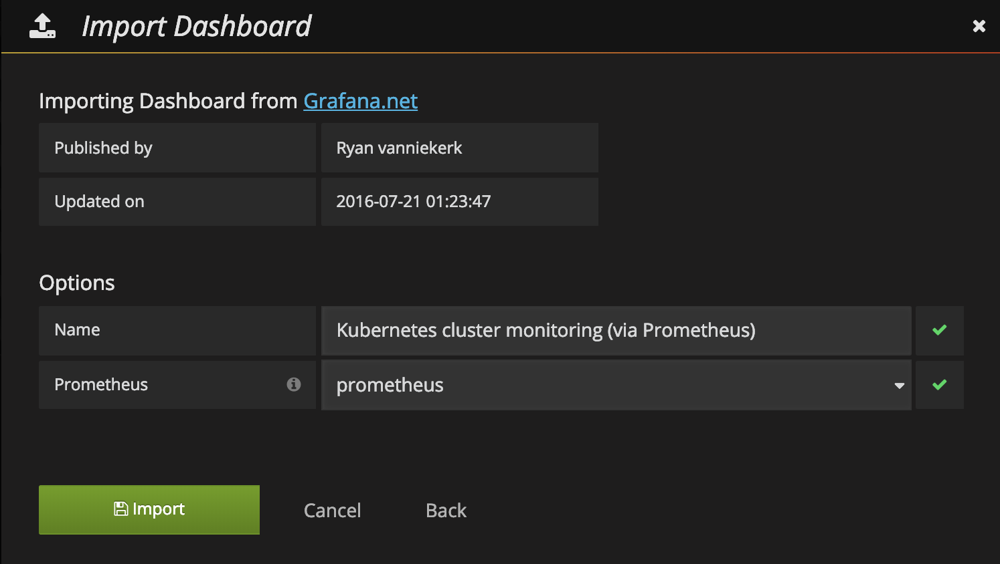
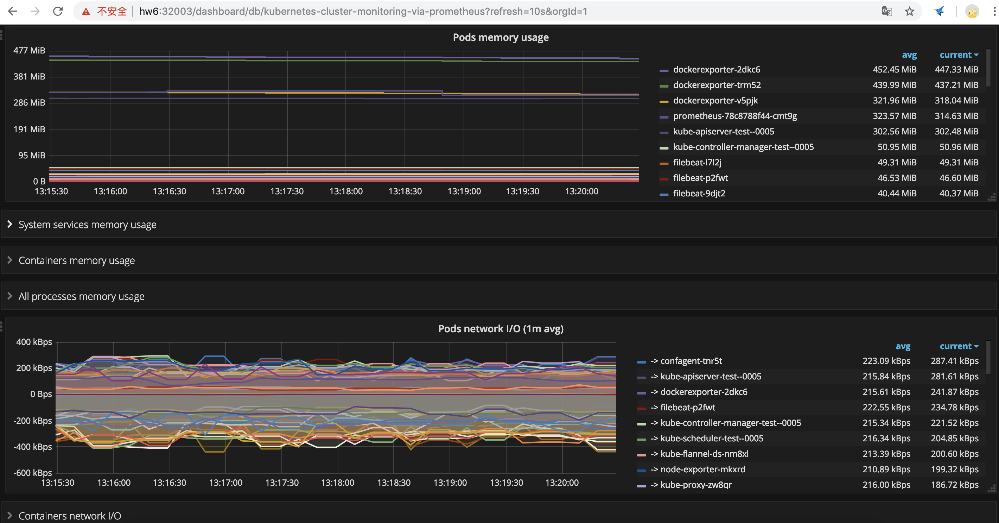
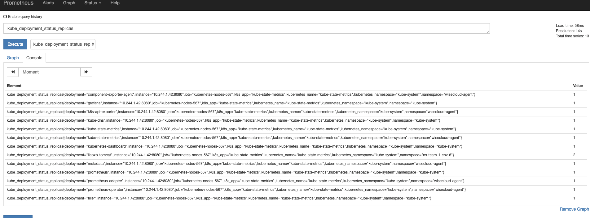
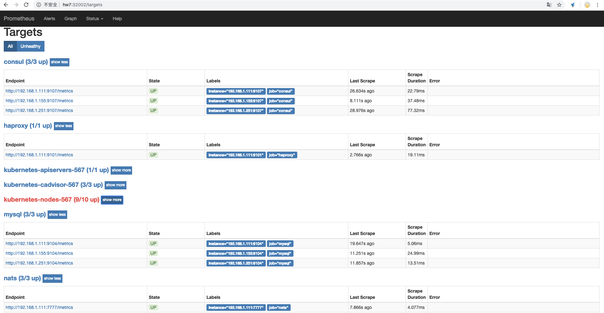

在实际工作中，通过prometheus监控的主要对象有如下几个：

- 基础设施层：主要是监控k8s节点资源，如CPU,内存,网络吞吐和带宽占用,磁盘I/O和磁盘使用等指标；
- 中间件层：监控产品使用到的中间件（一般会独立部署在外部集群），主要有consul、mysql、nats、redis、haproxy
- Kubernetes集群：监控Kubernetes集群本身的关键指标
- Kubernetes集群上部署的应用：监控部署在Kubernetes集群上的应用（pod或container等）

Step By Step，部署工作正式开始！

### 环境介绍

操作系统环境：centos linux 7.4 64bit

K8S软件版本： v1.8.6

Master节点IP： 192.168.1.111/24

Node节点IP： 192.168.1.155/24 192.168.1.251/24

### 采用daemonset方式部署node-exporter组件

#### 部署node-exporter.yaml文件

节点上默认暴露9100端口，通过hostip:9100即可访问node-exporter的metrics

```yaml
# cat node-exporter.yaml
apiVersion: v1
kind: Service
metadata:
  labels:
    k8s-app: node-exporter
    name: node-exporter
  name: node-exporter
  namespace: kube-system
  annotations:
    prometheus.io/scrape: 'true'
spec:
  ports:
  - name: http
    port: 9100
    protocol: TCP
  selector:
    app: node-exporter
  type: ClusterIP
---
apiVersion: extensions/v1beta1
kind: DaemonSet
metadata:
  name: node-exporter
  namespace: kube-system
  labels:
    app: node-exporter
spec:
  updateStrategy:
    type: RollingUpdate
  template:
    metadata:
      labels:
        app: node-exporter
    spec:
      hostNetwork: true
      containers:
      - image: prom/node-exporter:v0.16.0
        imagePullPolicy: IfNotPresent
        name: node-exporter
        ports:
        - containerPort: 9100
          hostPort: 9100
          name: http
        volumeMounts:
        - name: local-timezone
          mountPath: "/etc/localtime"
      tolerations:
      - key: "node-role.kubernetes.io/master"
        operator: "Exists"
        effect: "NoSchedule"
      hostPID: true
      restartPolicy: Always
      volumes:
      - name: local-timezone
        hostPath:
          path: /etc/localtime
```

#### 部署成功截图：

```sh
[root@test--0005 liaoxb]# kubectl create -f node-exporter.yaml
service "node-exporter" created
daemonset "node-exporter" created
[root@test--0005 liaoxb]# kcs get pods -o wide
NAME                                  READY     STATUS    RESTARTS   AGE       IP              NODE
kube-apiserver-test--0005             1/1       Running   0          5d        192.168.1.111   test--0005
kube-controller-manager-test--0005    1/1       Running   0          5d        192.168.1.111   test--0005
kube-dns-5cfc95db9f-qxk55             3/3       Running   0          5d        10.244.0.62     test--0005
kube-flannel-ds-48xfp                 1/1       Running   0          5d        192.168.1.155   test--0006
kube-flannel-ds-d84t5                 1/1       Running   0          5d        192.168.1.251   test--0007
kube-flannel-ds-nm8xl                 1/1       Running   0          5d        192.168.1.111   test--0005
kube-proxy-dxxd7                      1/1       Running   0          5d        192.168.1.155   test--0006
kube-proxy-hfzlf                      1/1       Running   0          5d        192.168.1.251   test--0007
kube-proxy-zw8qr                      1/1       Running   0          5d        192.168.1.111   test--0005
kube-scheduler-test--0005             1/1       Running   0          5d        192.168.1.111   test--0005
kubernetes-dashboard-d8b49876-2l2gx   1/1       Running   0          5d        10.244.0.63     test--0005
node-exporter-dzsq7                   1/1       Running   0          46s       192.168.1.155   test--0006
node-exporter-mkxrd                   1/1       Running   0          46s       192.168.1.111   test--0005
node-exporter-s8xw2                   1/1       Running   0          46s       192.168.1.251   test--0007
tiller-69ccbb4f7f-6dbsg               1/1       Running   0          4d        192.168.1.155   test--0006
[root@test--0005 liaoxb]# kcs get svc -o wide |grep node-exporter
node-exporter          ClusterIP   10.105.53.97    <none>        9100/TCP        1m        app=node-exporter
```

### 部署prometheus组件

#### 部署rbac文件

prometheus-rbac.yml定义了Prometheus容器访问k8s apiserver所需的ServiceAccount和ClusterRole及ClusterRoleBinding

```yaml
# cat prometheus-rbac.yaml
apiVersion: rbac.authorization.k8s.io/v1
kind: ClusterRole
metadata:
  name: prometheus
rules:
- apiGroups: [""]
  resources:
  - nodes
  - nodes/proxy
  - services
  - endpoints
  - pods
  verbs: ["get", "list", "watch"]
- apiGroups:
  - extensions
  resources:
  - ingresses
  verbs: ["get", "list", "watch"]
- nonResourceURLs: ["/metrics"]
  verbs: ["get"]
---
apiVersion: v1
kind: ServiceAccount
metadata:
  name: prometheus
  namespace: kube-system
---
apiVersion: rbac.authorization.k8s.io/v1
kind: ClusterRoleBinding
metadata:
  name: prometheus
roleRef:
  apiGroup: rbac.authorization.k8s.io
  kind: ClusterRole
  name: prometheus
subjects:
- kind: ServiceAccount
  name: prometheus
  namespace: kube-system
```


#### 部署prometheus的配置文件configmap

```yaml
#cat prometheus-cm.yaml
apiVersion: v1
kind: ConfigMap
metadata:
  name: prometheus-config
  namespace: kube-system
data:
  prometheus.yml: |
    global:
      scrape_interval:     15s
      evaluation_interval: 15s
    scrape_configs:

    - job_name: 'kubernetes-apiservers-567'
      kubernetes_sd_configs:
      - role: endpoints
      scheme: https
      tls_config:
        ca_file: /var/run/secrets/kubernetes.io/serviceaccount/ca.crt
      bearer_token_file: /var/run/secrets/kubernetes.io/serviceaccount/token
      relabel_configs:
      - source_labels: [__meta_kubernetes_namespace, __meta_kubernetes_service_name, __meta_kubernetes_endpoint_port_name]
        action: keep
        regex: default;kubernetes;https

    - job_name: 'kubernetes-cadvisor-567'
      kubernetes_sd_configs:
      - role: node
      scheme: https
      tls_config:
        ca_file: /var/run/secrets/kubernetes.io/serviceaccount/ca.crt
      bearer_token_file: /var/run/secrets/kubernetes.io/serviceaccount/token
      relabel_configs:
      - action: labelmap
        regex: __meta_kubernetes_node_label_(.+)
      - target_label: __address__
        replacement: kubernetes.default.svc:443
      - source_labels: [__meta_kubernetes_node_name]
        regex: (.+)
        target_label: __metrics_path__
        replacement: /api/v1/nodes/${1}/proxy/metrics/cadvisor

    - job_name: 'kubernetes-nodes-567'
      kubernetes_sd_configs:
      - role: endpoints
      relabel_configs:
      - source_labels: [__meta_kubernetes_service_annotation_prometheus_io_scrape]
        action: keep
        regex: true
      - source_labels: [__meta_kubernetes_service_annotation_prometheus_io_scheme]
        action: replace
        target_label: __scheme__
        regex: (https?)
      - source_labels: [__meta_kubernetes_service_annotation_prometheus_io_path]
        action: replace
        target_label: __metrics_path__
        regex: (.+)
      - source_labels: [__address__, __meta_kubernetes_service_annotation_prometheus_io_port]
        action: replace
        target_label: __address__
        regex: ([^:]+)(?::\d+)?;(\d+)
        replacement: $1:$2
      - action: labelmap
        regex: __meta_kubernetes_service_label_(.+)
      - source_labels: [__meta_kubernetes_namespace]
        action: replace
        target_label: kubernetes_namespace
      - source_labels: [__meta_kubernetes_service_name]
        action: replace
        target_label: kubernetes_name
```

#### 部署Prometheus deployment 文件

```yaml
# cat prometheus-deploy.yaml
apiVersion: apps/v1beta2
kind: Deployment
metadata:
  labels:
    name: prometheus-deployment
  name: prometheus
  namespace: kube-system
spec:
  replicas: 1
  selector:
    matchLabels:
      app: prometheus
  template:
    metadata:
      labels:
        app: prometheus
    spec:
      containers:
      - image: prom/prometheus:v2.7.1
        name: prometheus
        command:
        - "/bin/prometheus"
        args:
        - "--config.file=/etc/prometheus/prometheus.yml"
        - "--storage.tsdb.path=/prometheus"
        - "--storage.tsdb.retention=24h"
        ports:
        - containerPort: 9090
          protocol: TCP
        volumeMounts:
        - mountPath: "/prometheus"
          name: data
        - mountPath: "/etc/prometheus"
          name: config-volume
        resources:
          requests:
            cpu: 100m
            memory: 100Mi
          limits:
            cpu: 500m
            memory: 2500Mi
      serviceAccountName: prometheus
      imagePullSecrets:
        - name: regsecret
      volumes:
      - name: data
        hostPath:
           path: /prometheus
      - name: config-volume
        configMap:
          name: prometheus-config
```

#### 部署Prometheus svc 文件

```yaml
#cat prometheus-svc.yaml
kind: Service
apiVersion: v1
metadata:
  labels:
    app: prometheus
  name: prometheus
  namespace: kube-system
spec:
  type: NodePort
  ports:
  - port: 9090
    targetPort: 9090
    nodePort: 32002
  selector:
    app: prometheus
```

#### 部署成功截图：

```sh
[root@test--0005 liaoxb]# kubectl create -f prometheus-rbac.yaml
clusterrole "prometheus" created
serviceaccount "prometheus" created
clusterrolebinding "prometheus" created
[root@test--0005 liaoxb]# kubectl create -f prometheus-cm.yaml
configmap "prometheus-config" created
[root@test--0005 liaoxb]# kubectl create -f prometheus-deploy.yaml
deployment "prometheus" created
[root@test--0005 liaoxb]# kubectl create -f prometheus-svc.yaml
service "prometheus" created
[root@test--0005 liaoxb]# kcs get pods -o wide |grep prometheus
prometheus-78c8788f44-cmt9g           1/1       Running   0          32s       10.244.2.32     test--0007
```

通过prometheus节点加上nodeport即可访问prometheus web页面，target页面可看见prometheus已经成功连接上监控的job；此时prometheus就可以拉取并存储每个job采集的时序数据，Graph界面上提供了基本的查询K8S集群中每个POD的CPU使用情况，PromQL查询条件如下：

```
sum by (pod_name)( rate(container_cpu_usage_seconds_total{image!="", pod_name!=""}[1m] ) )
```


> prometheus节点ip:32002访问prometheus ui



> PromQL查询数据


### 部署Grafana组件

#### 部署grafana.yaml

```yaml
#cat grafana.yaml
apiVersion: v1
kind: Service
metadata:
  name: grafana
  namespace: kube-system
spec:
  type: NodePort
  ports:
  - port: 3000
    targetPort: 3000
    nodePort: 32003
  selector:
    app: grafana
---
apiVersion: extensions/v1beta1
kind: Deployment
metadata:
  labels:
    app: grafana
  name: grafana
  namespace: kube-system
spec:
  replicas: 1
  revisionHistoryLimit: 2
  template:
    metadata:
      labels:
        app: grafana
    spec:
      containers:
      - image: grafana/grafana:4.2.0
        name: grafana
        imagePullPolicy: Always
        ports:
        - containerPort: 3000
        env:
          - name: GF_AUTH_BASIC_ENABLED
            value: "true"
          - name: GF_AUTH_ANONYMOUS_ENABLED
            value: "false"
[root@test--0005 liaoxb]# kubectl create -f grafana.yaml
service "grafana" created
deployment "grafana" created
[root@test--0005 liaoxb]# kcs get pods -o wide |grep grafana
grafana-f9f5975f8-mv74b               1/1       Running   0          24s       10.244.1.32     test--0006
[root@test--0005 liaoxb]# kcs get svc -o wide |grep grafana
grafana                NodePort    10.102.160.34    <none>        3000:32003/TCP   42s       app=grafana
```

此时就可以通过grafana节点ip:32003访问grafana web页面，账户密码默认都是admin；

#### grafana配置数据源为prometheus



#### 导入监控Dashboard

使用[Kubernetes cluster monitoring (via Prometheus)](https://grafana.com/dashboards/162)这个即可



#### Dashboard数据展示

> 主机监控数据展示


> pod和container数据展示



### Kubernetes集群上部署应用的监控

Kubernetes集群上Pod, DaemonSet, Deployment, Job, CronJob等各种资源对象的状态需要监控，这也反映了使用这些资源部署的应用的状态。但通过查看前面Prometheus从k8s集群拉取的指标(这些指标主要来自apiserver和kubelet中集成的cAdvisor)，并没有具体的各种资源对象的状态指标。对于Prometheus来说，当然是需要引入新的exporter来暴露这些指标，Kubernetes提供了一个kube-state-metrics正式我们需要。

#### 在Kubernetes上部署kube-state-metrics组件

https://github.com/kubernetes/kube-state-metrics.git

kube-state-metrics/kubernetes目录下，有所需要的文件

```sh
[root@test--0005 liaoxb]# kubectl create -f kube-state-metrics/kubernetes/
clusterrolebinding "kube-state-metrics" created
clusterrole "kube-state-metrics" created
deployment "kube-state-metrics" created
rolebinding "kube-state-metrics" created
role "kube-state-metrics-resizer" created
serviceaccount "kube-state-metrics" created
service "kube-state-metrics" created
```


将kube-state-metrics部署到Kubernetes上之后，就会发现Kubernetes集群中的Prometheus会在kubernetes-nodes-567这个job下自动服务发现kube-state-metrics，并开始拉取metrics。这是因为prometheus-cm.yml中Prometheus的配置文件job kubernetes-nodes-567的配置。而部署kube-state-metrics的定义文件kube-state-metrics-service.yaml对kube-state-metrics Service的定义包含annotation prometheus.io/scrape: ‘true’，因此kube-state-metrics的endpoint可以被Prometheus自动服务发现

> 查询k8s集群中deploy的个数：



### 中间件监控

关于中间件的exporter部署请自行在prometheus项目中查找
https://github.com/prometheus
最主要的关键点是配置好prometheus.yml文件，在configmap中追加如下格式内容：

```yaml
- job_name: consul
  scrape_interval: 30s
  scrape_timeout: 30s
  metrics_path: /metrics
  scheme: http
  static_configs:
  - targets:
    - 192.168.1.111:9107
    - 192.168.1.155:9107
    - 192.168.1.251:9107
- job_name: haproxy
  scrape_interval: 30s
  scrape_timeout: 30s
  metrics_path: /metrics
  scheme: http
  static_configs:
  - targets:
    - 192.168.1.111:9101
- job_name: mysql
  scrape_interval: 30s
  scrape_timeout: 30s
  metrics_path: /metrics
  scheme: http
  static_configs:
  - targets:
    - 192.168.1.111:9104
    - 192.168.1.155:9104
    - 192.168.1.251:9104
- job_name: nats
  scrape_interval: 30s
  scrape_timeout: 30s
  metrics_path: /metrics
  scheme: http
  static_configs:
  - targets:
    - 192.168.1.111:7777
    - 192.168.1.155:7777
    - 192.168.1.251:7777
- job_name: redis
  scrape_interval: 30s
  scrape_timeout: 30s
  metrics_path: /metrics
  scheme: http
  static_configs:
  - targets:
    - 192.168.1.155:9121
```

prometheus-cm.yaml里job追加配置成功后，需要kubectl apply -f prometheus-cm.yaml，并且重启prometheus实例；重启成功后在target页面就可以看见新增加的中间件job采集项。

> consul haproxy等中间件采集job



部署实践小结：

- 至此，我们就能通过grafana能够展示基础设施层、Kubernetes集群自身的监控数据指标，比如cpu、内存、网络IO等（数据采集组件分别是node-exporter、cadvisor）
- Kubernetes集群上部署应用的监控，尤其是对应用状态的监控，主要是采用kube-state-metrics组件的指标，这是对以上组件很好的补充
- 中间件监控，主要是部署各自的exporter容器，暴露固定端口以供prometheus拉取监控metrics数据

参考链接：

https://www.kubernetes.org.cn/3418.html

https://github.com/prometheus