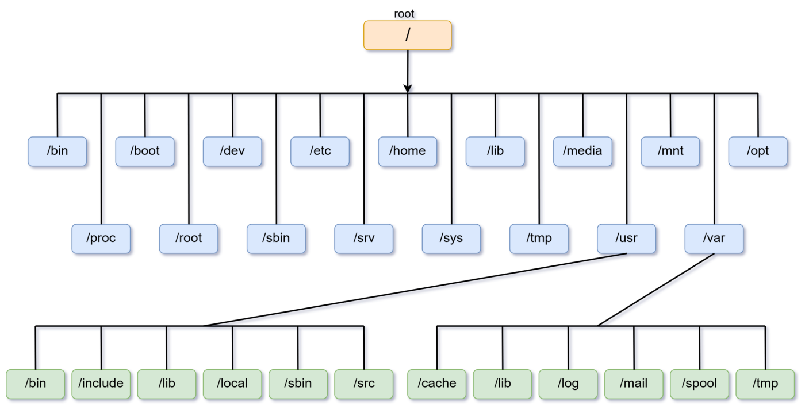
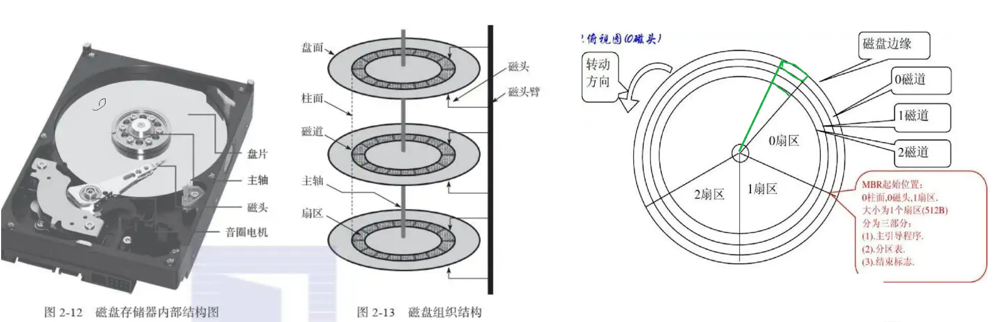
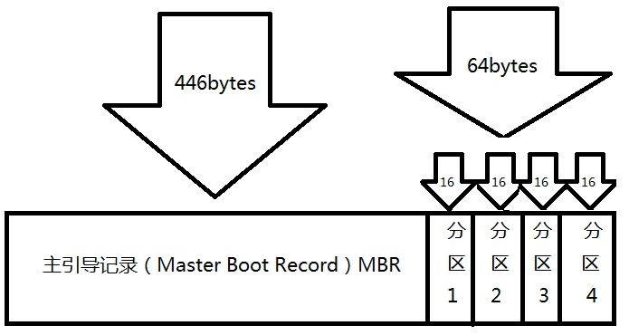
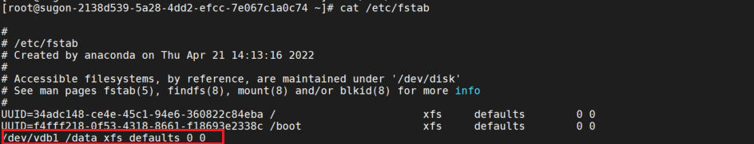

# Linux 文件系统

## 一切皆文件

“一切皆是文件”是 Unix/Linux 的基本哲学之一，它是指 Linux 系统中的所有的一切都可以通过文件的方式访问、管理，即使不是文件，也以文件的形式来管理。例如硬件设备、进程、套接字等都抽象成伪文件，使用统一的用户接口，虽然文件类型各不相同，但是对其提供的却是同一套操作。

在 Linux 中共有 7 种类型的文件，使用了不同的字符来加以区分，其中伪文件并不占用磁盘空间：

| 文件类型标识  | 文件类型                     |
| ------------- | ---------------------------- |
| `-`           | 普通文件                     |
| `d`           | 目录文件                     |
| `l`           | 符号链接                     |
| `c`（伪文件） | 字符设备（character device） |
| `b`（伪文件） | 块设备（block device）       |
| `s`（伪文件） | 套接字文件（socket）         |
| `p`（伪文件） | 命名管道文件（pipe）         |

**硬件设备命名**

系统内核中的udev设备管理器会自动把硬件名称规范起来，目的是让用户通过设备文件的名字可以猜出设备大致的属性以及分区信息等；这对于陌生的设备来说特别方便。

| 硬件设备      | 文件名称                                                     |
| ------------- | ------------------------------------------------------------ |
| SCSI/SATA/U盘 | /dev/sd[a-z]                                                 |
| virtio设备    | /dev/vd[a-z]（用于虚拟机内）                                 |
| 软驱          | /dev/fd[0-7]                                                 |
| 打印机        | /dev/lp[0-15]                                                |
| 光驱CDROM     | /dev/sr[0-1] （通用，CentOS 较常见）/dev/cdrom （当前 CDROM） |
| 鼠标          | /dev/mouse                                                   |
| 磁带机        | /dev/st0或/dev/ht0                                           |

## 目录树结构

在Windows操作系统中，想要找到一个文件，要依次进入该文件所在的磁盘分区（也叫盘符），然后再进入该分区下的具体目录，最终找到这个文件。但是在Linux系统中并不存在C、D、E、F等盘符，**Linux系统中的一切文件都是从“根”目录（/）开始的，并按照文件系统层次标准(FHS)采用倒树状结构来存放文件，以及定义了常见目录的用途。**



Linux系统中常见的目录名称以及相应内容

| 目录名称    | 应放置文件的内容                                          |
| ----------- | --------------------------------------------------------- |
| /boot       | 开机所需文件—内核、开机菜单以及所需配置文件等             |
| /dev        | 以文件形式存放任何设备与接口                              |
| /etc        | 配置文件                                                  |
| /home       | 用户主目录                                                |
| /bin        | 存放单用户模式下还可以操作的[命令]                        |
| /lib        | 开机时用到的函数库，以及/bin与/sbin下面的命令要调用的函数 |
| /sbin       | 开机过程中需要的命令                                      |
| /media      | 用于挂载设备文件的目录                                    |
| /opt        | 放置第三方的软件                                          |
| /root       | 系统管理员的家目录                                        |
| /srv        | 一些网络服务的数据文件目录                                |
| /tmp        | 任何人均可使用的“共享”临时目录                            |
| /proc       | 虚拟文件系统，例如系统内核、进程、外部设备及网络状态等    |
| /usr/local  | 用户自行安装的软件                                        |
| /usr/sbin   | Linux系统开机时不会使用到的软件/命令/[脚本]               |
| /usr/share  | 帮助与说明文件，也可放置共享文件                          |
| /var        | 主要存放经常变化的文件，如日志                            |
| /lost+found | 当文件系统发生错误时，将一些丢失的文件片段存放在这里      |

## inode介绍

- inode （索引节点）是 Linux/Unix 文件系统的基础。
- `stat` 命令可以查看文件的 inode 信息，包括文件元信息（例如权限、大小、修改时间以及数据块位置）
- inode 的访问速度非常快，Unix/Linux系统通过 inode 号码定位到文件的元数据信息，进而读取文件的块数据（4k、1M），无需遍历整个文件系统
- inode 的数量是有限的，每个文件系统只能包含固定数量的 inode。这意味着当文件系统中的 inode 用完时，无法再创建新的文件或目录，即使磁盘上还有可用空间。因此，在创建文件系统时，需要根据文件和目录的预期数量来合理分配 inode 的数量。

## 硬链接和软链接

**硬链接**

在 Linux/类 Unix 文件系统中，每个文件和目录都有一个唯一的索引节点（inode）号，用来标识该文件或目录。但是，Unix/Linux系统允许，多个文件名指向同一个inode号码。

- `ln` 命令用于创建硬链接
- 硬链接和源文件的 inode 节点号相同，两者对文件系统来说是完全平等的（可以看作是互为硬链接，源头是同一份文件）
- 只有删除了源文件和所有对应的硬链接文件，该文件才会被真正删除。
- 硬链接具有一些限制，不能对目录以及不存在的文件创建硬链接，并且，硬链接也不能跨越文件系统。

```sh
[root@master01 ~]# ll -i /etc/crontab
268535884 -rw-r--r-- 1 root root 451 Mar 14  2020 /etc/crontab

[root@master01 ~]# ln /etc/crontab .

# 建立硬链接，链接数加1
[root@master01 ~]# ll -i /etc/crontab crontab
268535884 -rw-r--r-- 2 root root 451 Mar 14  2020 crontab
268535884 -rw-r--r-- 2 root root 451 Mar 14  2020 /etc/crontab

# 删除硬链接，链接数减1
[root@master01 ~]# rm -rf crontab
[root@master01 ~]# ll -i /etc/crontab
268535884 -rw-r--r-- 1 root root 451 Mar 14  2020 /etc/crontab

```

**软链接**

- `ln -s` 命令用于创建软链接
- 软链接和源文件的 inode 节点号不同，而是指向一个文件路径
- 软连接类似于 Windows 系统中的快捷方式。即源文件删除后，软链接依然存在，但是指向的是一个无效的文件路径
- 不同于硬链接，可以对目录或者不存在的文件创建软链接，并且，软链接可以跨越文件系统。

```sh
[root@master01 ~]# ln -s /etc/crontab crontab_test

[root@master01 ~]# ll -i /etc/crontab crontab_test
344677386 lrwxrwxrwx 1 root root  12 Jan 20 18:41 crontab_test -> /etc/crontab
268535884 -rw-r--r-- 1 root root 451 Mar 14  2020 /etc/crontab
```

在Linux系统上/bin/sh通常就是指向/bin/bash的软链接。

```bash
[root@master01 ~]# ll -i /bin/sh
872423134 lrwxrwxrwx 1 root root 4 Feb 20  2024 /bin/sh -> bash

[root@master01 ~]# ll -i /bin/bash
872423123 -rwxr-xr-x 1 root root 1166952 Feb 20  2024 /bin/bash
```

## 常用文件系统

### XFS系统

XFS 是一种高性能的文件系统，相比 ext4，它在某些方面具有显著优势。如下：

- **大文件处理**：XFS 在处理大文件时性能优异，适合需要频繁读写大文件的场景（如视频编辑、数据库）。
- **高并发**：XFS 通过延迟分配（Delayed Allocation）和分布式 B+ 树索引，优化了高并发写入性能，特别是在多线程场景下，能够更好地利用多核 CPU，适合高并发工作负载。
- **动态 inode 分配**：XFS 可以动态分配 inode，而 ext4 需要在创建文件系统时预先分配 inode，可能导致 inode 不足和格式化速度慢的问题。
- **高效的日志机制**：XFS 的日志机制更高效，能够快速恢复文件系统一致性，尤其在系统崩溃后。

# Linux 硬盘与文件系统管理

## **硬盘类型**



**机械硬盘**（HDD）的组成主要有盘片、机械手臂、磁头与主轴马达所组成，而数据的写入其实是在盘片上面。盘片上面又可细分出扇区（Sector）与磁道（Track）两种单位，其中扇区的容量设计有两种大小，分别是 512Bytes 与 4KBytes。

**固态硬盘**（SSD）是基于半导体闪存（NAND Flash）作为存储介质的硬盘，相比传统的机械硬盘，它去掉了机械固件，引入了主控芯片来代替机械操作，这意味着它的性能、功耗及可靠性会比HDD高出一大截。固态硬盘虽然没有物理扇区，但逻辑上仍保留扇区的概念以兼容操作系统和文件系统。

关于硬盘的总结如下：

- 扇区（Sector）为最小的物理储存单位，且依据磁盘设计的不同，目前主要有 512Bytes与 4K 两种格式；
- 柱面（cylinder）是由多个盘片上处于同一磁道位置（即同一半径）的磁道组成的集合；

## 硬盘分区和挂载

**分区工具**
常用的分区工具有 `fdisk`、`parted`、Windows 下的磁盘管理工具等。使用这些工具可以在硬盘上建立一个分区表，用于记录每个分区的起始位置、结束位置、大小及其它属性。

**分区表类型**

**MBR（Master Boot Record）**：传统的分区表格式，最多支持4个主分区（或3个主分区加一个扩展分区，扩展分区内可创建多个逻辑分区）。

MBR 分区表中，第一个扇区最重要，里面有主开机记录（Master boot record,MBR）及分区表（partition table），其中 MBR 占有 446 Bytes，而 partition table 则占有 64 Bytes。



**GPT（GUID Partition Table）**：现代硬盘常用的分区表格式，支持更多分区，且对于大容量硬盘有更好的支持和数据冗余能力。

**分区过程**
分区工具会让你选择起始扇区和结束扇区，从而决定每个分区的大小。现在的分区都是基于逻辑扇区（LBA）进行划分的。

- **指定大小和位置**：用户可以根据需要指定各个分区的大小和位置，确保不同的分区满足不同应用场景的需求。
- **确定分区类型**：通常会根据用途为分区分配不同的标记或文件系统类型（如Linux下的 ext4、swap 分区，Windows下的 NTFS 等）。
- **写入分区表**：完成分区配置后，工具会将信息写入硬盘的分区表中。以后系统启动时，就会根据这个分区表来识别和管理各个分区。

**方法一：分区 → 格式化 → 挂载**

使用步骤：

1. 输入 `n` 创建新分区。
2. 输入分区类型（如 `primary` 或 `logical`）。
3. 设置起始和结束扇区（通常直接按回车使用默认值）。
4. 输入 `w` 保存分区表并退出。
5. 格式化分区
6. 挂载分区
7. 开机自动挂载（可选）




**方法二：直接格式化→ 挂载**

这种方法适合特定用途，例如非系统盘的大容量存储。

```sh
sudo mkfs.ext4 /dev/sdb
sudo mount /dev/sdb /mnt/data
```

**方法三：使用 LVM（逻辑卷管理器）**

如果需要灵活管理硬盘容量，可以使用 LVM：初始化 → 创建卷组 → 创建逻辑卷 → 格式化 → 挂载

```sh
# 初始化硬盘
sudo pvcreate /dev/sdb
# 创建卷组
sudo vgcreate my_vg /dev/sdb
# 创建逻辑卷
sudo lvcreate -L 50G -n my_lv my_vg
#格式化卷
sudo mkfs.ext4 /dev/my_vg/my_lv
#挂载卷
sudo mount /dev/my_vg/my_lv /mnt/data
```

**方法四：作为裸设备使用**

某些特殊用途（如数据库或存储系统）可能直接使用裸设备，无需分区和格式化。例如数据库（如 MySQL）可以直接将 `/dev/sdb` 作为数据存储路径。

## 硬盘阵列技术

RAID技术的设计初衷是减少因为采购硬盘设备带来的费用支出，但是与数据本身的价值相比较，**现代企业更看重的则是RAID技术所具备的冗余备份机制以及带来的硬盘吞吐量的提升**。也就是说，RAID不仅降低了硬盘设备损坏后丢失数据的几率，还提升了硬盘设备的读写速度，所以它在绝大多数运营商或大中型企业中得以广泛部署和应用。

### RAID 特性

- **协同工作**：多块硬盘通过一定的 RAID 级别协同工作。
- **性能提升**：通过并行读写提高数据吞吐量（如 RAID 0、RAID 10）。
- **可靠性增强**：通过数据冗余提高数据安全性（如 RAID 1、RAID 5）。
- **容量组合**：多块硬盘的容量可以组合成一个逻辑卷。
- **应用场景**：适用于服务器、企业级存储、大型数据库系统等。

### 常见的 RAID 级别

| **RAID 级别** | **特点**                                                     |
| ------------- | ------------------------------------------------------------ |
| RAID 0        | 数据交错存放，性能提升，但无数据冗余，一块硬盘损坏即丢失全部数据 |
| RAID 1        | 两块硬盘存储相同数据，可靠性高但容量利用率低，若使用软件RAID，可能写入性能会变差 |
| RAID 5        | 分布式校验数据，性能和可靠性均衡，需要至少 3 块硬盘；当一块磁盘损毁时，可以通过同位检查码重建数据 |
| RAID 10       | RAID 1+0，性能和可靠性均高，需要至少 4 块硬盘                |

### **软件 RAID**

由于磁盘阵列有很多优秀的功能，然而硬件磁盘阵列卡偏偏又贵的很～因此就有发展出利用软件来仿真磁盘阵列的功能，这就是所谓的软件磁盘阵列（software RAID）。软件磁盘阵列主要是通过软件来仿真阵列的任务，因此会损耗较多的系统资源，比如说 CPU 的运算与I/O 总线的资源等。

> 硬件磁盘阵列（hardware RAID）是通过磁盘阵列卡来达成阵列的目的。磁盘阵列卡上面有一块专门的芯片在处理 RAID 的任务，因此在性能方面会比较好。

软件实现 RAID，通过 Linux 的 `mdadm` 工具配置软件 RAID。

```sh
sudo mdadm --create /dev/md0 --level=5 --raid-devices=3 /dev/sd[b-d]
```