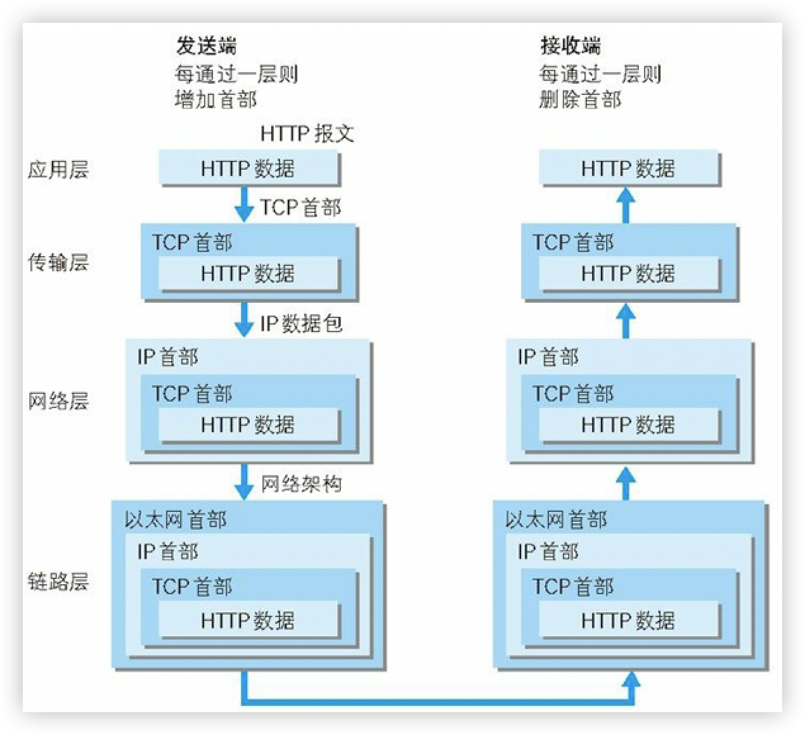
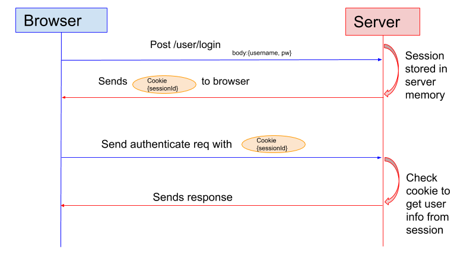
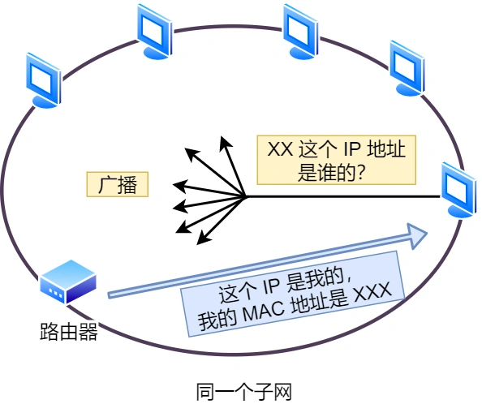
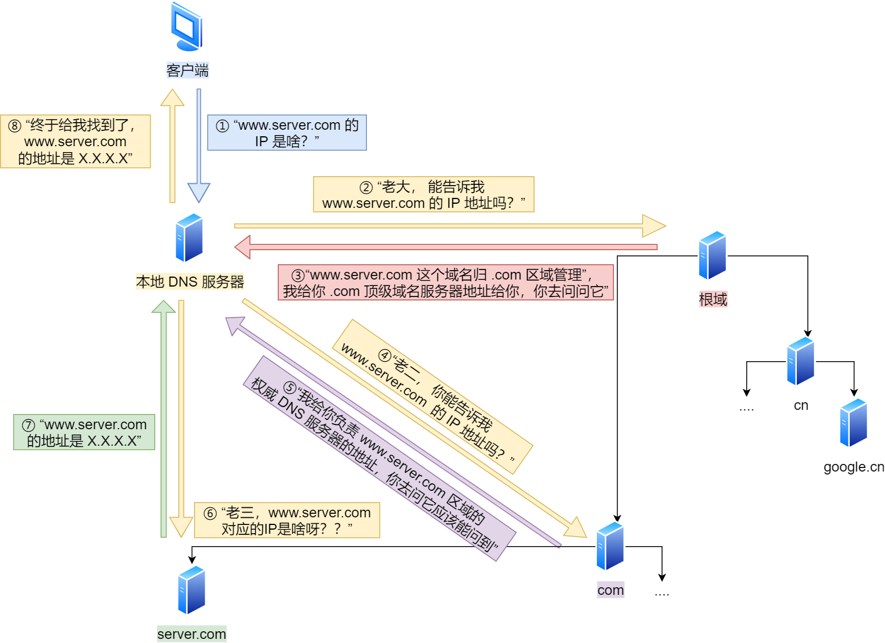

# TCP/IP 模型

| TCP/IP 层级 | 对应 OSI 层级                   | 功能描述                   | 核心协议                  |
| ----------- | ------------------------------- | -------------------------- | ------------------------- |
| 应用层      | L5-L7（会话层、表示层、应用层） | 面向用户，处理具体应用需求 | HTTP、FTP、DNS、SMTP、SSH |
| 传输层      | L4                              | 确保数据“端到端”可靠传输   | TCP、UDP                  |
| 网络层      | L3                              | 转发和路由                 | IP、ICMP、ARP、BGP        |
| 链路层      | L1-L2（数据链路层、物理层）     | 物理介质传输比特流         | 以太网、Wi-Fi、MAC 地址   |

# TCP/IP 网络协作过程

**协作过程示例（发一封邮件）**

1. **应用层**：你写邮件内容（使用SMTP协议）
2. **传输层**：TCP将邮件拆分成数据段，添加端口号
3. **网络层**：IP协议给数据段贴上目标IP地址，规划传输路线。
4. **链路层**：通过Wi-Fi将数据转为电信号，传给路由器
5. **接收端反向操作**：链路层接收信号 → 网络层验证IP → 传输层重组数据 → 应用层显示邮件

> 网络接口层的传输单位是帧（frame），IP 层的传输单位是包（packet），TCP 层的传输单位是段（segment），HTTP 的传输单位则是消息或报文（message）。但这些名词并没有什么本质的区分，可以统称为数据包。

# 常见网络协议

## HTTP 协议

**基本概念**

HTTP 是超文本传输协议，也就是**HyperText Transfer Protocol**。具体来说，主要是来规范浏览器和服务器端的行为的。并且，HTTP 是一个无状态（stateless）协议，也就是说服务器不维护任何有关客户端过去所发请求的消息。

**常见状态码**

`1xx` 类状态码属于**提示信息**，是协议处理中的一种中间状态，实际用到的比较少。

- 「**101 Switching Protocols**」协议切换，服务器已经理解了客户端的请求，并将通过 Upgrade 消息头通知客户端采用不同的协议来完成这个请求。比如切换到一个实时且同步的协议（如 WebSocket）以传送利用此类特性的资源。

`2xx` 类状态码表示服务器**成功**处理了客户端的请求。

- 「**200 OK**」是最常见的成功状态码，表示一切正常。如果是非 `HEAD` 请求，服务器返回的响应头都会有 body 数据。
- 「**204 No Content**」也是常见的成功状态码，与 200 OK 基本相同，但响应头没有 body 数据。
- 「**206 Partial Content**」是应用于 HTTP 分块下载或断点续传，表示响应返回的 body 数据并不是资源的全部，而是其中的一部分，也是服务器处理成功的状态。

`3xx` 类状态码表示客户端请求的资源发生了变动，需要客户端用新的 URL 重新发送请求获取资源，也就是**重定向**。

- 「**301 Moved Permanently**」表示永久重定向，说明请求的资源已经不存在了，需改用新的 URL 再次访问。
- 「**302 Found**」表示临时重定向，说明请求的资源还在，但暂时需要用另一个 URL 来访问。

- 「**304 Not Modified**」不具有跳转的含义，表示资源未修改，重定向已存在的缓冲文件，也称缓存重定向，也就是告诉客户端可以继续使用缓存资源，用于缓存控制。

`4xx` 类状态码表示客户端发送的**报文有误**，服务器无法处理，也就是错误码的含义。

- 「**400 Bad Request**」表示客户端请求的报文有错误，但只是个笼统的错误。
- 「**401 Unauthorized**」表示客户端请求没有进行验证或验证失败。
- 「**403 Forbidden**」表示服务器禁止访问资源，并不是客户端的请求出错。
- 「**404 Not Found**」表示请求的资源在服务器上不存在或未找到。

`5xx` 类状态码表示客户端请求报文正确，但是**服务器处理时内部发生了错误**，属于服务器端的错误码。

- 「**500 Internal Server Error**」与 400 类似，是个笼统通用的错误码。
- 「**501 Not Implemented**」表示请求的方法不被服务器支持。
- 「**502 Bad Gateway**」表示作为网关或者代理的服务器尝试执行请求时，从上游服务器接收到无效的响应。
- 「**503 Service Unavailable**」表示服务器尚未处于可以接受请求的状态，类似“网络服务正忙，请稍后重试”的意思。
- 「**504 Gateway Timeout**」表示作为网关或者代理的服务器无法在规定的时间内，从上游服务器获得想要的响应。

## **TCP 协议**

**基本概念**

TCP 的全称叫传输控制协议（*Transmission Control Protocol*），

**特点**

面向连接、可靠传输（流量控制、超时重传、拥塞控制）  、基于字节流。

**端口号**

一台设备上可能会有很多应用在接收或者传输数据，因此需要用一个编号将应用区分开来，这个编号就是**端口**。比如 80 端口通常是 Web 服务器用的，22 端口通常是远程登录服务器用的。而对于浏览器（客户端）中的每个标签栏都是一个独立的进程，操作系统会为这些进程分配临时的端口号。由于传输层的报文中会携带端口号，因此接收方可以识别出该报文是发送给哪个应用。

## **UDP 协议**

**基本概念**

UDP（User Datagram Protocol）是一个简单的面向消息的传输层协议。UDP 只负责发送数据包，不保证数据包是否能抵达对方，但它实时性相对更好，传输效率也高。当然，UDP 也可以实现可靠传输，则必须在用户应用程序中实现。

**特点**

无连接、不可靠、低延迟

## IP 协议

**基本概念**

网络层最常使用的是 IP 协议（*Internet Protocol*），IP 协议会将传输层的报文作为数据部分，再加上 IP 报头组装成 IP 报文，以便它们可以跨网络传播并到达正确的目的地。如果 IP 报文大小超过 MTU（以太网中一般为 1500 字节）就会**再次进行分片**，得到一个即将发送到网络的 IP 报文。

**子网**

IP 协议使用 **IP 地址** 来区分互联网上的每一台设备。但是一个单纯的 IP 地址，**寻址**起来还是特别麻烦，全世界那么多台设备，难道一个一个去匹配？这就产生了**子网**的概念，即寻址过程中，先要匹配找到同一个子网，才会去找对应的主机。

**路由**

IP 协议另一个重要的能力就是**路由**。实际场景中，两台设备并不是用一条网线连接起来的，而是通过很多网关、路由器、交换机等众多网络设备连接起来的，那么就会形成很多条网络的路径。**路由器**寻址工作中，就是要找到目标地址的子网，找到后进而把数据包转发给对应的网络内。

# 计算机网络面试题

## HTTP/1.1 的优点有哪些

***1. 简单***

HTTP 基本的报文格式就是 `header + body`，头部信息也是 `key-value` 简单文本的形式，**易于理解**，降低了学习和使用的门槛。

***2. 灵活和易于扩展***

HTTP 协议里的各类请求方法、URI/URL、状态码、头字段等每个组成要求都没有被固定死，都允许开发人员**自定义和扩充**。

同时 HTTP 由于是工作在应用层（ `OSI` 第七层），则它**下层可以随意变化**，比如 HTTPS 就是在 HTTP 与 TCP 层之间增加了 SSL/TLS 安全传输层；

***3. 应用广泛和跨平台***

互联网发展至今，HTTP 的应用范围非常的广泛，从台式机的浏览器到手机上的各种 APP，HTTP 的应用遍地开花，同时天然具有**跨平台**的优越性。

## HTTP/1.1 的缺点有哪些

HTTP 协议里有优缺点一体的双刃剑，分别是「**无状态**、***队头阻塞***」，同时还有一大缺点「**不安全**」。

**1.无状态**

HTTP协议的无状态特性意味着服务器不会记录客户端的请求历史，每个请求都被视为独立且无关的。这一设计虽然简化了服务器实现并提升了处理效率，但也带来了以下主要问题：

- 无法直接识别客户端：服务器无法直接识别客户端，每次都要进行用户身份验证和授权，导致用户登录、个性化推荐等关联功能难以实现。
- 重复传输大量信息：每个请求都要重复传输大量相同的信息，如Host、Authentication、Cookies等元数据，增加了数据传输量和服务器的处理负担。

**2.队头拥塞**

「请求 - 应答」的模式加剧了 HTTP 的性能问题。

因为当顺序发送的请求序列中的一个请求因为某种原因被阻塞时，在后面排队的所有请求也一同被阻塞了，会招致客户端一直请求不到数据，这也就是「**队头阻塞**」。

**3.不安全**

HTTP 比较严重的缺点就是不安全：

- 通信使用明文（不加密），内容可能会被窃听。
- 不验证通信方的身份，因此有可能遭遇伪装。
- 无法证明报文的完整性，所以有可能已遭篡改。

## 怎么解决 HTTP 请求无状态带来的问题

### 1. **Cookie机制**

- **原理**：服务器通过响应头的`Set-Cookie`字段向客户端浏览器写入键值对数据，客户端后续请求时自动携带这些Cookie，从而使服务器能够识别并跟踪用户会话。
- **局限**：
  - 数据存储在客户端，存在安全风险（如XSS攻击窃取Cookie）。
  - 单个域名下Cookie大小受限（通常4KB），且每次请求均会携带，可能影响性能

### 2. **Session机制**

- **原理**：服务器创建唯一Session ID并将其发送给客户端（通常通过Cookie传递），并将用户状态存储在服务端（如内存、数据库）。在后续的请求中，客户端会携带Session ID，服务器根据Session ID在服务器端检索对应的会话状态。
- **优势**：状态数据存储在服务端，安全性较高，适合保存敏感信息（如用户权限）。
- **局限**：
  - 服务器需维护Session存储（比如会话同步），高并发场景下可能产生性能瓶颈，且在分布式系统中会限制负载均衡的能力。
  - Session ID依赖Cookie传递，若客户端禁用Cookie则需通过URL重写实现。

### 3. **Token机制**

- **原理**：服务器生成包含用户信息的令牌（如JWT），客户端在请求头（如`Authorization`）中携带该令牌。客户端每次请求时携带该Token，服务器验证后获取用户信息，服务器无需存储会话数据。
- **优势**：
  - 无状态设计减轻服务器压力，适合分布式系统。
  - 支持跨域场景和多种客户端（如移动端App）
- **局限**：令牌需定期更新以防止泄露，且需处理令牌吊销问题

### 4. **其他优化技术**

- **持久连接（Keep-Alive）** ：HTTP/1.1默认启用，通过复用TCP连接减少握手开销，间接提升状态相关请求的效率（虽不直接解决无状态问题）。
- **缓存机制**：利用强制缓存（如`Cache-Control`）和协商缓存（如`ETag`）减少重复数据传输，缓解无状态导致的冗余问题

## HTTP 与 HTTPS 有哪些区别？

- HTTP 是超文本传输协议，信息是明文传输，存在安全风险的问题。HTTPS 则解决 HTTP 不安全的缺陷，在 TCP 和 HTTP 网络层之间加入了 SSL/TLS 安全协议，使得报文能够加密传输（通常是对称加密数据）。
- HTTP 连接建立相对简单，TCP 三次握手之后便可进行 HTTP 的报文传输。而 HTTPS 比 HTTP 多了 SSL/TLS 的握手过程，才可进入加密报文传输。
- **端口号**：HTTP 默认是 80，HTTPS 默认是 443。
- HTTPS 协议需要向 CA（证书权威机构）申请数字证书，来保证服务器的身份是可信的。

## 从输入 URL 到页面展示到底发生了什么？

1. 在浏览器中输入指定网页的 URL。
2. 浏览器通过 DNS 协议，获取域名对应的 IP 地址。
3. 浏览器根据 IP 地址和端口号，向目标服务器发起一个 TCP 连接请求（创建套接字 Socket）。
4. 浏览器在 TCP 连接上，向服务器发送一个 HTTP 请求报文，请求获取网页的内容。
5. 服务器收到 HTTP 请求报文后，处理请求，并返回 HTTP 响应报文给浏览器。
6. 浏览器收到 HTTP 响应报文后，解析响应体中的 HTML 代码，渲染网页的结构和样式，同时根据 HTML 中的其他资源的 URL（如图片、CSS、JS 等），再次发起 HTTP 请求，获取这些资源的内容，直到网页完全加载显示。
7. 浏览器在不需要和服务器通信时，可以主动关闭 TCP 连接，或者等待服务器的关闭请求。

## ARP地址解析协议的工作过程

**广播发送ARP请求，单播发送ARP响应。**

1. 首先，每个主机都会在自己的ARP缓冲区中建立一个ARP列表（通过`arp -n`查找），以表示IP地址和MAC地址之间的对应关系。
2. 当源主机要发送数据时，首先检查ARP列表中是否有对应IP地址的目的主机的MAC地址，如果有，则直接发送数据，如果没有，就向本网段的所有主机发送ARP数据包，该数据包包括的内容有：源主机 IP地址，源主机MAC地址，目的主机的IP 地址。
3. 当本网络的所有主机收到该ARP数据包时，首先检查数据包中的IP地址是否是自己的IP地址，如果不是，则忽略该数据包，如果是，则首先从数据包中取出源主机的IP和MAC地址写入到ARP列表中，如果已经存在，则覆盖，然后将自己的MAC地址写入ARP响应包中，告诉源主机自己是它想要找的MAC地址。
4. 源主机收到ARP响应包后。将目的主机的IP和MAC地址写入ARP列表，并利用此信息发送数据。如果源主机一直没有收到ARP响应数据包，表示ARP查询失败。

## DNS 的作用是什么？

DNS（Domain Name System）域名管理系统，是当用户使用浏览器访问网址之后，使用的第一个重要协议。DNS 要解决的是**域名和 IP 地址的映射问题**。

## DNS进行域名解析的过程

1. 简单来说，当在浏览器地址栏中输入某个Web服务器的域名时。主机会发出一个DNS请求到**本地DNS服务器**（也就是客户端 TCP/IP 设置中填写的 DNS 服务器地址）。
2. **本地DNS服务器**会首先查询高速缓存记录，如果缓存中有此条记录，就可以直接返回结果。若没有查到，本地DNS则将请求发给根域DNS服务器。
3. 根DNS服务器并不会记录域名和IP地址的对应关系，只会“指路”；即告知**本地DNS**去迭代查找至顶级域、二级域（.com 、.org），三级域，直至找到要解析的IP地址
4. **本地DNS** 再将IP地址返回给客户端，客户端与目标成功建立连接。同时把对应关系保存在缓存中，加快网络访问。

更详细的总结：

浏览器缓存——》系统hosts文件——》本地DNS解析器缓存——》本地域名服务器（本地配置区域资源、本地域名服务器缓存)——》根域名服务器——》主域名服务器——》下一级域名域名服务器 客户端——》本地域名服务器（递归查询) 本地域名服务器—》DNS服务器的交互查询是迭代查询

## TCP连接是怎么建立和断开的

建立一个 TCP 连接需要“三次握手”，缺一不可：

- **一次握手**:客户端发送带有 SYN（SEQ=x） 标志的数据包 -> 服务端，然后客户端进入 **SYN_SEND** 状态，等待服务端的确认；
- **二次握手**:服务端发送带有 SYN+ACK(SEQ=y,ACK=x+1) 标志的数据包 –> 客户端,然后服务端进入 **SYN_RECV** 状态；
- **三次握手**:客户端发送带有 ACK(ACK=y+1) 标志的数据包 –> 服务端，然后客户端和服务端都进入**ESTABLISHED** 状态，完成 TCP 三次握手。

断开一个 TCP 连接则需要“四次挥手”，缺一不可：

1. **第一次挥手**：客户端发送一个 FIN（SEQ=x） 标志的数据包->服务端，用来关闭客户端到服务端的数据传送。然后客户端进入 **FIN-WAIT-1** 状态。
2. **第二次挥手**：服务端收到这个 FIN（SEQ=X） 标志的数据包，它发送一个 ACK （ACK=x+1）标志的数据包->客户端 。然后服务端进入 **CLOSE-WAIT** 状态，客户端进入 **FIN-WAIT-2** 状态。
3. **第三次挥手**：服务端发送一个 FIN (SEQ=y)标志的数据包->客户端，请求关闭连接，然后服务端进入 **LAST-ACK** 状态。
4. **第四次挥手**：客户端发送 ACK (ACK=y+1)标志的数据包->服务端，然后客户端进入**TIME-WAIT**状态，服务端在收到 ACK (ACK=y+1)标志的数据包后进入 CLOSE 状态。此时如果客户端等待 **2MSL** 后依然没有收到回复，就证明服务端已正常关闭，随后客户端也可以关闭连接了。

## WebSocket 和 HTTP 有什么区别

WebSocket 和 HTTP 两者都是基于 TCP 的应用层协议，都可以在网络中传输数据。

下面是二者的主要区别：

- WebSocket 是一种双向实时通信协议，而 HTTP 是一种单向通信协议。并且，HTTP 协议下的通信只能由客户端发起，服务器无法主动通知客户端。
- WebSocket 使用 ws:// 或 wss://（使用 SSL/TLS 加密后的协议，类似于 HTTP 和 HTTPS 的关系） 作为协议前缀，HTTP 使用 http:// 或 https:// 作为协议前缀。
- WebSocket 可以支持扩展，用户可以扩展协议，实现部分自定义的子协议，如支持压缩、加密等。
- WebSocket 通信数据格式比较轻量，用于协议控制的数据包头部相对较小，网络开销小，而 HTTP 通信每次都要携带完整的头部，网络开销较大（HTTP/2.0 使用二进制帧进行数据传输，还支持头部压缩，减少了网络开销）。

## 什么时候选择 TCP，什么时候选 UDP

- **UDP 一般用于即时通信**，比如：语音、 视频、直播等等。这些场景对传输数据的准确性要求不是特别高，比如你看视频即使少个一两帧，实际给人的感觉区别也不大。
- **TCP 用于对传输准确性要求特别高的场景**，比如文件传输、发送和接收邮件、远程登录等等
