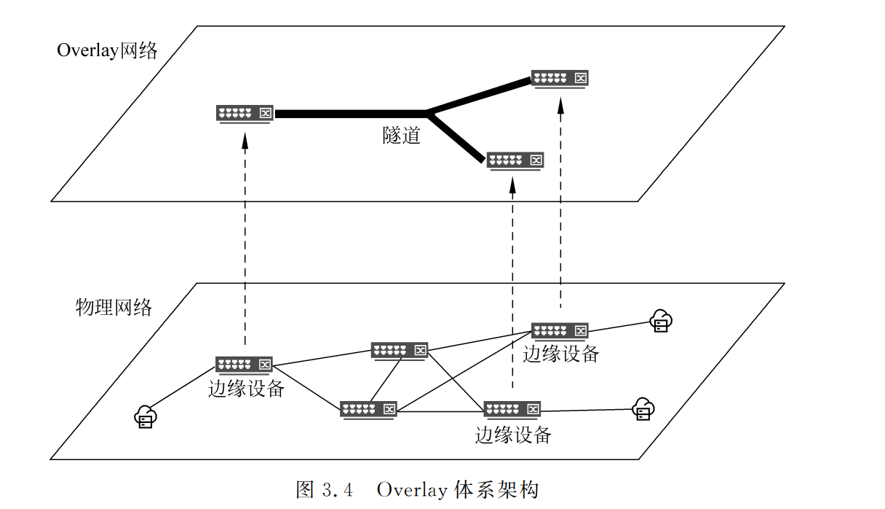
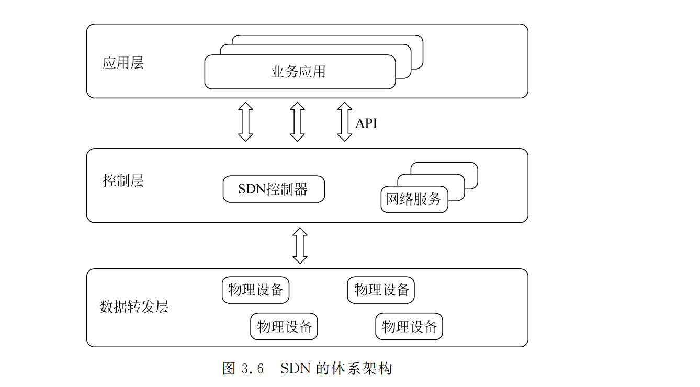

# 数据中心网络

虚拟化技术在云计算中被广泛应用,大量的虚拟机和容器部署于云数据中心,这会带来两个最直接的结果:一是网络流量的爆发式增长;二是数据中心网络流量模型从南北向为主转变为了以东西向为主。虚拟机之间的互通、虚拟机的迁移、存储数据的同步等,更多的带宽将被东西向流量所占用,数据中心网络的架构也从传统的烟囱式架构向分布式架构转变,从纵向扩展向横向扩展演进。

随着 VXLAN、SDN 等技术的出现,云计算场景下,业界开始将数据中心网络抽象为Underlay网络 (物理网络)和 Overlay网络 (叠加网络),将 负责 VXLAN 封 装 的 VTEP(VXLAN TunnelEndPoint,VXLAN 隧道端点)下沉到接入交换机或者物理服务器,数据中心的物理网络只需要提供三层可达的通道即可。数据中心网络开始由传统的“核心+汇聚+接入” 的三层架构向“骨干节点(Spine)+叶子节点(Leaf)”的二层架构演进。

# Overlay网络虚拟化技术

Overlay在网络领域指的是一种物理网络架构上叠加虚拟网络的模式,其大体框架是对基础网络不进行大规模修改的条件下,实现应用在网络上的承载,并能与其他网络业务分离。

针对传统 VLAN 网络虚拟化技术的两个局限性,Overlay在很大程度上提供了全新的解决方案。 

(1)虚拟机创建的灵活性:Overlay是一种封装在IP报文之上的新的数据格式,可以在三层路由的网络中建立起逻辑的二层网络,因而具备大规模扩展能力。同时,IP网络本身具备很强的故障自愈和负载均衡能力,采用 Overlay技术后,利用现有网络进行技术迭代,便可用于支撑新的云计算业务。 

(2)针对网络隔离规模的限制:在 Overlay技术中引入了类似 VLANID 的用户标识, 但对标识的范围做了很大的扩展,如 VXLAN 技术引入的 VXLANID,支持上千万级别的用户标识。

Overlay网络由边缘设备、控制平面和转发平面组成。边缘设备是指与虚拟机直接相连的设备;控制平面主要负责虚拟隧道的建立维护以及主机位置性信息的通告;转发平面是承载 Overlay报文的物理网络。

# SDN网络

SDN 将网络划分为数据转发层和控制层,控制层与数据转发层分离:控制层更灵活, 数据转发层更标准化。通过集中控制,网络管理员可以通过控制器的API编写程序,实现自动化服务部署,大大缩短业务部署周期,并实现按需动态调整。SDN 的出现使网络虚拟化更加灵活、高效,网络虚拟化已成为SDN 的重量级应用。

当前的SDN 网络架构通常采用控制器集群的形式,收集整个网络的拓扑和流量信息,计算流量转发路径,并将转发表项发送给交换机(包括硬件交换机和vSwitch)。交换机根据下发的转发表里的条目执行转发操作。控制层从传统网络的单个设备剥离并集中在控制器上。 转发层由交换机组成。

