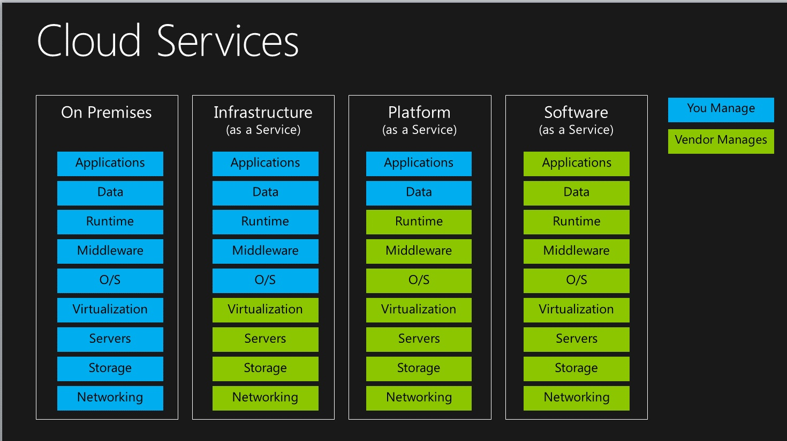
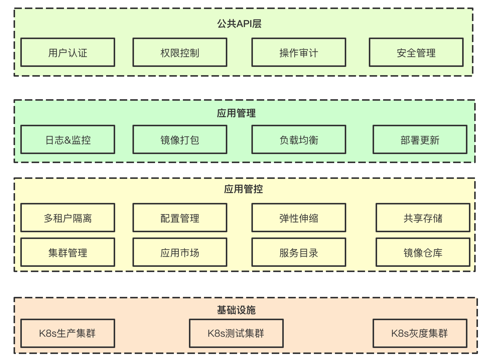
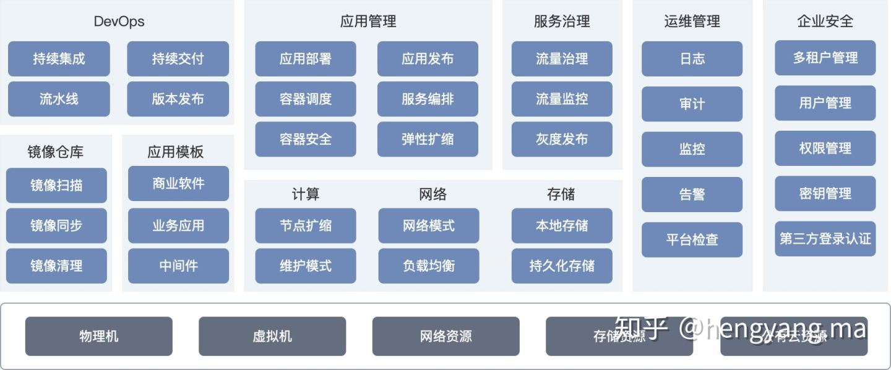
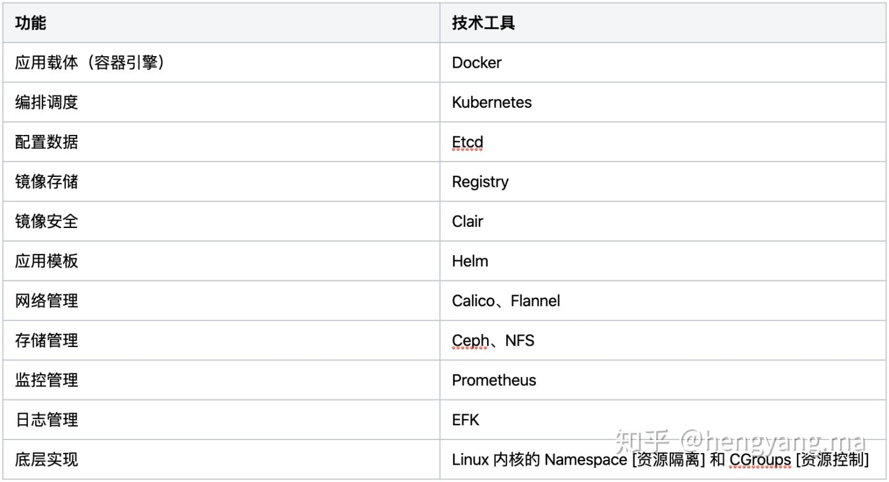

# 为什么需要PaaS平台

PaaS（平台即服务）给用户提供的平台化能力是建立在IaaS服务上层，它给用户提供的核心价值就围绕在Application和Data两方面。PaaS用户（一般指开发人员）只需专注于业务逻辑和应用本身研发，无需管理底层的基础设施，包括网络、服务器，操作系统或者存储，同时大大简化了研发运维间的沟通协作难度。

# 如何建设PaaS平台

PAAS设计

功能模块

平台技术

## 应用管理

PaaS平台最核心的功能就是应用全生命周期管理。应用通常是一个独立完整的业务功能，一个应用可能由多个服务组件组成，对于微服务而言每个组件都可以独立于其他组件部署、启动、运行和治理。PaaS平台需要提高对应用的一键式部署、健康检查、弹性扩缩、升级发布、资源管理、访问管理、监控管理等功能，从而保证应用的整体服务能力。

一键式部署：一般支持通过镜像、应用模板和 YAML等方式部署应用，让用户可通过多种应用交付物快速便捷的部署。

健康检查：由于容器启动后应用还需要较长时间才能接受请求，容器正常运行但容器中的应用服务异常等原因。需要支持应用健康状态的检查，健康检查结果会指导负载均衡、滚动发布和弹性伸缩，实现更平滑的过程 。

弹性扩缩：支持通过手动、自动和定时等方式对容器的实例进行弹性的扩缩，保证应用运行的稳定性。

升级发布：支持通过单一服务按照指定实例数滚动升级实现滚动发布；通过建立跨服务的 4 层负载均衡实现灰度发布／蓝绿发布；并支持一键回滚；基于预定义镜像规则自动发布，支持 DevOps 自动化流水线场景。

资源管理：对容器部署或运行过程中的的 CPU、内存等计算资源、网络和存储资源的分配进行集中管理。

访问管理：容器的外部接入访问入口，和平台内部访问容器的控制台入口的管理。

监控管理：对容器产生的日志进行统一查看和导出，并且配置容器的日志管理服务器；对容器的资源包括CPU、内存、网络、存储等的使用情况进行可视化监控。

服务治理：通过提供完整的非侵入式的微服务治理解决方案，支持完整的服务生命周期管理和流量治理。能够很好的解决云原生服务的管理、网络连接以及安全管理等服务网络治理问题。

灰度发布：灰度发布是迭代软件产品在生产环境安全上线的重要手段。允许用户按照标准制定一套流量分发规则，平滑稳定的实现灰度发布功能。主要有金丝雀、蓝绿、A/B Testing 等典型灰度发布功能。

流量治理：应用流量治理提供可视化云原生应用的网络状态监控，并实现在线的网络连接和安全策略的管理配置。提供策略化、场景化的网络连接、安全策略管理能力。支持基于应用拓扑对服务配置负载均衡、熔断容错等治理规则，并提供实时的、可视化的服务流量管理。

流量监控：通过流量监控可以监控流量概况、组件运行状态、调用链等信息，并在系统业务异常时快速定位到问题点。

## Devops

由于软件开发复杂度的增高和更多的协同工作，敏捷开发能够更好地在协同工作中确保软件开发和交付质量。而 CI/CD 就是专门为解决上述需求的软件开发实践。CI/CD 要求每次的集成都是通过自动化的构建来验证，包括自动编译、发布和测试，从而尽快地发现集成错误，让团队能够更快的开发内聚的软件，减轻了软件发布时的压力。

持续集成：持续集成是一种实现产品和应用快速迭代的一种实践方式，这种实践要求开发人员所提交的每一次代码都能够快速被合并到生产线，并进行自动构建和上线。能够容易定位 Bug 并提前发现和解决，降低开发成本。

持续交付：持续交付的缩短了需求完成周期，满足小粒度交付需求，打造自持敏捷开发，精益迭代和持续交付的研发基础设施。此外，提高了产品迭代速度，提升了应用软件质量。并且支持容器扩容、收缩、升级和回滚，轻松实现应用灰度发布，还拥有更快的应用交付和Go-to-Market能力。

流水线：应用从代码编译、测试、打包和部署的过程，流水线管理一般使用常用的 Jenkinsfile 来表述一组 CI/CD 流程。从代码仓库 、代码编译、镜像制作、镜像安全、推送到仓库、应用版本、到定时构建的端到端流水线设置。

版本发布：DevOps 的应用版本管理可备份每个应用的关键配置。应用下可以设置应用版本，用于记录本次应用和其下制品版本的关系，可便于部署或回滚操作。

## 运维管理

日志、监控和告警等实现对容器云平台的组件状态、基础设施资源、运行的各个应用系统统一管理。让用户能够对平台进行手动和自动检查、排错和维护，保证平台的稳定。

日志：日志模块需收集平台组件、业务应用、业务服务以及云上中间件的日志。可采用平台统一日志管理系统，或对接 ELK。

监控告警：监控模块需提供对集群和应用的资源状态两个维度监控。并支持大规模系统监控、多指标监控、多维度监控，为每一个层级资源的运行状态都提供实时的多种指标监控。并且收集资源实时监控数据和历史监控数据，帮助用户观察和建立资源和集群性能的正常标准。监控模块可采用平台的自有监控体系，或对接外部监控系统，比如 Prometheus。

## 交付中心

容器镜像实现容器运行时标准化，应用模板（helm）实现编排文件的标准化。镜像和应用模板是开发（Dev）和运维（Ops）的媒介，完成测试的镜像、应用模板可以发布到生产环境；然后在平台上部署和管理应用，持续监控应用服务的运行情况，并保持持续的反馈运行情况，以便及时的改进，形成一个良性循环。

镜像管理：提供了多种构建镜像的方式，支持对接 CI/CD工具，能够简化企业应用容器化的难度，轻松实现应用的容器化。并提供日常镜像维护的功能，比如镜像扫描、镜像同步和镜像清理等。

应用模板：基于 Helm 标准的应用模板提供统一的资源管理与调度，高效地实现了模板的快速部署与后期管理，大幅简化了Kubernetes资源的安装管理过程。

## 安全管理

多租户管理：不同租户中的资源彼此隔离。使得它们既可以共享同一个平台资源，也能够互不干扰。对于平台来说，需要将平台的计算资源、存储资源和网络资源，分配给各租户，让租户根据自身使用场景管理应用、用户、角色和资源。

用户管理：用户管理模块，可对企业用户进行增删改查等操作，以及配置用户密码安全策略，保证用户和平台安全；同时可对接企业用户目录，同步企业现存用户管理系统，避免重复操作。

权限管理：权限管理是在 Kubernetes的角色访问控制（RBAC）的能力基础上，打造的细粒度权限管理功能。支持集群级别、租户级别的权限控制，能够从集群和租户层面对用户组或用户进行细粒度授权。

第三方登录认证：当对接企业现有用户中心时，需要实现第三方登录认证。用户只需要登录一次，就可以访问所有相互信任的应用系统。解决企业不同业务应用之间的身份认证问题。

文档参考链接来源：
https://www.kubernetes.org.cn/7272.html
https://zhuanlan.zhihu.com/p/108719565
