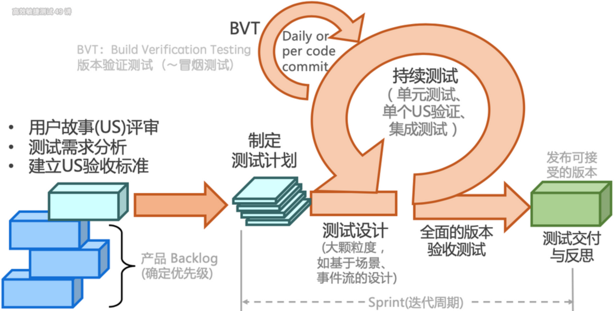

---

## 软件质量模型

软件质量模型是一组特性及特性之间的关系，它提供规定质量需求和评价质量的基础。

| 特性         | 核心子特性                                                   |
| ------------ | ------------------------------------------------------------ |
| **功能性**   | 适合性、准确性、互操作性、安全性                             |
| **可靠性**   | 成熟性（无故障）、容错性（出了故障不影响主功能）、可恢复性（快速恢复） |
| **易用性**   | 易理解性、易学性、易操作性                                   |
| **效率**     | 时间特性（RT≤2s）、资源利用率（CPU≤80%）                     |
| **可维护性** | 可分析性、可修改性、稳定性、易测试性                         |
| **可移植性** | 适应性（环境兼容）、易安装性、共存性（与其他系统共存）       |

---

## 测试思维与方法

### 测试思维
- **批判性思维**：基于观察、分析、推理，持续质疑系统，优化测试设计。
- **系统性思维**：从整体到局部分析被测对象，对系统进行分解、分层（如分层测试策略）。
- **发散性思维**：多角度探索用户场景（如探索式测试中的路径多样性）。

### 黑盒测试方法
| 方法           | 核心逻辑                                                     |
| -------------- | ------------------------------------------------------------ |
| **场景法**     | 模拟用户操作流程，覆盖基本流（正确流程）和备选流（异常流程）。 |
| **等价类划分** | 将输入划分为有效/无效等价类，每类选一个用例覆盖。            |
| **边界值分析** | 测试输入边界值（如最大值、最小值、空值）。                   |
| **因果图**     | 分析输入条件与输出的因果关系，生成判定表设计用例。           |
| **错误猜测法** | 基于经验测试易错点，以点带面地挖掘共性bug（如特殊字符、越权漏洞测试）。 |

### 白盒测试方法

- **语句覆盖**：每条代码至少执行一次。
- **判定覆盖**：每个分支的真/假至少执行一次。
- **条件覆盖**：每个条件表达式取真/假至少一次。
- **路径覆盖**：覆盖所有可能的执行路径（理论最高覆盖，但成本高）。

### **推荐的综合策略**

**对于大多数云原生系统的状态测试**，推荐混合使用状态转换测试（主干）+ 因果图（异常分支）+ 场景测试（并发/时序），以平衡覆盖率和执行成本。

1. **分层测试设计**
   - **主干逻辑**：使用**状态转换测试**覆盖实例状态机（如`Running`→`Stopped`→`Deleted`）。
   - **复杂分支**：用因果图覆盖异常场景（如资源不足、节点故障）。
   - **并发和时序**：补充基于场景的测试或混沌实验。
2. **用例混合设计示例**

- 用例1（状态转换）：Running → Stop → Stopped  
- 用例2（因果图）：Create + ResourceExhausted → Error  
- 用例3（并发场景）：Create和Delete同时触发 → 操作冲突提示 

---

## 测试流程与敏捷实践

### 传统测试流程
1. **需求分析**：明确测试范围与优先级。
2. **测试计划**：制定目标、策略、风险应对方案。
3. **测试设计**：转化为具体用例（等价类、场景法等）。
4. **测试执行**：执行自测、回归测试、缺陷跟踪。
5. **发布维护**：监控线上问题并修复。

### 敏捷测试流程

敏捷测试本质是短、频、快地反馈代码提交的质量，促进持续交付。

敏捷测试的特点如下：

- **质量内建**：测试左移（参与需求评审） + 测试右移（监控生产环境）。
- **持续测试**：自动化与探索式测试结合，快速反馈代码质量。
- **分层策略**：单元测试→接口测试→UI测试，平衡效率与覆盖。

### 探索式测试（ET）

探索式测试旨在将学习、测试设计、测试执行和测试结果分析做为一个循环快速地迭代，在较短的时间内（如1个小时）完成多次循环，以持续优化测试。该思路再次与敏捷软件开发小步快跑、持续反馈的理念不谋而合。

- **核心**：质疑系统存在漏洞（需求误解、实现错误、性能瓶颈等）。
- **实施步骤**：  
  1. 制定SMART目标（具体、可度量、可实现）。  
  2. 分时间盒（如50分钟）执行“设计-执行-分析”循环。  
  3. 通过测程管理（SBTM）记录测试结果并复盘。

---

## 性能测试

### 测试类型
| 类型         | 目标                                                         |
| ------------ | ------------------------------------------------------------ |
| **负载测试** | 确定系统在满足性能指标下的最大负载，同时可找到性能下降拐点（如响应时间≤2s时支持1万用户）。 |
| **压力测试** | 测试系统在极端负载下的稳定性和可靠性（如用户量继续增加导致系统崩溃的临界点）。 |
| **容量测试** | 验证系统处理数据量/用户量的极限（如云存储最大数据量）。      |

### 性能指标
| 指标              | 定义                                                         |
| ----------------- | ------------------------------------------------------------ |
| **响应时间 (RT)** | 用户发起请求到收到响应的总时间（含网络传输、后端服务处理、前端渲染）。 |
| **吞吐率（TPS）** | 每秒处理的事务数（衡量系统整体吞吐能力）。                   |
| **QPS**           | 每秒处理的请求数（公式：QPS = 并发用户数 / 平均响应时间）。  |

## 可靠性测试

- **定义**：验证系统在特定条件下（如长时间运行、异常输入、资源限制等）持续稳定运行的能力，确保其在设计预期内无故障运行或快速恢复。

- **核心目标**：

  - 发现系统潜在缺陷（如内存泄漏、死锁、资源耗尽）。
  - 验证系统在异常场景下的容错能力（如网络抖动、磁盘故障）。
  - 评估系统恢复时间（MTTR，Mean Time To Recovery）。

- **典型测试场景**：

  - 长时间压力测试（7×24小时运行）。
  - 模拟硬件故障（如强制关闭虚拟机节点）。
  - 异常输入测试（如无效请求、超大数据包）。

- **与高可用测试的区别**：

  | 维度         | 可靠性测试                   | 高可用测试                                 |
  | :----------- | :--------------------------- | :----------------------------------------- |
  | **侧重点**   | 系统整体稳定性与容错能力     | 故障时服务的持续可用性                     |
  | **范围**     | 更广泛（覆盖所有异常场景）   | 更聚焦（仅针对故障场景的可用性）           |
  | **典型指标** | MTBF（平均无故障时间）、MTTR | SLA（如99.99%可用性）、RTO（恢复时间目标） |
  | **设计原则** | 容错设计、代码健壮性         | 冗余架构、故障转移机制                     |

## 测试之道

在软件工程领域，测试不仅是发现缺陷的手段，更是贯穿产品生命周期的质量反馈机制。以下结合理论与测试实践，对测试工作的核心逻辑进行分析和总结，并探讨其深层意义。

### **测试的本质是反馈：反馈驱动质量改进**

- 根据ISTQB（国际软件测试资格认证委员会）的定义，测试的核心目标之一是**提供质量相关信息**。测试结果无论成功与否，均能为团队提供关键信息：  
  - **通过**：验证功能符合预期，增强信心。  
  - **失败**：暴露问题，推动改进。  
- 例如，自动化测试的稳定性监控（如每日构建）能够反馈代码变更对系统的影响，即使未发现新缺陷，也能反映当前版本的可靠性。  

**启示**：测试不仅是技术的实践，更是质量的哲学。唯有将反馈思维融入每个环节，才能让测试从“成本中心”蜕变为“价值引擎”。

### **测试人员的价值：质量的全链路守护者**  

- 在敏捷和DevOps实践中，测试角色已从“质检员”转变为**质量赋能者**。测试人员需：  
  - **发现缺陷**：通过设计用例覆盖复杂场景。  
  - **定位问题**：结合日志、监控和代码分析，缩短排查路径（如通过APM工具追踪性能瓶颈）。  
  - **推动解决**：参与根因分析，提出可落地的优化建议（如优化数据库索引）。  
- 例如，某电商系统在高并发下单时出现超卖，测试人员通过压力测试复现问题后，协助开发引入分布式锁机制，最终解决缺陷。  

**启示**：测试人员的价值不仅在于“发现问题”，更在于**加速问题闭环**。

### **测试的充分性：始于需求分析，而非用例设计**

- 测试遗漏常源于**需求盲区**。例如： 某支付系统因需求未明确“余额不足时的重试逻辑”，导致测试未覆盖，上线后引发重复扣款。  
- 解决方法：  
  - **早期介入**：测试参与需求评审，识别模糊点（如通过实例化需求方法）。  
  - **需求可测性**：将非功能性需求（如性能、安全）纳入分析范围。  

**启示**：测试充分性的天花板在需求阶段已确定，测试设计只是实现手段。

### **测试的有效性：效率与价值的平衡** 

- **风险驱动测试**：优先覆盖高概率、高影响的场景（如核心支付链路）。  
- **自动化分层策略**：金字塔模型（单元测试70%、接口测试20%、UI测试10%）优化执行效率。  

**启示**：在有限资源下，测试需聚焦**关键质量目标**，而非盲目追求覆盖率100%。

### **缺陷的确定性：科学方法破除“玄学”**

- 无法重现的问题，就说明我们不知道问题到底是什么。
- **缺陷复现三要素**：环境、数据、操作步骤的一致性。  
- 案例：某服务间歇性超时，通过逐步隔离变量（网络延迟、线程池配置、依赖服务状态），最终定位为数据库连接泄漏。    

**启示**：缺陷排查是**系统性实验**，需用控制变量法定位根因，而非运气游戏。

### **杀虫剂悖论：测试的进化法则**

- **悖论本质**：重复相同的测试会逐渐降低缺陷发现率（Boris Beizer, 1990）。  
- 应对策略：  
  - **用例维护**：随需求变更同步更新（如版本迭代后删除过期用例）。  
  - **变异测试**：人工修改代码生成缺陷，验证用例是否捕获。  
  - **探索式测试**：每周2小时自由探索，记录意外问题。  

**启示**：测试资产是**活文档**，需持续迭代以匹配系统演进。

### **测试左移与右移：质量共同体建设**

- **测试左移**：  
  - **需求阶段**：与产品共建，通过实例化需求（Specification by Example）定义验收标准，避免歧义。例如，使用Gherkin语法编写用户故事，直接生成自动化测试用例。  
  - **开发阶段**：与开发协作，推动单元测试与代码评审，结合SonarQube等工具检测代码坏味道。  
- **测试右移**：  
  - **运维阶段**：与运维协作，生产环境通过监控（如Prometheus）、日志（如ELK）和A/B测试验证实际用户场景。  
  - **混沌工程**：利用混沌工程工具（Chaos Mesh）模拟生产故障（如网络分区、节点宕机），验证系统韧性。  

**启示：**测试活动应贯穿需求、开发、交付、运维的全生命周期。  

### **质量指标可视化：从经验主义到科学决策**

- **缺陷模式分析**：  
  - 通过历史缺陷数据识别高频问题模块（如支付服务占线上缺陷的40%），针对性增强测试覆盖。  
  - 使用热图（Heatmap）标记代码改动频繁的区域，优先测试。  
- **效果度量**：  
  - 定义核心指标：缺陷逃逸率（<5%）、测试用例有效性（缺陷发现数/用例数）、自动化ROI（>1:3）；
  - 搭建质量看板：Grafana集成Jira、Jenkins数据；
  - 每周同步：在站会上展示指标趋势，驱动改进  

**启示**：测试策略应基于数据而非直觉，包括测试优先级、资源分配和风险评估。  

### **自动化不是银弹：平衡人机协作**

- **自动化适用场景**：  
  - 高频回归（如核心链路）、数据驱动测试（如参数组合）、精准重复操作（如性能测试）。  
- **探索式测试优势**：  
  - 发现“意料之外”的问题（如界面渲染异常、多步骤交互副作用）。  
  - 快速验证新功能逻辑，弥补自动化滞后性。  
- **平衡策略**：  
  - 80%核心场景自动化 + 20%探索式测试覆盖长尾场景。  
  - 使用Session-Based Test Management（SBTM）管理探索式测试过程。  

**启示**：自动化解决效率问题，探索式测试（ET）解决认知问题，二者缺一不可。

### **测试工程师的核心竞争力：技术深度与业务广度的平衡**  

**技术能力**：  

- 读懂代码逻辑：快速定位缺陷根源（如空指针异常、事务未提交）。  
- 理解系统架构：设计分布式场景测试（如Redis缓存一致性、MQ消息幂等）。 

**业务能力**：  

- 掌握领域知识：金融测试需理解清算规则、医疗系统需符合HL7协议。  
- 用户视角思维：从用户操作路径设计端到端场景（如电商下单→支付→退货）。  

**提升路径**：

- **技术深度**：每月研究一个开源项目（如Kubernetes测试框架）；
- **业务广度**：季度性轮岗（如参与产品需求设计）；
- **自动化思维**：将重复工作脚本化（如用Python自动生成测试报告）
